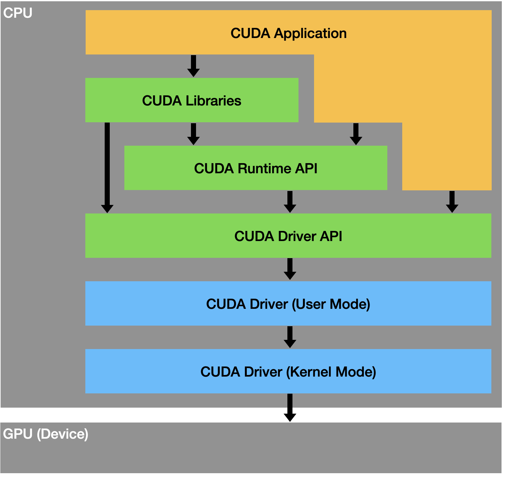

# 环境配置和工具编译

[toc]

## Linux开发环境配置

- 安装或升级gcc/yasm/nasm
- 安装或升级make/cmake
- 安装或升级sed
- 安装universal-ctags
- 安装或升级vim (+python3支持)，配置~/.vimrc，安装插件
- 安装或升级git，配置~/.gitconfig，配置密钥
- 配置~/.condarc，包括镜像源、虚拟环境路径、缓存路径
- 配置网络代理

## 虚拟环境和程序包管理系统

### python安装软件包新方式

python 3.11之后，采用了新的软件包安装和管理方式，可采用以下方式安装应用软件（命令行工具）和软件库（python项目中需要`import`的软件包）。

#### 方法1：使用pipx

适用于应用软件，即命令行工具，可以使用pipx，pipx会自动为每个应用软件维护一个单独的虚拟环境

```
yum install pipx
pipx ensurepath     # add ~/.local/bin to PATH
pipx install some-python-application
```

#### 方法2：在venv中使用pip

适用于软件库，使用venv手动维护一个虚拟环境

```
# 方式一
python -m venv path/to/venv
path/to/venv/bin/pip install numpy

# 方式二
python -m venv path/to/venv
source path/to/venv/bin/activate
pip install numpy
```

#### 方法3：system-wide方式

适用于软件库，使用系统的软件包管理工具直接安装

```
sudo apt install python3-numpy  # Ubuntu
sudo yum install python3-numpy  # Centos
sudo brew install python3-numpy # MacOS
```

#### 方法4：强制采用旧方式

```
pip install --break-system-packages numpy
```

### 虚拟环境管理

#### venv

python3自带，不需要额外安装库就能运行，只支持3.3以后版本。

```
# 创建环境，会创建myvenv目录
python3 -m venv /path/to/myvenv
# 激活环境
&& source /path/to/myvenv/bin/activate
# 安装包
pip3 install numpy
# 退出环境
deactivate
# 删除环境
rm -rf /path/to/myvenv
```

#### virtualenv

安装virtualenv
```
pip3 install virtualenv
```

virtualenv使用方法
```
# 创建环境，会创建myenv的目录
virtualenv path/to/myenv
# 激活环境
source path/to/myenv/bin/activate
# 退出环境
deactivate
# 删除环境
rm -rf path/to/myenv
```

#### conda

##### 基本操作

| command                                       | usage                                         |
| -----                                         | -----                                         |
| conda info                                    | show conda info                               |
| conda info -e                                 | show env                                      |
| conda activate 3dlut                          | enter env                                     |
| conda deactivate                              | exit env                                      |
| conda create --name py35 python=3.5           | create env                                    |
| conda remove --name py35 --all                | delete env                                    |
| conda create -n dst --clone src               | clone  env                                    |
| conda install --file requirements.txt -y      | install package via requirement file          |
| conda install -n py35 numpy                   | install package                               |
| conda install -n py35 numpy -c conda-forge    | install package via conda-forge channel       |
| conda remove -n py35 numpy                    | delete package                                |
| conda update -n py35 numpy                    | update package                                |
| conda update conda                            | update conda                                  |
| conda update anaconda                         | update anaconda                               |
| conda search numpy                            | search package                                |
| conda list -n py35                            | list package installed                        |
| conda env export > environment.yml            | export env to yml file                        |
| conda env create -f environment.yml           | create env by yml file                        |
| conda clean -p                                | clean unused packages                         |
| conda clean -t                                | archive packages via tar                      |
| conda clean -y -all                           | 删除不再使用的包和缓存                        |
| conda clean --dry-run --all                   | 查看 Conda 缓存的使用情况                     |
| conda config --set auto_activate_base false   | disable auto-activate base env while logining |

```
conda config --show channels    # 显示当前镜像源配置
conda config --show-sources     # 显示镜像源配置文件路径
```

##### 管理镜像源

```
conda config --add    channels $URL     # 增加镜像源
conda config --remove channels $URL     # 删除镜像源
conda config --remove-key channels      # 重置镜像源

# 增加腾讯镜像，删除默认镜像
conda config --add channels https://mirrors.tencent.com/anaconda/pkgs/r/
conda config --add channels https://mirrors.tencent.com/anaconda/pkgs/main/
conda config --add channels https://mirrors.tencent.com/anaconda/pkgs/free/
conda config --remove channels defaults
conda config --set show_channel_urls yes

# 增加清华镜像，删除默认镜像
conda config --add channels https://mirrors.tuna.tsinghua.edu.cn/anaconda/pkgs/free/
conda config --add channels https://mirrors.tuna.tsinghua.edu.cn/anaconda/pkgs/main/
conda config --add channels https://mirrors.tuna.tsinghua.edu.cn/anaconda/cloud/conda-forge/
conda config --add channels https://mirrors.tuna.tsinghua.edu.cn/anaconda/cloud/bioconda/
conda config --remove channels defaults
conda config --set show_channel_urls yes
```

##### 修改虚拟环境路径

方法一：

```
conda config --add envs_dirs DIR     # 添加环境路径DIR
conda config --add pkgs_dirs DIR     # 添加缓存路径DIR
conda config --remove envs_dirs DIR  # 删除环境路径DIR
conda config --remove pkgs_dirs DIR  # 删除缓存路径DIR
```

方法二：

编辑`~/.condarc`文件的`env_dirs`和`pkgs_dirs`配置项分别设置环境和缓存路径，按顺序第一个路径作为默认路径，搜索环境和缓存时按路径先后顺序查找

```
channels:
  - https://mirrors.tencent.com/anaconda/pkgs/main/
  - https://mirrors.tencent.com/anaconda/pkgs/free/
  - https://mirrors.tencent.com/anaconda/pkgs/r/
show_channel_urls: true
envs_dirs:
  - /workspace/user_code/vincenluo/.conda/envs
  - /cfs/cfs-59dc00a2e/vincenluo/.envs/miniconda3/envs
  - /data/miniconda3/envs
pkgs_dirs:
  - /data/miniconda3/pkgs
```

```
channels:
  - defaults
show_channel_urls: true
default_channels:
  - https://mirrors.tuna.tsinghua.edu.cn/anaconda/pkgs/main
  - https://mirrors.tuna.tsinghua.edu.cn/anaconda/pkgs/r
  - https://mirrors.tuna.tsinghua.edu.cn/anaconda/pkgs/msys2
custom_channels:
  conda-forge: https://mirrors.tuna.tsinghua.edu.cn/anaconda/cloud
  msys2: https://mirrors.tuna.tsinghua.edu.cn/anaconda/cloud
  bioconda: https://mirrors.tuna.tsinghua.edu.cn/anaconda/cloud
  menpo: https://mirrors.tuna.tsinghua.edu.cn/anaconda/cloud
  pytorch: https://mirrors.tuna.tsinghua.edu.cn/anaconda/cloud
  pytorch-lts: https://mirrors.tuna.tsinghua.edu.cn/anaconda/cloud
  simpleitk: https://mirrors.tuna.tsinghua.edu.cn/anaconda/cloud
```

##### conda安装应用报错

```
Solving environment: failed with initial frozen solve. Retrying with flexible solve
```

解决办法：
```
$ conda -V # 查询conda版本
$ conda update -n base conda # 升级conda
conda update --all # 更新全部应用
```

### PIP

pip设置镜像源和代理
```
pip3 install torch -i https://mirrors.tencent.com/pypi/simple  --trusted-host mirrors.tencent.com --proxy proxy.xxx.com
pip3 install torch -i https://pypi.tuna.tsinghua.edu.cn/simple --trusted-host pypi.tuna.tsinghua.edu.cn
pip3 install torch -i https://mirrors.aliyun.com/pypi/simple   --trusted-host mirrors.aliyun.com
pip3 install torch -i https://pypi.mirrors.ustc.edu.cn/simple  --trusted-host pypi.mirrors.ustc.edu.cn
```

pip设置信任镜像源
```
# 命令行方式
pip config set global.index-url https://mirrors.tencent.com/pypi/simple/
pip config set global.extra-index-url https://mirrors.tencent.com/repository/pypi/tencent_pypi/simple
pip config set global.trusted-host mirrors.tencent.com

# 修改配置文件方式
$ cat ~/.config/pip/pip.conf
index-url = https://mirrors.tencent.com/pypi/simple/
extra-index-url = https://mirrors.tencent.com/repository/pypi/tencent_pypi/simple
trusted-host = mirrors.tencent.com
root-user-action = ignore
```

导出requirements.txt文件
```
pip freeze                  # 可能包含文件路径
pip list --format=freeze    # 不会包含文件路径
```

清除缓存
```
pip cache purge            # 清除所有缓存，包括已下载但未安装的软件包和已安装但未被使用的缓存
pip cache remove package   # 清除package的缓存
```

#### 安装程序包

安装ipywidgets
```
pip install ipywidgets
jupyter nbextension enable --py widgetsnbextension  # 在jupyter中启用ipywidgets
```

#### Pypi国内镜像源
[腾讯](https://mirrors.tencent.com/pypi/simple)
[阿里云](https://mirrors.aliyun.com/pypi/simple)
[清华](https://pypi.tuna.tsinghua.edu.cn/simple)
[中科大](https://pypi.mirrors.ustc.edu.cn/simple)
[豆瓣](https://pypi.douban.com/simple)


## 工具安装或升级

若需要源码编译，建议在专门目录下进行

```
test -d ~/tools/selfinstall || mkdir -p ~/tools/selfinstall
cd ~/tools/selfinstall
```

### gcc

#### 使用devtoolset

```
# 升级到7.x.x
sudo yum install centos-release-scl
sudo yum install devtoolset-7-gcc devtoolset-7-gcc-c++  # devtoolset-7-gcc*

# 使用设置
scl enable devtoolset-7 bash        # shall execute for every terminai
source /opt/rh/devtoolset-7/enable
```

#### 源码编译安装(v7.3.0)

下载gcc-7.3.0的源码并解压，并下载依赖的gmp、mpc、mpfr，解压到gcc-7.3.0的根目录下

```
cd gcc-7.3.0
tar -xjf gmp-6.1.0.tar.bz2 && ln -s gmp-6.1.0 gmp
tar -xzf mpc-1.0.3.tar.gz && ln -s mpc-1.0.3 mpc
tar -xjf mpfr-3.1.4.tar.bz2 && ln -s mpfr-3.1.4 mpfr
mkdir build
cd build
../configure --disable-multilib --enable-languages=c,c++ --enable-checking=release --prefix=/usr/local/gcc-7.3.0
make -j 8
make install
export PATH=/usr/local/bin:$PATH
```

若gmp/mpc/mpfr不存在，编译时会报错
```
configure: error: Building GCC requires GMP 4.2+, MPFR 2.4.0+ and MPC 0.8.0+.
Try the --with-gmp, --with-mpfr and/or --with-mpc options to specify
their locations.  Source code for these libraries can be found at
their respective hosting sites as well as at
ftp://gcc.gnu.org/pub/gcc/infrastructure/.  See also
http://gcc.gnu.org/install/prerequisites.html for additional info.  If
you obtained GMP, MPFR and/or MPC from a vendor distribution package,
make sure that you have installed both the libraries and the header
files.  They may be located in separate packages.
```

### cmake

```
wget https://cmake.org/files/v3.18/cmake-3.18.0.tar.gz
tar -xzf cmake-3.18.0.tar.gz
cd cmake-3.18.0
./configure --prefix=/usr
make && sudo make install
ln -s /usr/bin/cmake /usr/bin/cmake3
ln -s /usr/bin/ccmake /usr/bin/ccmake3
```

### sed

```
wget https://ftp.gnu.org/gnu/sed/sed-4.8.tar.gz
tar -xzf sed-4.8.tar.gz
cd sed-4.8
./configure --prefix=/usr
make && sudo make install
cd ..
rm -rf sed-4.8 sed-4.8.tar.gz
```

### glibc(v2.18)

编译和安装

```
wget http://mirrors.ustc.edu.cn/gnu/libc/glibc-2.18.tar.gz
tar -zxvf glibc-2.18.tar.gz
cd glibc-2.18
mkdir build
cd build
../configure --prefix=/usr
make -j4
sudo make install
```

### git

```
# 安装依赖
sudo yum install curl-devel expat-devel gettext-devel openssl-devel zlib-devel gcc perl-ExtUtils-MakeMaker
sudo yum install asciidoc xmlto docbook2X
sudo ln -s /usr/bin/db2x_docbook2texi /usr/bin/docbook2x-texi
wget https://github.com/git/git/archive/refs/tags/v2.39.2.tar.gz -O git-v2.39.2.tar.gz
tar -xzf git-v2.39.2.tar.gz
cd git-2.39.2
source /opt/rh/devtoolset-7/enable  # 否则会报错"Required C99 support is in a test phase"

# 方法1
make prefix=/usr/local all doc info
sudo make prefix=/usr/local install install-doc install-html install-info

# 方法2
make configure
./configure --prefix=/usr/local
make all
sudo make install install-doc install-html
```

#### 错误解决

报错`/usr/local/lib64/libcrypto.so: undefined reference to 'dlopen'`

打开Makefile目录，搜索LIB_4_CRYPTO，前面添加-ldl
```
ifdef NEEDS_SSL_WITH_CRYPTO
  LIB_4_CRYPTO = $(OPENSSL_LINK) -ldl -lcrypto -lssl
else
  LIB_4_CRYPTO = $(OPENSSL_LINK) -ldl -lcrypto
endif
```

可使用`sed`命令修改：
```
sed -i 's#LIB_4_CRYPTO = $(OPENSSL_LINK)#LIB_4_CRYPTO = $(OPENSSL_LINK) -ldl#' Makefile
```

### universal-ctags

```
# 方法1：预编译二进制安装
wget https://github.com/universal-ctags/ctags-nightly-build/releases/download/2024.10.05%2Becf0c4adcce9853d666590bf2be101f983bad1cf/uctags-2024.10.05-linux-x86_64.tar.gz
tar -xzf uctags-2024.10.05-linux-x86_64.tar.gz
cd uctags-2024.10.05-linux-x86_64
sudo cp bin/* /usr/local/bin

# 方法2：源码编译安装
git clone https://github.com/universal-ctags/ctags.git
git checkout v6.1.0
./autogen.sh
./configure --prefix=/usr/local
make
sudo make install
```

### vim

```
# Centos升级安装VIM8
sudo yum remove vim-common vim-enhanced vim-filesystem
sudo wget -P /etc/yum.repos.d/ https://copr.fedorainfracloud.org/coprs/lbiaggi/vim80-ligatures/repo/epel-7/lbiaggi-vim80-ligatures-epel-7.repo
sudo yum update vim-minimal
sudo yum install vim-enhanced
sudo ln -s /usr/bin/diff /usr/share/vim/vim80diff

# 安装插件
git clone https://github.com/VundleVim/Vundle.vim.git ~/.vim/bundle/Vundle.vim
vim +PluginInstall +qall
```

### mediainfo

yum安装

```sh
sudo yum install epel-release
sudo yum install mediainfo
```

编译安装（静态链接）

```sh
# 编译ZenLib
git clone https://github.com/MediaArea/ZenLib.git
cd ZenLib/Project/GNU/Library
./autogen.sh
./configure --enable-static
make
ls -l .libs
#make install

# 编译MediaInfoLib
git clone https://github.com/MediaArea/MediaInfoLib.git
cd MediaInfoLib/Project/GNU/Library
./autogen.sh
./configure --enable-static
make
ls -l .libs
#make install

# 编译mediainfo
git clone https://github.com/MediaArea/MediaInfo.git
cd MediaInfo/Project/GNU/CLI
./autogen.sh
./configure --enable-staticlibs # ./configure --enable-shared
make
./mediainfo --version
```

### MP4Box

编译

```
./configure --static-mp4box --enable-debug
```

MacOS
```
brew install gpac
MP4Box -version     # /opt/homebrew/bin/MP4Box
```

### x265

编译

```
cmake -DCMAKE_INSTALL_PREFIX=../bin/debug/ -DCMAKE_BUILD_TYPE=Debug \
    -DENABLE_SHARED=OFF \
    -DCMAKE_C_FLAGS=-pg -DCMAKE_CXX_FLAGS=-pg \
    -DCMAKE_EXE_LINKER_FLAGS=-pg -DCMAKE_SHARED_LINKER_FLAGS=-pg \
    -G "Unix Makefiles" ../source/
```

若要做gprof profiling，需要增加-pg编译和链接选项，并使用静态编译，动态编译无法分析动态库的函数耗时

### zimg

安装

```
sudo yum install zimg   # 依赖/etc/yum.repos.d/epel.repo
```

### libfftw3f.so

YUM安装

```
# 方法1
sudo yum install epel-release
sudo yum install fftw-libs-single

# 方法2
sudo yum install libtiff-devel
```

源码安装

```
wget http://www.fftw.org/fftw-3.3.10.tar.gz
tar -xzvf fftw-3.3.10.tar.gz
cd fftw-3.3.10
./configure --enable-float --enable-shared
make
sudo make install
# 添加库路径
echo "/usr/local/lib" | sudo tee /etc/ld.so.conf.d/fftw.conf
sudo ldconfig
```

## AI环境配置

### GPU查询

GPU硬件状态查询

```
nvidia-smi
nvidia-smi dmon
nvidia-topo -m
```

GPU硬件性能分析工具
```
DLProf
PyProf
```

### CUDA

#### 系统框架



`CUDA`架构分为2大部分：`Host`、`Device`。一般而言，`Host`指的是`CPU`，`Device`指的是`GPU`。

主程序由`CPU`来执行，当遇到数据并行处理的部分，`CUDA`就会将程序编译成`GPU`能执行的程序，并传送到`GPU`。

基于 CUDA 开发的程序代码在实际执行中分为 2 种，一种是运行在 CPU 上的宿主代码（Host Code），一种是运行在`GPU`上的设备代码（Device Code）。不同类型的代码由于其运行的物理位置不同，能够访问到的资源不同

CUDA软件架构可细分为多层，包含以下部分：

- CUDA Driver
    - 同一个机器只能安装一个版本
    - 可细分为
        - CUDA Kernel-Mode Driver：即平常所说的GPU Driver，一般通过下载官网驱动的方式
        - CUDA User-Mode Driver
- CUDA Driver API
    - `GPU`设备的抽象层，通过提供一系列接口函数来操作`GPU`设备，性能好，但编程难度高
    - 由GPU Driver Installer安装
    - 典型文件有libcuda.so
- CUDA Runtime API
    - 基于`CUDA Driver API`封装的上层接口，内部调用`CUDA Driver API`，从而降低编程难度
    - 提供应用开发接口和运行时组件，包括基本数据类型的定义和各类计算、类型转换、内存管理、设备访问和执行调度等函数。
    - 同一个机器可安装多个版本
    - 有多种安装方法，包括`CUDA Toolkit Installer`安装、pytorch安装包安装
    - 典型文件有libcudart.so/nvcc
- CUDA Libraries
    - 是对`CUDA Runtime API`更高一层的封装，通常是一些成熟的高效函数库
    - 常见的库有：`cuFFT`, `cuBLAS`，这是两个重要的标准数学运算库，解决的是典型的大规模并行计算问题
- CUDA Toolkit
    - 即`CUDA Runtime API`和`CUDA Libraries`
    - Ubuntu可通过`sudo apt-get install nvidia-cuda-toolkit`安装
    - Conda可通过`conda install -c conda-forge cudatoolkit`安装

相互关系：

- Nvidia将匹配的`CUDA Kernel-Mode Driver`和`CUDA User-Mode Driver`版本捆绑发布，因此安装完驱动之后即可调用`nvidia-smi`，就会显示`CUDA User-Mode Driver`版本
- `CUDA Driver API`向下兼容旧版本`CUDA Runtime API`，`CUDA Runtime API`版本号必须小于等于`CUDA Driver API`版本号
- 通常所说的`CUDA`都是指`CUDA Runtime API`（除非是驱动开发人员）
- 几乎所有的框架程序（如`Torch`）和`CUDA Application`所调用的`CUDA`都是`CUDA Runtime API`
- `nvidia-smi`查询的是`CUDA Driver API`版本
- `nvcc --version`查询的是`CUDA Runtime API`版本

[CUDA Toolkit release notes](https://docs.nvidia.com/cuda/cuda-toolkit-release-notes/index.html)，包含GPU驱动版本对应表。
[Minor Version Compatibility](https://docs.nvidia.com/deploy/cuda-compatibility/minor-version-compatibility.html)，包含CUDA Toolkit的最低driver要求

#### 安装包区别

##### GPU Driver Installer

包含GPU驱动和`CUDA Driver API`，可单独安装和升级

卸载nvidia GPU驱动
```
sudo /usr/bin/nvidia-uninstall
```

##### CUDA Toolkit Installer

包含`CUDA Runtime API`，通常集成了`GPU Driver Installer`。

如果通过`CUDA Toolkit Installer`安装，`Runtime API`与`Driver API`的版本应该一致。
如果单独安装`GPU Driver Installer`，版本有可能不一致

CUDA Toolkit官网下载地址: [CUDA Toolkit download](https://developer.nvidia.com/cuda-downloads)
cuDNN官网下载地址：[cuDNN download](https://developer.nvidia.com/rdp/cudnn-archive)

安装CUDA Toolkit
```
sudo ./cuda_9.2_linux.run --no-opengl-libs
```

卸载CUDA Toolkit
```
sudo /usr/local/cuda-9.2/bin/uninstall_cuda-9.2.pl
```

##### Pytorch

PyTorch安装包自带`CUDA Runtime API`，只包含库文件，不包含`nvcc`

#### 相关命令区别

##### `nvidia-smi`

- 管理和监控NVIDIA GPU设备，既显示GPU Driver版本，又显示`CUDA Driver API`版本，也即所支持的最高`CUDA Runtime API`版本(另一种说法是，默认的`CUDA Runtime API`版本，特别是对于docker而言，容易造成这个版本与`/usr/local/cuda`指向版本不同的情况）
- 装完GPU Driver就可以使用
- 只知道它自身构建时的CUDA Driver版本，并不知道安装了什么版本的CUDA Runtime API，甚至不知道是否安装了CUDA Runtime API

##### `nvcc`

- `nvcc`是一个编译器，显示的是它自身构建时的`CUDA Runtime API`版本
- 一般是在安装`CUDA Runtime API`时附带的，系统中不一定存在`nvcc`，与`CUDA Runtime API`的安装方法有关
- 只知道它自身构建时的`CUDA Runtime API`版本，并不知道安装了什么版本的`GPU Driver`，甚至不知道是否安装了Driver
- 在一个系统有多套`CUDA Runtime API`时，需要明确实际执行的是哪个`CUDA Runtime API`版本对应的`nvcc`
- 通过`which nvcc`可查看实际执行路径，如`/usr/local/cuda-11.2/bin/nvcc`、`/usr/lib/nvidia-cuda-toolkit/bin/nvcc`

##### `torch.version.cuda`

pytorch使用的`CUDA Runtime API`版本

##### cat安装路径version.txt

- `/usr/lib/cuda/version.txt` 属于 Linux distribution 的安装版本
- `/usr/local/cuda`是手动安装的版本，不依赖于系统分发

#### 参考文献

[CUDA是什么](https://chenglu.me/blogs/what-is-cuda)

[CUDA环境详解](https://blog.csdn.net/weixin_44966641/article/details/123776001)

[不同命令查看cuda版本的区别](https://www.cnblogs.com/ining/p/17069111.html)

### Torch

安装Pytorch

```
# 通过pip自动安装 (venus容器需要配置代理, 具体参见https://iwiki.woa.com/p/4007830687)
pip3 install torch==1.9.0+cu102 torchvision==0.10.0+cu102 -f https://download.pytorch.org/whl/cu102/torch_stable.html
pip3 install torch==1.7.1+cu110 torchvision==0.8.2+cu110 -f https://download.pytorch.org/whl/cu110/torch_stable.html
pip3 install torch==1.12.0+cu116 torchvision==0.13.0+cu116 torchaudio==0.12.0 -f https://download.pytorch.org/whl/cu116/torch_stable.html
pip3 install torch==1.12.0+cu116 torchvision==0.13.0+cu116 torchaudio==0.12.0 --extra-index-url https://download.pytorch.org/whl/cu116

# 手动下载安装包安装
wget https://download.pytorch.org/whl/cu110/torch-1.7.1%2Bcu110-cp38-cp38-linux_x86_64.whl     && pip install torch-1.7.1+cu110-cp38-cp38-linux_x86_64.whl
wget https://download.pytorch.org/whl/cu110/torchvision-0.8.2%2Bcu110-cp38-cp38-linux_x86_64.whl && pip install torchvision-0.8.2+cu110-cp38-cp38-linux_x86_64.whl
```

```
conda create --name=hat.cuda110.py38 pytorch=1.7.1 cudatoolkit=11.0 -c pytorch -c nvidia
conda install pytorch -c python
conda install pytorch-cuda=1.7.1 -c python
```

Pytorch相关安装包下载地址

```
https://download.pytorch.org/whl/
https://download.pytorch.org/whl/torch_stable.html
https://download.pytorch.org/whl/cu110/torch_stable.html
```

查看Pytorch能否利用GPU计算能力
```
>>> import torch
>>> print(torch.cuda.is_available())
```

查看编译Pytorch release版本时使用的CUDA版本
```
>>> import torch
>>> torch.version.cuda
```

查看Pytorch实际运行时使用的CUDA版本
```
>>> import torch
>>> import torch.utils
>>> import torch.utils.cpp_extension
>>> torch.utils.cpp_extension.CUDA_HOME
```

torchvision版本适配关系
```
https://pypi.org/project/torchvision/
```

### TensorBoard

执行`tensorboard --logdir=LOG_PATH`，然后在浏览器中访问`http://localhost:6006/`便可以查看到图形

### 其他

针对venus在线编码Git采用密钥连接不上的问题，有以下2个解决办法：

- 方法1：修改/etc/ssh/ssh_config的Port字段为22
- 方法2：在~/.ssh/config中增加以下文本

```
Host git.woa.com
Port 22
```
[CUDA Toolkit release notes](https://docs.nvidia.com/cuda/cuda-toolkit-release-notes/index.html)
