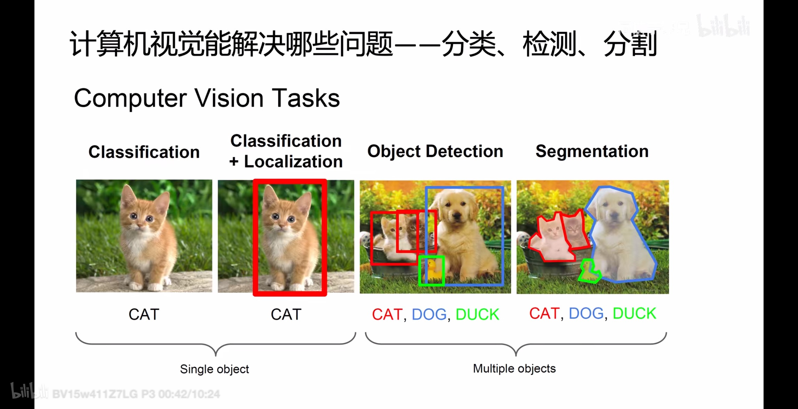
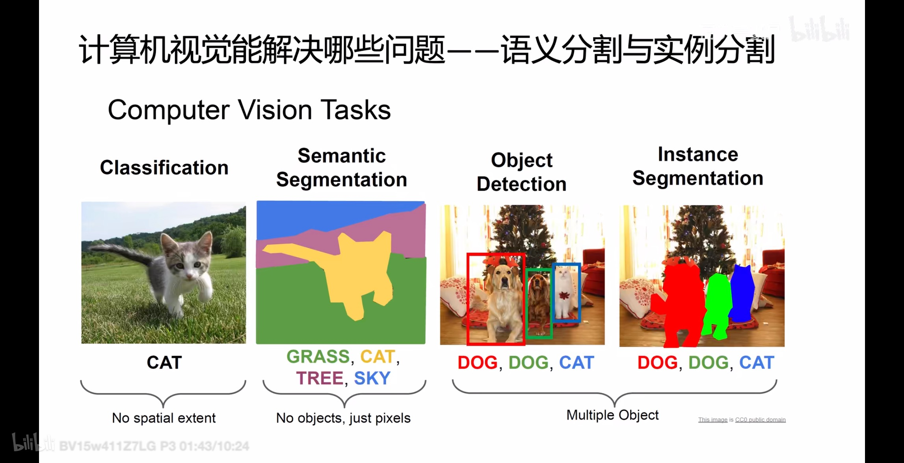
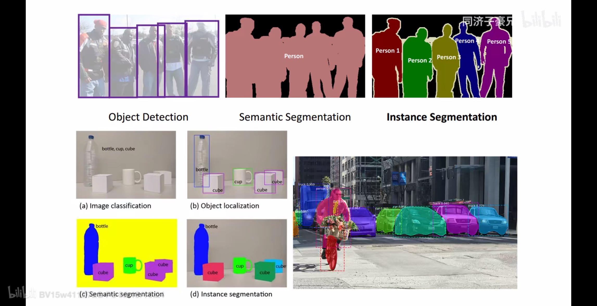
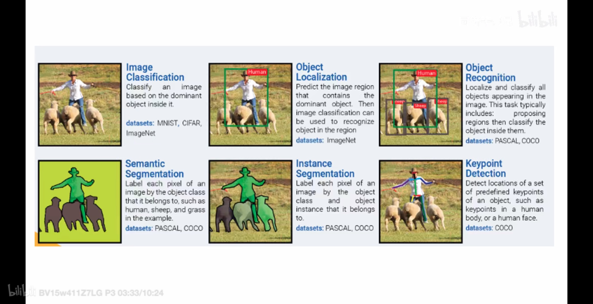
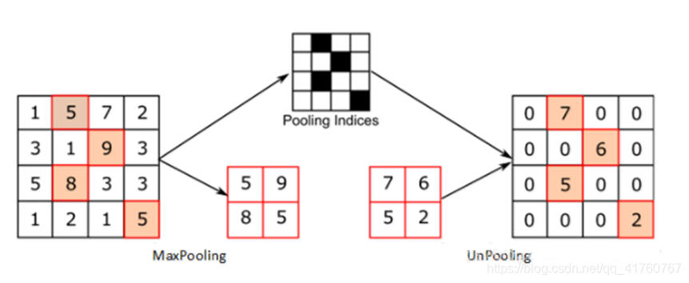
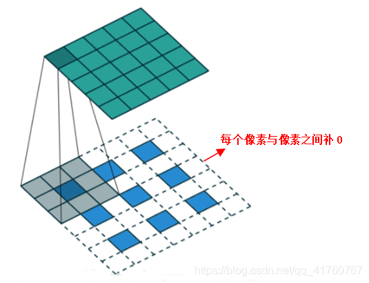

# 分类方法

人工智能可分为四大主要组成部分：

1.  计算机视觉（CV）：辨识图像的形状、颜色、动作及含义

2.  自然语言处理（NLP）：理解人类的自然语言，识别对话意图、归纳文章主题，并能够以自然语言进行人机交流

3.  推理与规划（启发式算法）：能根据已有的知识，遵循逻辑推理出解决问题的方法

4.  仿真机器人：能运动，包括操作工具、跑动、避开障碍物等

按智能水平，可分为：

1.  弱人工智能：即应用型人工智能，拥有部分人类智能，能且只能在限定领域解决特定问题

2.  强人工智能：即通用型人工智能，拥有人类的全部智能，能够胜任人类的所有工作

3.  超人工智能：远超人类目前表现出的智能水平

按发展思路，可分为：

1.  连接主义

2.  符号主义

3.  机器学习：**基于统计学**

按学习方式，可分为：

1.  有监督学习(Supervised Learning)
- 主要原理：监督学习是根据带标签的训练数据来学习一个模型，主要目标是预测新数据的标签。在训练过程中，算法会尝试最小化预测标签与真实标签之间的差异。
- 与其他方式的关系：监督学习需要大量的带标签数据进行训练，而非监督学习、半监督学习和自监督学习不需要或仅需要部分带标签数据。
- 典型任务：朴素贝叶斯分类器、决策树、SVM、逻辑回归、线性回归、集成学习

2.  无监督学习(Unsupervised Learning)
- 主要原理：在没有标签的数据上进行学习，主要目标是发现数据中隐含的结构或模式
- 与其他方式的关系：无监督学习不依赖带标签的数据，而监督学习、半监督学习和自监督学习需要利用标签信息。
- 典型任务：聚类、降维(PCA、SVD矩阵分解、ICA独立成分分析)、密度估计

3.  半监督学习(Semi-Supervised Learning)
- 主要原理：结合了监督学习和无监督学习。使用少量带标签数据和大量无标签数据进行模型训练，目标是利用无标签数据的结构信息来改善模型在有标签数据上的表现。
- 与其他方式的关系：半监督学习在监督学习和非监督学习之间，利用了有标签数据的监督信息和无标签数据的结构信息。
- 典型任务：

4.  自监督学习(Self-Supervised Learning)：
- 主要原理：一种特殊的监督学习方法，通过从输入数据中自动生成标签来进行学习。通常涉及到将输入数据的一部分作为目标或标签，而模型的任务是根据剩余的输入数据来预测这些目标。
- 与其他方式的关系：自监督学习可以看作是监督学习的一种，但它不需要额外的标签数据。相较于非监督学习，自监督学习有明确的预测任务。
- 典型任务：

5.  迁移学习

6.  强化学习：更偏重于智能体与环境的交互

神经网络按网络深度，可细分为：

1.  神经网络：感知机MLP、线性回归、逻辑回归

2.  多层神经网络（深度学习）：DNN前馈神经网络、CNN、RNN

按信息来源或形式的种类，可分为：

1.  单模态：只有一种信息来源或形式，如只有视觉或只有语言

2.  多模态：有多种信息来源或形式，如视觉、听觉、触觉、嗅觉、语言等。多模态可以利用不同模态之间的互补性和关联性，提高信息的完整性和准确性，实现更丰富和复杂的任务，从而实现更接近人类的认知和交互方式。

按模型参数量或复杂度，可分为：

1.  小模型：参数量通常在千万以下，如LeNet、AlexNet、LSTM等，是深度学习的基础和起点，相对简单和高效，但也存在信息缺失或不确定性的问题，难以实现复杂和丰富的任务。

2.  中模型：参数量通常在千万到十亿之间，如 BERT、ResNet、Transformer等，是目前应用最广泛的模型，可以在各种领域和任务中取得较好的效果，但也面临着数据标注、模态转换、对齐融合等挑战。

3.  大模型：参数量通常超过百亿或千亿，如GPT-3、盘古、Switch Transformer等，需要大量的数据和计算资源来训练，但可以实现更强的泛化能力和自监督学习能力，被称为基础模型或基石模型。

按研究对象和任务，可分为：

1.  CV：目标分类、目标识别、动作识别、目标跟踪
2.  NLP：翻译、语音识别、问答系统、搜索
3.  机器人（动态规划）：接收外界信息并对其做出反应与控制，并完成各种复杂动作与任务
4.  决策系统：AlphaGo、量化投资
5.  大数据应用：推荐系统、广告投放、精准营销
6.  大模型：生成模型（文生文、文生图、文生视频、图生文、图生视频）

# 任务领域

## CV

分类：

- 目标检测
- 目标定位
- 物体识别
- 物体跟踪
- 实例分割
- 语义分割
- 图像修复
- 盲图像修复，也称为盲图像补全，是指在不知道图像缺失区域的具体情况（例如形状、位置等）的条件下，对图像进行修复的技术。这种技术的目标是在没有明确掩模信息的情况下，自动估计缺失区域并生成合理的图像内容
- 图像合成
- 超分
    - 盲图像超分：blind和non-blind的区别是是否假设退化核已知并将其作用于图像来做网络训练
- 光流
- HDR
- 锐化
- 降噪
- 增强
- Imaging
- inpainting
- 图像和谐化
- 本征图像分解

常见的研究领域有：图像生成、图像识别、生成对抗网络、图像预处理、边缘检测、纹理分析、光流、图像分割、变化检测、跨域学习、小样本学习、域适应、半监督学习、无监督学习、自监督学习、注意力机制、图卷积网络、元学习、目标检测、异常检测等等太多了，都是大领域。

常用的CV模型有：VGG系列、Resnet系列、Densenet系列、inception系列、Googlenet系列以及效果最佳的Efficientnet系列、GAN系列、数据增强系列、注意力机制系列等等。

{width="6.299305555555556in"
height="3.2375240594925634in"}{width="6.299305555555556in"
height="3.2375240594925634in"}{width="6.299305555555556in"
height="3.2375240594925634in"}{width="6.299305555555556in"
height="3.2375240594925634in"}

## NLP

常见的研究领域有：词义消解、指代消解、语义角色标注、中文分词、问答系统、情感倾向性分析、推荐系统、阅读理解、知识图谱、隐喻机器处理、命名实体识别、关系挖掘、事件提取、文本分类、信息检索、信息抽取、机器翻译等。

常用的NLP模型有：RNN、Seq2Seq、Transformer、GRU、GPT、LSTM、Bert系列、Elmo、
XLNet等。

## 顶会及时间线

机器学习三大顶会：ICML、NeurlPS、ICLR

CV三大顶会：CVPR、ICCV、ECCV

IJCAI -\> SIGIR-\> ECCV (偶数年)-\>ICCV (奇数年)-\> ACMMM -\> AAAI \>
CVPR

[目标分类](https://docs.qq.com/doc/DT0hNam52VXVpTGRr?is_no_hook_redirect=1)

[目标检测](https://docs.qq.com/doc/DT1JNQmRIUmVtSXN4?u=15ed59833fd54d19bc78ed3ee13df741)

## 目标定位

## 语义分割

## 实例分割

## 目标识别

## 生成模型

# 重要模块

- ResBlock

- DenseBlock

- SE block

- PSA

- PCD Align

- TSA Fusion

# 卷积类型

## 转置卷积(Transposed convolution)

又称为反卷积(deconvolution)，输入与输出正好一一倒置，看上去就像，已知正向卷积的输出图像，卷积核，得到正向卷积中的原始图像，如同y=x\*k被倒置成x=y\*k，对于输出中的每个值，卷积核k只有一部分参数真正起作用，且具有周期规律，如被周期性地筛选一般。

具体操作为分像素卷积，如下：

## 分像素卷积(Sub-pixel convolution)

将转置卷积的输入x，进行周期性的空洞(dilation)填空0，输出y=x\*k等同于转置卷积的效果

## 空洞卷积

## 深度可分离卷积(Depthwise Separable Convolution, DSC)

由depthwise(DW)和pointwise(PW)两个部分结合起来，用来提取特征feature
map，相比常规的卷积操作，其参数数量和运算成本比较低。

DW完全是在二维平面内进行，卷积核的数量与上一层的通道数相同（通道和卷积核一一对应）；

PW与常规卷积运算非常相似，卷积核尺寸为1×1×M，将上一步的map在深度方向上进行组合生成新的Feature
map

## 可变形卷积(Deformable Conolution)

## 反卷积

# 卷积相关公式

## 卷积层输出size计算公式

{width="1.8020833333333333in"
height="0.1875in"}

其中，i：input size，p : padding size，k : kernel size，s : stride

## 卷积层参数量计算公式

{width="4.791666666666667in"
height="0.16666666666666666in"}

# 上采样

## upsample

通常指最邻近、双线性、三线性插值上采样。

## UnPooling（反池化上采样）

MaxPooling的逆操作，记住MaxPooling时最大值的位置index，UnPooling时最大值的位置填充输入值，其余位置置为0。出自[Visualizing
and Understanding Convolutional
Networks](https://arxiv.org/pdf/1311.2901v3.pdf)

{width="3.2907841207349082in"
height="1.3514359142607175in"}

## 反卷积（转置卷积）

通常用来对卷积层的结果进行上采样，使其恢复到原始分辨率。

普通卷积通常会使分辨率降低，如需增加分辨率可以在输入图像四周填充0，但这种方法会导致最边上的信息不太好，因此可以平均下，改为在输入图像的每个像素之间填充0，如下图：

{width="2.1770833333333335in"
height="1.6684186351706036in"}

## PixelShuffle

输入(B, C\*r\*r, H, W)特征图，输出(B, C, H\*r,
W\*r)。先通过卷积得到C\*r\*r通道的特征图，再通过周期筛选(periodic
shuffle)得到高分辨率图像。出自《[Real-Time Single Image and Video
Super-Resolution Using an Efficient Sub-Pixel Convolutional Neural
Network](https://arxiv.org/abs/1609.05158)》

在分像素卷积中，卷积核k被周期筛选，可分拆为多个互相独立的小卷积核。反卷积即为使用这些小卷积核直接对原始输入进行卷积，并对卷积结果的大分辨率维度C进行周期筛选转换为大分辨率维度H和W，可得到与分像素卷积相同的结果。

# 轻量化

模型压缩

剪枝

量化

蒸馏

# 降维

带stride的卷积：会将很大计算量放在网络头部，所以效率很低

pooling：可能会使特征出现人为丢失

Unshuffle：可以将Unshuffle理解成Pixelshuffle的对偶

# 重参数

原理可以归结为，利用卷积的同质性和可加性把不同的卷积进行融合。从上图中可以看到，开始的计算结构有三个链接：一个跳跃链接、一个1x1卷积和一个3x3卷积，通过卷积的两个特性可将它们最终归并成一个3x3卷积。大家可能有疑问，为什么不可以直接使用3x3卷积呢，这是因为三个链接的学习力度是不一样的，跳跃链接、1x1和3x3对特征抽取的力度不同，所以可以使用一个很简单的策略，不增加额外计算量即可提升卷积模块的学习性能。在训练阶段采用重参数，在infer阶段则是把它归并成单个卷积。

# Word Embeding

# 损失函数

参考[损失函数](https://docs.qq.com/doc/DT3VnS1BTdUVzb0No)

# Normalization（规范化）

参考[Whitening（白化）](https://docs.qq.com/doc/DT29OZk5xamx0bVNM)文档中的Normalization章节

# 传统机器学习

参考[传统机器学习](https://docs.qq.com/doc/DT3ZGSUZXb093b1pB)

集成学习

迁移学习

元学习

reinforcement learning (RL) without supervised fine-tuning (SFT)

# Ensemble

目的是通过不同的方法，将通过多模型、多输入等方法推理产生的多个结果进行组合，从而期望得到更好的结果。

## Multi-model ensemble

将同一输入采用不同模型推理的输出结果进行组合。会增加总的推理计算量。

## Self-ensemble

将不同输入采用相同模型推理的输出结果进行组合，输入可通过翻转、旋转、Channel Shuffle等方法产生多个变体。会增加总的推理计算量。

## Feature Ensemble

将不同模型的权重参数进行加权平均产生新的模型权重参数，采用新的模型权重参数对输入进行推理，总的推理计算量保持不变。
