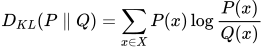
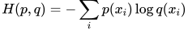
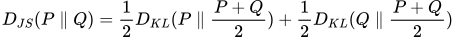
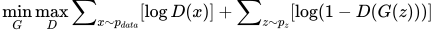

# 相关基础

## 熵

{width="2.25in"
height="0.3958333333333333in"}

## 相对熵（KL散度）

用于衡量两个分布之间距离，但不对称，从不同方向计算会得到不同的距离：

{width="2.75in" height="0.5in"}

KL散度在GAN中非常容易造成模式崩塌，即生成数据的多样性不足。

## 交叉熵

{width="2.4166666666666665in"
height="0.3958333333333333in"}

p和q的交叉熵可以看做是，使用分布q(x) 表示目标分布p(x)的困难程度。

## JS散度

在KL散度的基础上进行了修正，对两个方向KL散度取平均值，保证了对称性：

{width="4.739583333333333in"
height="0.3854166666666667in"}

JS散度存在一个严重的问题：两个分布不重叠时，JS散度为零，而在训练初期，两个分布非常大可能不重叠。

无论KL散度还是JS散度，直接用作loss时，都是难以训练的：由于分布只能通过取样计算，这个loss在每次迭代时都几乎为零。

## Gram矩阵

n维欧式空间中任意n个向量之间两两的内积所组成的矩阵，称为这k个向量的格拉姆矩阵(Gram matrix)

$$
G = A^T A = \begin{bmatrix} a_1^T \\ a_2^T \\ \vdots \\ a_2^T \end{bmatrix} \begin{bmatrix} a_1 a_2 \cdots a_n \end{bmatrix}
$$

很明显，这是一个对称矩阵。

格拉姆矩阵可以看做feature之间的偏心协方差矩阵（即没有减去均值的协方差矩阵），在feature map中，每个数字都来自于一个特定滤波器在特定位置的卷积，因此每个数字代表一个特征的强度，而Gram计算的实际上是两两特征之间的相关性，哪两个特征是同时出现的，哪两个是此消彼长的等等。

格拉姆矩阵用于度量各个维度自己的特性以及各个维度之间的关系。内积之后得到的多尺度矩阵中，对角线元素提供了不同特征图各自的信息，其余元素提供了不同特征图之间的相关信息。这样一个矩阵，既能体现出有哪些特征，又能体现出不同特征间的紧密程度。 

# Perceptual Loss

出处：李飞飞团队，发表于ECCV2016

论文：[Perceptual Losses for Real-Time Style Transfer and Super-Resolution](https://arxiv.org/abs/1603.08155)

参考文章：

<https://fengweiustc.github.io/paper-reading/2019/11/05/perceptualLoss/>

## 基本思想

在CV任务中，需要把输入图片转化成目标图片，这个目标图片不一定是精确的某张图，可能是指定的图像风格迁移、超分辨率等目标。传统的pixel-wise loss追求像素级的值相等。
然而并不是pixel-loss低，output和target就会差距小. 因此, 在侧重追求视觉效果更高level的任务中, 以feature作为loss更能反映实际的优化方向。

## 创新意义

产生了一个非常重要的idea，那就是可以将CNN提取出的feature，作为目标函数的一部分，通过比较待生成的图片经过CNN的feature值与目标图片经过CNN的feature值，使得待生成的图片与目标图片在语义上更加相似(相对于Pixel级别的损失函数)。

## 系统框架

使用预训练VGG-16模型，分别对GT和网络生成结果，提取特征，衡量高层特征之间的距离，即Perceptual Differences，使高层特征接近，而VGG模型的高层特征能体现内容和全局结构，因此具有感知能力。

网络分为两部分，其中，Image Transfrom Net是待训练的网络，Loss Netword(VGG-16)是预训练的模型，参数冻结固定不变。

## 计算公式

分为两部分：content loss和style loss

### content loss

$$
\ell ^{\phi, j}_{feat}(\hat{y},y) = \frac {1} {C_j H_j W_j} \left \| \phi_j(\hat{y}) - \phi_j(y) \right \| _2^2
$$

其中，$\phi_j(\hat{y})$ 和 $\phi_j(y)$ 分别指output和content target在VGG中的feature。

### style loss

定义了一个Gram matrix来衡量每个张量的无中心协方差大小。
如果输入feature的维度是C×H×W, 那么该矩阵的维度就是C×C. 这样做带来一个优势, 即使output和style target的shape不一样, 但依然可以计算loss.

TODO: 待研究

## 优点

一般会在imagenet这种大数据量级上进行训练，特征非常general，
输出结果具有高频细节信息，
风格转移或者超分辨率中，速度快，GAN中，收敛效果好，
收敛速度快，因为回传导数时，相比于pixel-pixel差异， 回传分布更具有普适性。

# GAN Loss

一切损失计算都是在D输出处产生的，而D的输出一般是true/fake的判断，所以整体上采用的是二进制交叉熵函数。

左边包含两部分minG和maxD：

- maxD：GAN训练一般是先保持G不变训练D。D的训练目标是正确区分true/fake，如果以1/0代表true/fake，则对第一项求和∑，因为输入来自真实数据所以期望D(x)趋近于1，即第一项越大越好，同理第二项求和∑的输入来自G生成数据所以期望D(G(z))趋近于0，即第二项越大越好，所以期望整体Loss越大越好，这就是maxD的含义。

- minD：保持D不变训练G，此时只有第二项求和∑有用，D的所有输入都是G生成的fake数据，但希望G能迷惑D，D(G(z))趋近于1，即第二项求和∑越小越好，这就是minG的含义。

# Wasserstein Loss

# Edge Loss

基于sobel算子

对抗loss：重复纹理生成

Pixel-loss：约束GAN可能产生的伪影
