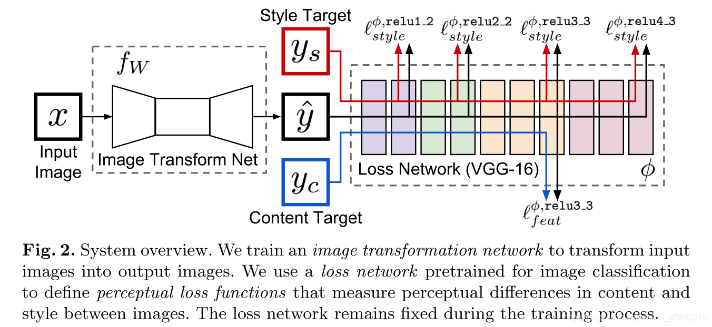
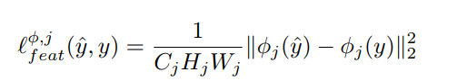
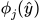
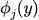

# 相关基础

## 熵

{width="2.25in"
height="0.3958333333333333in"}

## 相对熵（KL散度）

用于衡量两个分布之间距离，但不对称，从不同方向计算会得到不同的距离：

{width="2.75in" height="0.5in"}

KL散度在GAN中非常容易造成模式崩塌，即生成数据的多样性不足。

## 交叉熵

{width="2.4166666666666665in"
height="0.3958333333333333in"}

p和q的交叉熵可以看做是，使用分布q(x) 表示目标分布p(x)的困难程度。

## JS散度

在KL散度的基础上进行了修正，对两个方向KL散度取平均值，保证了对称性：

{width="4.739583333333333in"
height="0.3854166666666667in"}

JS散度存在一个严重的问题：两个分布不重叠时，JS散度为零，而在训练初期，两个分布非常大可能不重叠。

无论KL散度还是JS散度，直接用作loss时，都是难以训练的：由于分布只能通过取样计算，这个loss在每次迭代时都几乎为零。

## Gram矩阵

# Perceptual Loss

出处：李飞飞团队，发表于ECCV2016

论文：[Perceptual Losses for Real-Time Style Transfer and
Super-Resolution](https://arxiv.org/abs/1603.08155)

参考文章：

<https://fengweiustc.github.io/paper-reading/2019/11/05/perceptualLoss/>

## 基本思想

在CV任务中，需要把输入图片转化成目标图片，这个目标图片不一定是精确的某张图，可能是指定的图像风格迁移、超分辨率等目标。传统的pixel-wise
loss追求像素级的值相等.
然而并不是pixel-loss低，output和target就会差距小. 因此,
在侧重追求视觉效果更高level的任务中,
以feature作为loss更能反映实际的优化方向。

## 创新意义

产生了一个非常重要的idea，那就是可以将CNN提取出的feature，作为目标函数的一部分，通过比较待生成的图片经过CNN的feature值与目标图片经过CNN的feature值，使得待生成的图片与目标图片在语义上更加相似(相对于Pixel级别的损失函数)。

## 实现方法

使用预训练VGG-16模型，分别对GT和网络生成结果，提取特征，衡量高层特征之间的距离，即Perceptual
Differences，使高层特征接近，而VGG模型的高层特征能体现内容和全局结构，因此具有感知能力。

{width="6.299305555555556in"
height="2.898053368328959in"}

网络分为两部分，其中，Image Transfrom Net是待训练的网络，Loss
Netword(VGG-16)是预训练的模型，参数冻结固定不变。

计算公式：

{width="4.083333333333333in"
height="0.7306157042869641in"}

其中，{width="0.4270833333333333in"
height="0.20833333333333334in"}和{width="0.40625in"
height="0.20833333333333334in"}分别指output和content
target在VGG中的feature。

## 优点

一般会在imagenet这种大数据量级上进行训练，特征非常general

输出结果具有高频细节信息

风格转移或者超分辨率中，速度快，GAN中，收敛效果好

收敛速度快，因为回传导数时，相比于pixel-pixel差异， 回传分布更具有普适性

# GAN Loss

{width="4.53125in"
height="0.3229166666666667in"}

一切损失计算都是在D输出处产生的，而D的输出一般是true/fake的判断，所以整体上采用的是二进制交叉熵函数。

左边包含两部分minG和maxD：

- maxD：GAN训练一般是先保持G不变训练D。D的训练目标是正确区分true/fake，如果以1/0代表true/fake，则对第一项求和∑，因为输入来自真实数据所以期望D(x)趋近于1，即第一项越大越好，同理第二项求和∑的输入来自G生成数据所以期望D(G(z))趋近于0，即第二项越大越好，所以期望整体Loss越大越好，这就是maxD的含义。

- minD：保持D不变训练G，此时只有第二项求和∑有用，D的所有输入都是G生成的fake数据，但希望G能迷惑D，D(G(z))趋近于1，即第二项求和∑越小越好，这就是minG的含义。

# Wasserstein Loss

# Edge Loss

基于sobel算子

对抗loss：重复纹理生成

Pixel-loss：约束GAN可能产生的伪影
