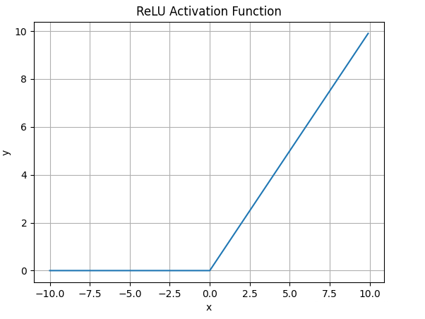

激活函数

Sigmoid

表达式

{width="1.1875in"
height="0.3958333333333333in"}

曲线图

{width="2.512983377077865in"
height="1.8736384514435696in"}

优点

梯度平滑，便于求导，防止训练中出现突变的梯度

输出范围是(0,
1)，非常适合用于输出0～1范围内的概率值，如二分类的类别或置信度

缺点

由于导数都小于0.25，容易造成梯度消失；权重值较大时梯度较小，存在梯度饱和问题

包含指数运算，比较消耗计算资源

输出不是以0为中心，梯度可能会向特定方向移动

Tanh

sigmoid的改进版本

表达式

{width="3.28125in"
height="0.4166666666666667in"}

曲线图

{width="2.6354166666666665in"
height="1.874633639545057in"}

优点

输出范围是(-1, 1)，中心对称，负输入映射为负，零输入映射为0，

输出以0为中心

缺点

仍然存在梯度饱和问题

仍然包含指数运算，比较消耗计算资源

ReLU

表达式

{width="1.40625in"
height="0.1875in"}

曲线图

{width="2.5in"
height="1.8770756780402449in"}

优点

解决了梯度消失和饱和的问题，当输入值为正时，梯度值始终不会为0

具有线性、非饱和的性质，在SGD中能快速收敛

计算复杂度低

缺点

输出不是以0为中心

Dead ReLU问题：负输入的梯度为0，导致参数不会更新，需要避免参数为负值

LeakyReLU

表达式

{width="2.8645833333333335in"
height="0.1875in"}

曲线图

{width="2.3854166666666665in"
height="1.8736515748031497in"}

优点

解决了ReLU的Dead ReLU问题

具有线性、非饱和的性质，在SGD中能快速收敛

计算复杂度低

缺点

近似线性，在非线性映射的复杂任务中效果不好

ReLU6

{width="2.0833333333333335in"
height="0.1875in"}

Softmax

表达式

{width="1.7604166666666667in"
height="0.4375in"}

曲线图

{width="2.59375in"
height="1.876061898512686in"}

优点

输出范围(0, 1)，将输入值的相对差异放大

常用于输出层，将最终输出构造为概率分布，适用于多分类问题

缺点
