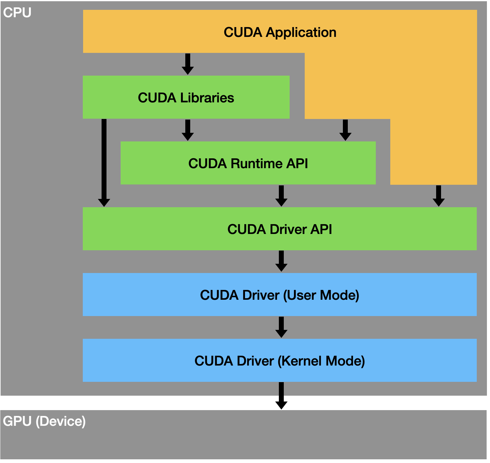

# CUDA

## 系统框架

<div align="center">

</div>

`CUDA`架构分为2大部分：`Host`、`Device`。一般而言，`Host`指的是`CPU`，`Device`指的是`GPU`。

主程序由`CPU`来执行，当遇到数据并行处理的部分，`CUDA`就会将程序编译成`GPU`能执行的程序，并传送到`GPU`。

基于 CUDA 开发的程序代码在实际执行中分为 2 种，一种是运行在 CPU 上的宿主代码（Host Code），一种是运行在`GPU`上的设备代码（Device Code）。不同类型的代码由于其运行的物理位置不同，能够访问到的资源不同

CUDA软件架构可细分为多层，包含以下部分：

- CUDA Driver
    - 同一个机器只能安装一个版本
    - 可细分为
        - CUDA Kernel-Mode Driver：即平常所说的GPU Driver，一般通过下载官网驱动的方式
        - CUDA User-Mode Driver
- CUDA Driver API
    - `GPU`设备的抽象层，通过提供一系列接口函数来操作`GPU`设备，性能好，但编程难度高
    - 由GPU Driver Installer安装
    - 典型文件有libcuda.so
- CUDA Runtime API
    - 基于`CUDA Driver API`封装的上层接口，内部调用`CUDA Driver API`，从而降低编程难度
    - 提供应用开发接口和运行时组件，包括基本数据类型的定义和各类计算、类型转换、内存管理、设备访问和执行调度等函数。
    - 同一个机器可安装多个版本
    - 有多种安装方法，包括`CUDA Toolkit Installer`安装、pytorch安装包安装
    - 典型文件有libcudart.so/nvcc
- CUDA Libraries
    - 是对`CUDA Runtime API`更高一层的封装，通常是一些成熟高效的函数库
    - 常见的库有：`cuFFT`, `cuBLAS`，这是两个重要的标准数学运算库，解决的是典型的大规模并行计算问题
- CUDA Toolkit
    - 即`CUDA Runtime API`和`CUDA Libraries`
    - Ubuntu可通过`sudo apt-get install nvidia-cuda-toolkit`安装
    - Conda可通过`conda install -c conda-forge cudatoolkit`安装

相互关系：

- Nvidia将匹配的`CUDA Kernel-Mode Driver`和`CUDA User-Mode Driver`版本捆绑发布，因此安装完驱动之后即可调用`nvidia-smi`，就会显示`CUDA User-Mode Driver`版本
- `CUDA Driver API`向下兼容旧版本`CUDA Runtime API`，`CUDA Runtime API`版本号必须小于等于`CUDA Driver API`版本号
- 通常所说的`CUDA`都是指`CUDA Runtime API`（除非是驱动开发人员）
- 几乎所有的框架程序（如`Torch`）和`CUDA Application`所调用的`CUDA`都是`CUDA Runtime API`
- `nvidia-smi`查询的是`CUDA Driver API`版本
- `nvcc --version`查询的是`CUDA Runtime API`版本

[CUDA Toolkit release notes](https://docs.nvidia.com/cuda/cuda-toolkit-release-notes/index.html)，包含GPU驱动版本对应表。
[Minor Version Compatibility](https://docs.nvidia.com/deploy/cuda-compatibility/minor-version-compatibility.html)，包含CUDA Toolkit的最低driver要求

## 安装包区别

### GPU Driver Installer

包含GPU驱动和`CUDA Driver API`，可单独安装和升级

卸载nvidia GPU驱动
```
sudo /usr/bin/nvidia-uninstall
```

### CUDA Toolkit Installer

包含`CUDA Runtime API`，通常集成了`GPU Driver Installer`。

如果通过`CUDA Toolkit Installer`安装，`Runtime API`与`Driver API`的版本应该一致。
如果单独安装`GPU Driver Installer`，版本有可能不一致

CUDA Toolkit官网下载地址: [CUDA Toolkit download](https://developer.nvidia.com/cuda-downloads)
cuDNN官网下载地址：[cuDNN download](https://developer.nvidia.com/rdp/cudnn-archive)

安装CUDA Toolkit
```
sudo ./cuda_9.2_linux.run --no-opengl-libs
```

卸载CUDA Toolkit
```
sudo /usr/local/cuda-9.2/bin/uninstall_cuda-9.2.pl
```

### Pytorch

PyTorch安装包自带`CUDA Runtime API`，只包含库文件，不包含`nvcc`

## 相关命令区别

### `nvidia-smi`

- 管理和监控NVIDIA GPU设备，既显示GPU Driver版本，又显示`CUDA Driver API`版本，也即所支持的最高`CUDA Runtime API`版本(另一种说法是，默认的`CUDA Runtime API`版本，特别是对于docker而言，容易造成这个版本与`/usr/local/cuda`指向版本不同的情况）
- 装完GPU Driver就可以使用
- 只知道它自身构建时的CUDA Driver版本，并不知道安装了什么版本的CUDA Runtime API，甚至不知道是否安装了CUDA Runtime API

### `nvcc`

- `nvcc`是一个编译器，显示的是它自身构建时的`CUDA Runtime API`版本
- 一般是在安装`CUDA Runtime API`时附带的，系统中不一定存在`nvcc`，与`CUDA Runtime API`的安装方法有关
- 只知道它自身构建时的`CUDA Runtime API`版本，并不知道安装了什么版本的`GPU Driver`，甚至不知道是否安装了Driver
- 在一个系统有多套`CUDA Runtime API`时，需要明确实际执行的是哪个`CUDA Runtime API`版本对应的`nvcc`
- 通过`which nvcc`可查看实际执行路径，如`/usr/local/cuda-11.2/bin/nvcc`、`/usr/lib/nvidia-cuda-toolkit/bin/nvcc`

### cat安装路径version.txt

- `/usr/lib/cuda/version.txt` 属于 Linux distribution 的安装版本
- `/usr/local/cuda`是手动安装的版本，不依赖于系统分发

## 参考文献

[CUDA是什么](https://chenglu.me/blogs/what-is-cuda)

[CUDA环境详解](https://blog.csdn.net/weixin_44966641/article/details/123776001)

[不同命令查看cuda版本的区别](https://www.cnblogs.com/ining/p/17069111.html)

[CUDA Toolkit release notes](https://docs.nvidia.com/cuda/cuda-toolkit-release-notes/index.html)
