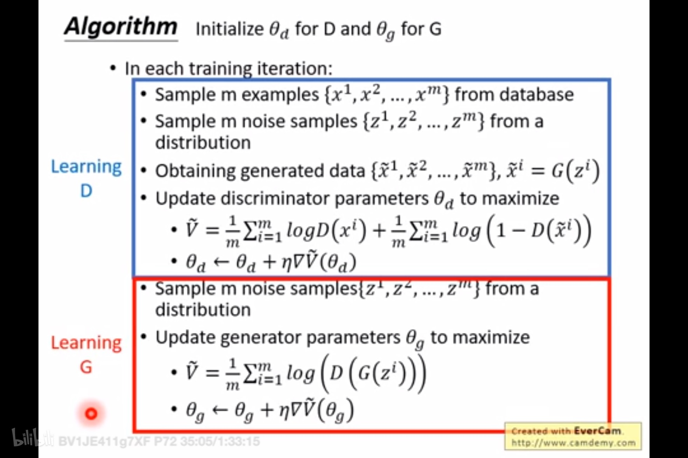

# 生成对抗网络GAN

## 原理
生成对抗网络（GAN）由生成器和判别器组成，通过博弈学习。生成器生成逼真图像，判别器区分生成图像与真实图像。

生成器用$G$表示，其输入为$z$，判别器用$D$表示，其输入既有`true`数据$x$，也有通过$G$生成的`fake`数据$G(z)$。  

$D$的训练目标是正确区分输入属于`true/fake`，`true/fake`分别以`1/0`表示，计算输入属于`true`的概率并输出，输出范围为`$[0, 1]$`。  

GAN的训练一般是先固定生成器$G$训练判别器$D$，此时$D$的输入即有`true`数据也有`fake`数据，然后再固定判别器$D$训练生成器$G$，此时$D$的输入只有$G$生成的`fake`数据，如此循环迭代。

## GAN Loss

$$
\min_{G} \max_{D} \sum_{x \sim P_{data}} \left [\log D(x) \right ] + \sum_{z \sim P_{z}} [\log(1 - D(G(z)))]
$$

$G$表示生成器，其输入为$z$，$D$表示判别器，其输入既有`true`数据$x$，也有通过$G$生成的`fake`数据$G(z)$。  
$D$的训练目标是正确区分输入属于`true/fake`，`true/fake`分别以`1/0`表示，计算输入属于`true`的概率并输出，输出范围为`$[0, 1]$`。

GAN Loss包含两部分：
- $\max_{D}$：此时固定$G$训练$D$，Loss对$D$生效，第一项求和$\sum$的输入来自真实数据所以期望$D(x)$趋近于`1 (true)`，即越大越好，同理第二项求和$\sum$的输入来自$G$生成数据所以期望$D(G(z))$趋近于`0 (fake)`，即越小越好，因此$1 - D(G(z))$越大越好
- $\min_{G}$：此时固定$D$训练$G$，Loss对$G$生效，此时$D$的所有输入都是$G$生成的`fake`数据，只有第二项求和$\sum$有用，训练目的是希望$G$能迷惑$D$，使得$D(G(z))$趋近于`1 (true)`，即越大越好，因此$1 - D(G(z))$越小越好

## 应用

GAN在多个领域有应用：

1. 图像生成：如名画生成和风格迁移
2. 数据增强：生成多样图像数据
3. 图像到图像翻译：如将风景转换为漫画
4. 超分辨率：提高图像分辨率
5. 填充缺失区域：填补图像中的缺失

## 挑战

GAN训练中存在问题：

### 不稳定收敛：

判别器和生成器竞争导致训练波动

当生成器和判别器都可以访问其整个策略集时，生成对抗网络具有唯一的全局最优点。
但在实际场景中，可以访问的数据并不一定是整个策略集。而当它们具有受限策略集时，未必能够稳定收敛到全局最优点。

### 模式崩溃

GAN经常遭受模式崩溃，从输入数据中丢失整个模式，以至于生成器陷入重复模式，无法正确泛化。例如，在包含每个数字的许多样本的MNIST数据集上训练的GAN可能只会生成个别数字0的图片。

发生这种情况的一种原因是生成器与判别器相比学习速度太快。
例如，对于训练期间的某些阶段，判别器以某种方式喜欢数字0比其他数字稍微多一点，则生成器可能会抓住机会只生成数字0，即使在判别器改进后，生成器也无法逃脱局部最优点。

### 梯度消失

如果判别器与生成器相比学习速度太快，那么判别器几乎可以完美地区分真实样本和生成样本。
这种情况下，生成器可能会有非常高的损失，无论向哪个方向改变参数，梯度都接近于零，这会导致生成器无法学习。

# WGAN (Wasserstein GAN)

为了应对GAN的梯度消失问题，Wasserstein提出了一种新的生成对抗网络WGAN，主要从两个方面进行改进。

## 利普希茨连续限制

将判别器的策略集限制为利普希茨连续。利普希茨连续函数限制了函数改变的速度，符合利普希茨条件的函数的斜率，必小于一个称为利普希茨常数的实数。即： 

$$
\parallel D_L \parallel \lt K
$$

这限制了判别器的斜率变化，抑制了判别器的学习速度，在一定程度上改进了生成器梯度消失的问题。

## 目标函数优化

将整个模型的估值函数改为：

$$
V_{WGAN} (G, D) = E_{x \sim p_{data}} [\log D(x)] - E_{z \sim p_{z}(z)} [\log D(G(z))]
$$

这限制了生成器在初始时刻的梯度，有效地解决了梯度消失问题。
