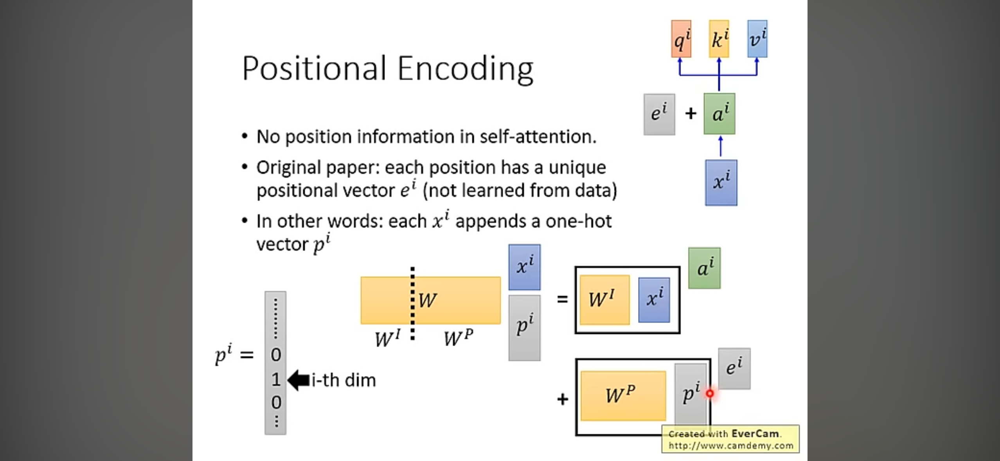

[Transformer模型详解（图解最完整版）](https://zhuanlan.zhihu.com/p/338817680)

[李宏毅讲解课程](https://www.youtube.com/watch?v=ugWDIIOHtPA&list=PLJV_el3uVTsOK_ZK5L0Iv_EQoL1JefRL4&index=61)

结构图

{width="6.299305555555556in"
height="4.101271872265967in"}

{width="6.299305555555556in"
height="8.959241032370954in"}

# 演化

BERT、GPT、ERNIE用于NLP

ViT用于图像分类，DETR和Deformable DETR用于目标检测

# 原理

QKV

## 注意力机制

## 自注意力机制

RNN并行处理困难，CNN/self-attention容易并行，CNN感受野有限，可使用self-attention来替换RNN

{width="4.229166666666667in"
height="5.083333333333333in"}

{width="6.299305555555556in"
height="2.905666010498688in"}{width="6.299305555555556in"
height="2.905666010498688in"}{width="6.299305555555556in"
height="2.905666010498688in"}

{width="6.299305555555556in"
height="3.2375240594925634in"}

## Multi-head注意力机制

{width="4.177083333333333in"
height="5.6064293525809274in"}

{width="6.299305555555556in"
height="2.905666010498688in"}

## 位置编码

{width="6.299305555555556in"
height="2.905666010498688in"}

{width="6.299305555555556in"
height="3.2375240594925634in"}{width="6.299305555555556in"
height="3.2375240594925634in"}{width="6.299305555555556in"
height="3.2375240594925634in"}

# 优缺点

优点：

Transformer关注全局信息，能建模更加长距离的依赖关系，而CNN关注局部信息，全局信息的捕捉能力弱。

Transformer避免了CNN中存在的归纳偏好问题

归纳偏置在机器学习中是一个很微妙的概念：在机器学习中，很多学习算法经常会对学习的问题做一些假设，这些假设就称为归纳偏好(Inductive
Bias)。归纳偏置可以理解为，从现实生活中观察到的现象中归纳出一定的规则(heuristics)，然后对模型做一定的约束，从而可以起到"模型选择"的作用，即从假设空间中选择出更符合现实规则的模型。可以把归纳偏好理解为贝叶斯学习中的"先验"。在深度学习中，也使用了归纳偏好。在CNN中，假设特征具有局部性(Locality)的特点，即把相邻的一些特征融合到一起，会更容易得到"解"；在RNN中，假设每一时刻的计算依赖于历史计算结果；还有attention机制，也是从人的直觉、生活经验归纳得到的规则。而Transformer可以避免CNN的局部性归纳偏好问题。

缺点：

Transformer复杂度比CNN高，但是ViT和Deformable
DETR给出了一些解决方法来降低Transformer的复杂度。

# ViT

[计算机视觉\"新\"范式:
Transformer](https://zhuanlan.zhihu.com/p/266069794)

论文：[An Image is Worth 16x16 Words: Transformers for Image Recognition
at Scale](https://arxiv.org/abs/2010.11929)

[github.com/lucidrains/vit-pytorch](https://github.com/lucidrains/vit-pytorch)

Vision
Transformer(ViT)是一篇将Transformer用于图片任务的工作。ViT的想法很朴素，直接对原图片进行等块分割并且拉直(flatten)，然后通过FC层将原图像素直接映射到初级特征，然后直接输入到Transformer中。这种思路相当于将每个小块按照顺序视为文本输入中的token输入到Transformer.

ViT将输入图片拆分成16x16个patches，每个patch做一次线性变换降维同时嵌入位置信息，然后送入Transformer，避免了像素级attention的运算。类似BERT\[class\]标记位的设置，ViT在Transformer输入序列前增加了一个额外可学习的\[class\]标记位，并且该位置的Transformer
Encoder输出作为图像特征。

{width="6.299305555555556in"
height="3.2475853018372702in"}

在输Transformer Encode之前需要加上［class］token以及Position
Embedding，都是可训练参数

patch距离越近，position embedding越相似
