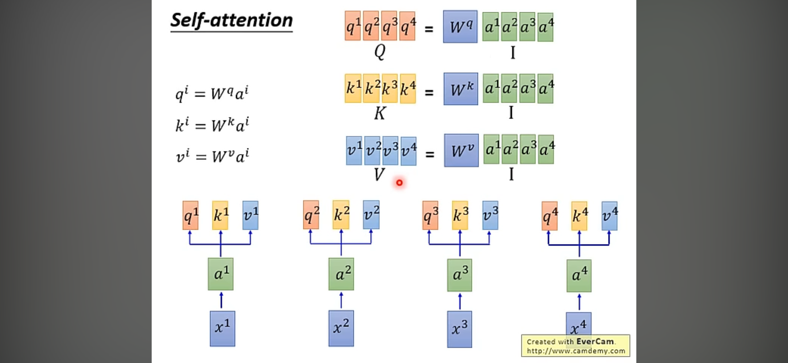

# Transformer

[Transformer模型详解（图解最完整版）](https://zhuanlan.zhihu.com/p/338817680)

[李宏毅讲解课程](https://www.youtube.com/watch?v=ugWDIIOHtPA&list=PLJV_el3uVTsOK_ZK5L0Iv_EQoL1JefRL4&index=61)

结构图

## 演化

BERT、GPT、ERNIE用于NLP

ViT用于图像分类，DETR和Deformable DETR用于目标检测

## 原理

QKV

### 注意力机制

### 自注意力机制

RNN并行处理困难，CNN/self-attention容易并行，CNN感受野有限，可使用self-attention来替换RNN

### Multi-head注意力机制

### 位置编码

## 优缺点

优点：

Transformer关注全局信息，能建模更加长距离的依赖关系，而CNN关注局部信息，全局信息的捕捉能力弱。

Transformer避免了CNN中存在的归纳偏好问题

归纳偏置在机器学习中是一个很微妙的概念：在机器学习中，很多学习算法经常会对学习的问题做一些假设，这些假设就称为归纳偏好(Inductive
Bias)。归纳偏置可以理解为，从现实生活中观察到的现象中归纳出一定的规则(heuristics)，然后对模型做一定的约束，从而可以起到"模型选择"的作用，即从假设空间中选择出更符合现实规则的模型。可以把归纳偏好理解为贝叶斯学习中的"先验"。在深度学习中，也使用了归纳偏好。在CNN中，假设特征具有局部性(Locality)的特点，即把相邻的一些特征融合到一起，会更容易得到"解"；在RNN中，假设每一时刻的计算依赖于历史计算结果；还有attention机制，也是从人的直觉、生活经验归纳得到的规则。而Transformer可以避免CNN的局部性归纳偏好问题。

缺点：

Transformer复杂度比CNN高，但是ViT和Deformable
DETR给出了一些解决方法来降低Transformer的复杂度。

# Vision Transformer (ViT)

Vision Transformer是一篇将Transformer用于视觉任务的工作。
ViT的想法很朴素，直接对原图片进行等块分割、变换和拉直(flatten)，通过FC层将原图像素直接映射到初级特征，加入[class] token和position embedding，然后直接输入到Transformer中。
这种思路相当于将每个小块按照顺序视为文本输入中的token输入到Transformer。

## 基本信息

论文：[An Image is Worth 16x16 Words: Transformers for Image Recognition at Scale](https://arxiv.org/abs/2010.11929)

代码：
- [官方代码](https://github.com/google-research/vision_transformer)
- [第三方pytorch代码](https://github.com/lucidrains/vit-pytorch)

解读文章：
- [计算机视觉新范式: Transformer](https://zhuanlan.zhihu.com/p/266069794)
- [Vision Transformer详解](https://blog.csdn.net/qq_37541097/article/details/118242600)

## 网络结构

网络结构主要由三个模块组成：
- Linear Projection of Flattened Patches ( Embedding Layer )
- Transformer Encoder
- MLP Head

### Embedding Layer

标准的Transformer模块要求输入的是token向量序列，即二维矩阵`[num_token, token_dim]`，
对于图像数据而言，其数据格式为`[H, W, C]`，是三维矩阵，所以需要先通过一个Embedding层来对数据做个变换。

以ViT-B/16为例，将输入图片`224x224`按照`16x16`的patch进行划分，得到196个patch，每个patch为`[16, 16, 3]`，接着通过一个线性变换得到长度为768的向量，即为token。

代码实现中，可直接使用一个卷积核大小为16x16、步距为16、通道数为768的卷积来实现。通过卷积将`[224, 224, 3]`变换为`[14, 14, 768]`，然后把`HW`两个维度展平即可变成一个二维矩阵`[196, 768]`。

此后，需要加上`[class]token`和`Position Embedding`，都是可训练参数。
- `[class]token`来源于BERT，在一堆token中插入一个专门用于分类的`[class]token`，也是一个长度为768的向量，与从图片中生成的token拼接在一起`Cat([1, 768], [196, 768])` $\to$ `[197, 768]`。
- Position Embedding就是Transformer中的Positional Encoding，这里采用的是一个可训练的参数`1D Pos. Emb.`，直接叠加到tokens，所以shape要一样。

以ViT-B/16为例，拼接`[class]token`后shape是`[197, 768]`，那么Position Embedding的shape也是`[197, 768]`。
并且，patch距离越近，position embedding越相似。

### Transformer Encoder

上方左图来自原论文，右图来自网络，根据官方代码绘制，将Dropout/DropPath也画出来了。

Transformer Encoder其实就是Transformer Block重复堆叠L次，其中需要注意以下几点：

1. Norm：采用Layer Norm
2. MSA: 为标准的Multi-Head Self Attention模块，简称`MSA`
3. MLP: 第1个全连接层会将输入节点数量翻4倍, 即`[197, 768] -> [197, 3072]`，第2个全连接层会将节点数量还原为`[197, 768]`
4. Dropout：在MSA和MLP之前有Dropout层，原论文代码实现直接使用Dropout层，但在`rwightmen`实现中使用的是DropPath (stochastic depth)，可能后者性能更好

### MLP Head

这一步只需要提出`[class]token`生成的对应结果就行，即从`[197, 768]`中抽取出对应的`[1, 768]`，然后通过MLP Head得到最终的分类结果。

原论文中有两种结构：
- Linear + tanh + Linear
- Linear

### 模型变体

在相同的网络结构下，原文作者实现 3 种变体，如ViT-B/16表示将输入图像划分为16x16尺寸的patch的“Base"变体。

以ViT-B/16为例，详细完整的结构图为：

原论文中，在Transformer Encoder后面其实还有一个Layer Normalization没有画出来。

# Swin Transformer

## 基本信息

论文：[Swin Transformer: Hierarchical Vision Transformer using Shifted Windows](https://arxiv.org/abs/2103.14030)

官方代码：[https://github.com/microsoft/Swin-Transformer](https://github.com/microsoft/Swin-Transformer)

## 网络结构

Swin Transformer想要解决的是原生 Transformer 的 Self-Attention 计算复杂度太高的问题。

相比ViT，Swin-Transformer的主要变化有：

- Windows-MSA (W-MSA)
- Hierarchical feature map 和 Patch Merging
- Shifted Windows MSA (SW-MSA)
- Relative position bias

由于在Swin Transformer Block中问题带W-MSA和带SW-MSA的Block前后成对搭配，故名Swin Transformer。

### W-MSA (Windows Multi-head Self-Attention)

本模块的作用是减少计算量。

具体而言，原生 Transformer 对 N 个 token 做 Self-Attention ，复杂度为 $O(N^2)$。
Swin Transformer 将 N 个 token 分为 $N/n$ 个窗口，$n$ 为常数，每个窗口 n 个token 进行Self-Attention计算，复杂度降为$O(Nn)$，考虑到 n 是常数，复杂度实际为 $O(N)$。

若$h$、$w$、$C$分别为feature map的高度、宽度和通道数，M为窗口的尺寸大小，则MSA和W-MSA的计算量分别为

$$
\Omega (\text{MSA}) = 4 h w C^2 + 2 (hw)^2 C \newline
\Omega (\text{W-MSA}) = 4 h w C^2 + 2 M^2 h w C
$$

分组计算虽然降低了 Self-Attention 的复杂度，但引入了 2 个新问题需要解决：
1. 分窗后 Transformer 的视野局限于 n 个token，看不到全局信息
2. 窗与窗之间的信息缺乏交互

因此，Swin Transformer 分别引入了 Hierarchical feature map 和 Shifted Windows-MSA。

### Hierarchical feature map 和 Patch Merging

每个 stage 前, 对$2 \times 2$组的特征进行融合和压缩，空间尺寸$H \times W \to \frac {H}{2} \times \frac {W}{2}$ ，特征维度$C \to 4C \to 2C$，这样视野就和CNN结构一样随着stage逐渐变大。

### SW-MSA (Shifted Windows Multi-head Self-Attention)

本模块的作用是为了解决引入 W-MSA 之后窗口之间无法进行信息交换的问题。

如上图，假设当前在第 L 层，进行左侧的常规的 W-MSA 之后，在第 L+1 层计算 W-MSA 时，将窗口向右方和下方各偏移 $\frac{M}{2}$ 像素，这就是 SW-MSA。

由于第 L+1 层偏移后的新窗口跨越了第 L 层的旧窗口的边界，因此提供了窗口之间信息交换的能力。

由上可知，W-MSA 与 SW-MSA 总是先后成对使用。

根据上图，偏移窗口后原来 4 个窗口变成 9 个窗口了，后面需要对 9 个窗口计算 MSA，增加了计算的麻烦程度，为了论文又提出了一种更加高效的计算方法`Efficient batch computation for shifted configuration`。

具体做法是：对于处于图像上方和左方边缘位置的patch A、B、C，进行cyclic shift从而补充到图像下方和右方，与图像原本的下方和右方边缘的patch同时计算MSA，完成计算后再将A、B、C移回原来位置。

cyclic shift之后，A、B、C的同窗口patch在空间上与A、B、C不相邻，为了防止它们之间信息交换，使用了masked MSA来屏蔽不相邻patch的信息，具体做法是在计算完MSA后，将不相邻patch的结果减去100，经过后续的SoftMax之后这些结果就被转换为0了。

### Relative position bias

这个创新点的目的是为了解决MSA中Q和K计算相关性时存在位置不同但position embedding相同的情况。

本质是将$M \times M$的patch之间的相对位置$[x, y]$，用类似图像逐行扫描的方式将二维坐标映射为一维的像素索引，即$index = y \times (2M - 1) + x$，此处$2M-1$是相对位置$x$和$y$的取值范围。

具体参考[Swin-Transformer网络结构详解](https://blog.csdn.net/qq_37541097/article/details/121119988)
