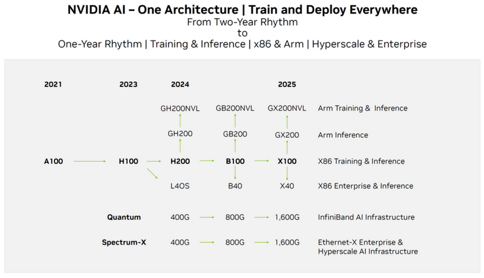
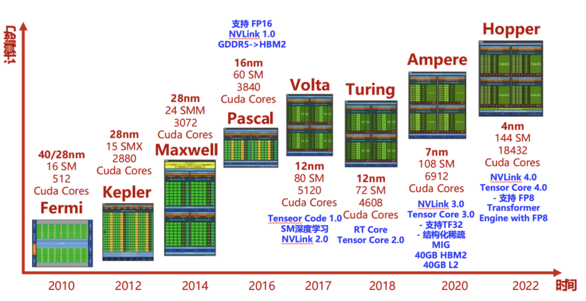
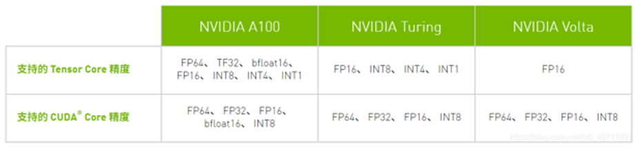
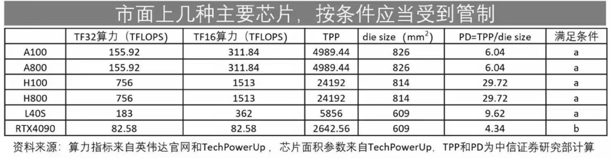
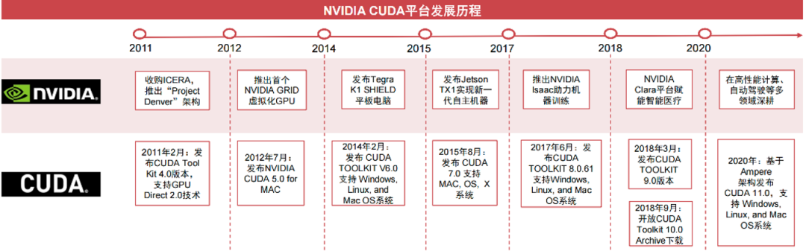
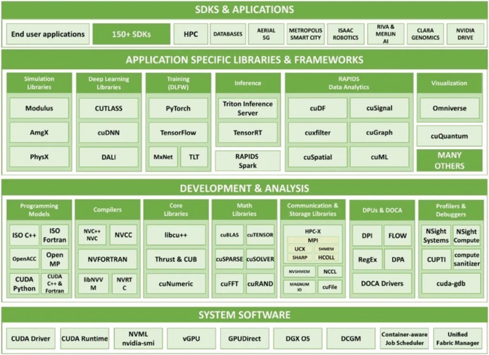
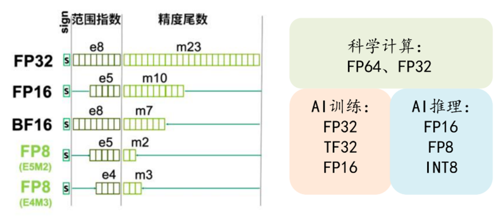
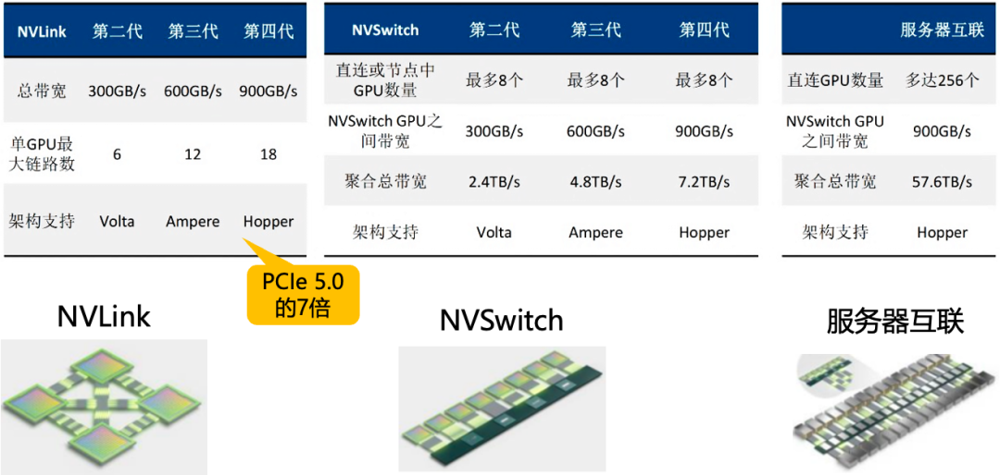
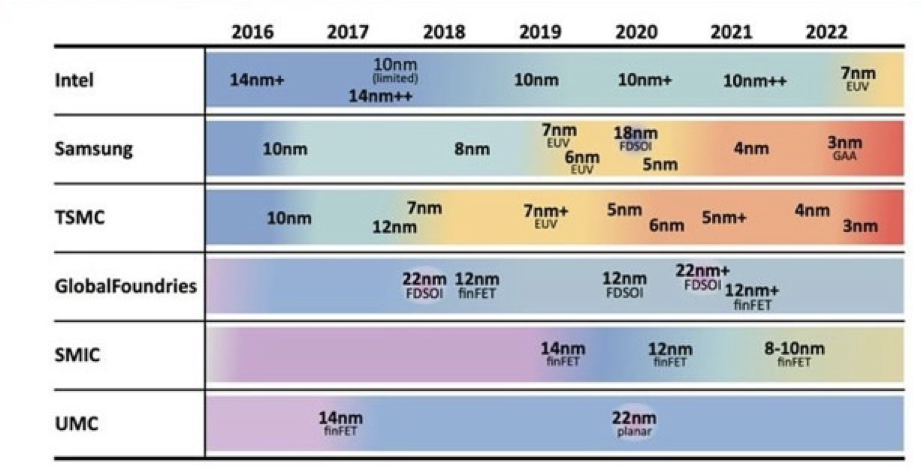

[https://www.livevideostack.cn/news/interview-20231226/](https://www.livevideostack.cn/news/interview-20231226)

# NVIDIA GPU上市计划

{width="6.299305555555556in"
height="3.617737314085739in"}

# NVIDIA GPU架构演进

{width="6.299305555555556in"
height="3.2429757217847768in"}Ada 架构和 Hopper 架构（2022年）

典型代表有H100、H800、著名的游戏卡 Geforce RTX 4090。采用Tenser Core
4.0。其中这代架构最突破的变化是，Tenser Core 开始支持 FP8，就是将 FP16
又变小为 FP8，这是在AI领域中都要抢购4090的原因。

## Ampere 架构（2020年）

典型代表有A100、A800、V100、以及游戏卡Geforce RTX 3090。采用Tenser Core
3.0 。其Tensor Core 主要支持了三个新的数据类型，FP64、TF32和BF16， BF16
非常关键，BF16 就是将 FP16
的指数位和精度位做了偏移，正是因为这个偏移使得BF16 在 AI
训练的展示中范围大大扩大，所以 BF16 也是现在很多 AI
模型所训练的主流选择。

支持结构化稀疏。

{width="6.299305555555556in"
height="1.4620942694663168in"}

# NVIDIA GPU算力对比

{width="6.299305555555556in"
height="1.6331528871391077in"}H100比A100强不是因为密度提升，其实就密度本省只有1.2倍的提升；更多是因为微架构的设计。新的Tensor
Core提升了2倍，新的Transformer引擎提升了2倍，频率提升1.3倍，总计提升了6倍（在大模型下表现）。

英伟达针对2022年的禁令，推出了降低参数配置的阉割卡，也就著名的A800，H800，主要降低了卡间通行速率，和浮点算力
(FP64,FP32)。

B100的性能相当于A100的6-8倍

# CUDA

{width="6.299305555555556in"
height="1.9656167979002626in"}{width="6.299305555555556in"
height="4.574435695538058in"}计算加速技术

## 浮点加速

{width="6.299305555555556in"
height="2.7063681102362205in"}一般来说，更少位数的浮点数运算需要的计算成本更低，因此选用更小位数的浮点数有利于提升性能降低成本，但也意味着数据的表示范围和精度的能力会降低，同时也要考虑表示范围和精度之间的平衡，否则会导致数据信息的损失，在推理场景下具体表现为推理的效果会变差。在
AI
领域中，特别是推理领域，精度不是最敏感的因素，同时数据的分布也表现为集中在
0 值附近，因此在 AI
领域，在不损失较大效果的前提下采用更少位数的浮点数类型是一个非常不错的优化方案，它可以使得计算量大大减少，提升性能，降低硬件成本。

常见的浮点数类型有 64 位双精度 double（FP64）、32 位单精度
float（FP32)、16 位半精度 half、以及四分之一精度的 FP8 等。

其中，半精度在指数位和尾数位的分配上又可以细分成：BF16 和 FP16。同样 FP8
也可以细分成 E5M2和E4M3。FP8 总共使用 8
个比特位来表示一个浮点数。它包含两种编码格式E4M3 与 E5M2。对于 E4M3
而言，其包含 4 个指数位、3 个尾数位、以及 1 个符号位。E5M2 包含 5
个指数位、2 个尾数位、以及 1 个符号位。显然 E5M2 的表示范围要比 E4M3
大，但 E5M2 的精度上不如 E4M3。

把 FP8 来代替
FP16/BF16，训练和推理的性能至少可以提高一倍，而且效果上没有差异。相较于
int8，FP8
能够相对容易地实现全链路量化，将其性能提高一倍，成本降低一倍，同时量化损失更小，这是因为对于
0 值附近分布比较稠密，距离 0
值较远的数据比较稀疏的数据分布来说，FP8的精度和表示范围最合适，而 AI
领域的模型权重恰恰大概率符合这一特性。

对于 FP8 这样的新类型，也只有最新的 GPU
硬件上才会支持，而新的硬件也往往比较昂贵。

为了让开发者更方便地使用 fp8 来加速基于 Transformer 的模型，Nvidia
发布了 Transformer Engine (TE)。Transformer Engine (TE) 是一个用于在
NVIDIA GPU 上加速 Transformer 模型的库，包括在 Hopper GPU 上使用 8
位浮点（FP8）精度，在训练和推断中提供更好的性能和更低的内存利用率。TE
为主流的 Transformer
架构提供了一系列高度优化的构建块，以及一个类似于自动混合精度的
API，可以与特定框架的代码无缝集成使用。TE 还包括一个与框架无关的 C++
API，可以与其他深度学习库集成，以实现 Transformer 的 FP8 支持。

## Tensor Core

关于 CUDA
Core：（个人理解为GPU在通用计算领域定义的Core，属于抽象的编程概念）

NVIDIA 率先在 GPU 中引入了通用计算能力，使得开发者能利用 CUDA
编程语言来驱动。这时候 GPU 的核都是CUDA Core。由于一个 GPU 里面有大量的
CUDA Core，使得并行度高的程序获得了极大的并行加速。但是，CUDA Core
在一个时钟周期只能完成一个操作。

关于 Tensor
Core：（个人理解为GPU在FMA、矩阵计算领域定义的Core，属于抽象的编程概念）

GPU
最善于的做的"加乘运算"（GPU中有最常用的矩阵计算，就是先乘后加，也就是FMA）FMA：Z=W\*X+b。NVIDIA
为了进一步加速"加乘运算"，在 2017 年推出了 Volta 架构的
GPU，从这个架构开始 Tensor Core被引入。它可以在一个时钟周期完成两个
4×4x4 半精度浮点矩阵的乘法(64 GEMM per clock)。

例如，Pascal 架构没有 Tensor Core 的能力， Volta 架构引入了Tensor
Core之后，能够以 12 倍的效率完成加乘计算。

## 稀疏化加速（HyperAttention）：

Nvida 的 GPU
专门为稀疏矩阵做了优化，使得相同规模的稀疏矩阵的计算速度是稠密矩阵的 2
倍。

稀疏矩阵是在矩阵中大量都为
0（或者接近于0），能够通过硬件快速计算出来的矩阵。稀疏化是通过行和列的交换，最终把数据密度高的地方，拉到反斜线，对非反斜线区域数据置零，即剪枝，后面无论是加还是乘，都能很快计算出来。

剪枝能够很好用于长序列长度模型，当序列的上下文特别大时，剪枝的效果会非常明显。可以简单理解，随着上下文越长，剪枝效果越好。如果是因果论的模型（例如laMa模型），在很长的参数下会有20倍的差异，但是在非因果论的模型（例如GM模型），优势会少一些。大家可能见到过一个模型能支持很长的上下文，能够把《哈利波特》一本书读下去，其实并不难，只要用剪枝就能做出一定的效果。

## 投机采样（Speculative Decoding）

是 Google 和 DeepMind 在 2022
年同时发现的大模型推理加速方法。它可以在不损失生成效果前提下，获得 3x
以上的加速比。

投机采样是一种创造性的工程化加速方法，它与算子融合、模型量化等方法完全是不同维度的。其核心是，用一个比原模型小很多的草稿模型(draft
model)，来加速原模型的推理。草稿模型一般都会比原模型小很多倍，因此推理速度也是比原模型更快，消耗资源更少，但它有一个缺点，就是推理生产的
token 可能是不对的。

那怎么解决这个问题呢？很简单，解决方案是先让小的草稿模型推理若干的
token，然后再将这些 token
让大模型检验其是否合理。如果合理则继续让小模型接着推理，否则就大模型自行推理。

由于大模型检验小模型的推理结果是可以并行地检查多个 token
的，因此这个过程要比大模型自己一个一个的推 token
要快很多。这也就意味着，只要小模型在多数情况下的推理是正确的，那么整个的推理速度就会很快。

## 多卡互联

{width="6.299305555555556in"
height="2.9980030621172356in"}NVLink
主要用于两卡甚至四卡间的交替互联，但是卡多后则无法使用 NVLink，要用
NVSwitch。第二个图就是 NVSwtich
的数据，因为它在训练时数据非常大，一个卡的数据存不下来，就必须用卡间通信，卡间带宽是多卡互联技术在大模型训练时会遇到的非常大的瓶颈。

# GPU禁令对策

中国公司应该怎么应对"卡脖子"呢，大概有几个路径吧

第一：买不到卡，慢慢训练，时间变长

第二：走完全不同的技术路线，发展"小模型"发展量化，用低端卡（甚至比GeForce
RTX4090还要低的）来训练

第三：还有就是在国外用公开数据集训练，在国内用私有数据集Fine-Tuning。

还有就是用举国之力解决"卡脖子"问题。其实芯片设计能力其实不是最关键的瓶颈，FAB厂和光刻机才是最关键的问题。

这是FAB厂的目前能做到的能力表：

{width="6.299305555555556in"
height="3.2111428258967627in"}为什么 4090 是性价比最好的推理显卡?

相较于 H800 商用卡，消费级卡 4090 具有极高的性价比优势；

相较于 不支持 fp8 的 3090/A800 来说，4090 又支持 fp8 这一新特性；

在 40 系的同代卡中，4090 的显存又是最大的，性能最高的；

8 卡 4090 的整机基本上可以满足未量化 70B 级别的大模型推理。

因此综合来说，对于 fp8 有强需求的推理场景，4090
是各种因素平衡下最佳的选择。
