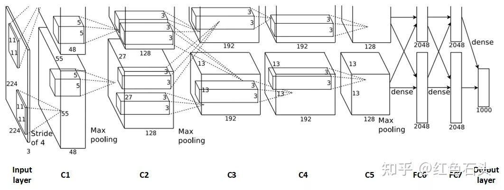
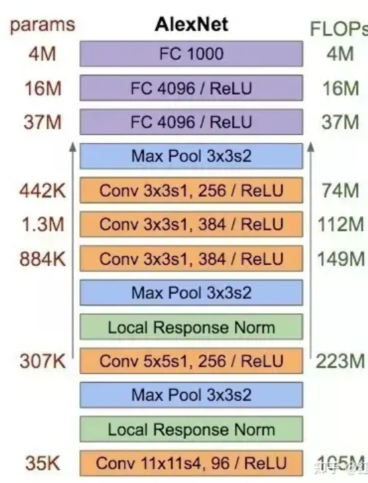
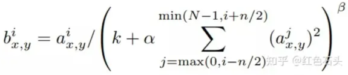

# 基本信息

论文标题：ImageNet Classification with Deep Convolutional Neural
Networks

论文地址：<http://www.cs.toronto.edu/~fritz/absps/imagenet.pdf>

解析文章：<https://zhuanlan.zhihu.com/p/467017218>

# 网络结构

{width="6.299305555555556in"
height="2.384482720909886in"}鉴于当时的硬件资源限制，由于AlexNet结构复杂、参数很庞大，难以在单个GPU上进行训练。因此AlexNet采用两路GTX
580 3GB
GPU并行训练。也就是说把原先的卷积层平分成两部分FeatureMap分别在两块GPU上进行训练（例如卷积层55x55x96分成两个FeatureMap：55x55x48）。上图中上部分和下部分是对称的，所以上半部分没有完全画出来。

原论文中，AlexNet的输入图像尺寸是224x224x3。但是实际图像尺寸为227x227x3。据说224x224可能是写paper时候的手误

# 参数量和计算量

{width="3.8333333333333335in"
height="5.03125in"}

参数量：大约6千万

34944 + 307456 + 885120 + 663936 + 442624 + 37752832 + 16781312 +
4096000 = 60964224

# 创新点

## 两种数据增强（data augmentation）方法

分别是：

- 镜像反射和随机剪裁：对图像做镜像反射，在原图和镜像反射的图（256×256）中随机裁剪227×227的区域，对左上、右上、左下、右下、中间分别做了5次裁剪，然后翻转，共10个裁剪，之后对结果求平均

- 改变训练样本RGB通道的强度值：对RGB空间做PCA（主成分分析），然后对主成分做一个（0,
  0.1）的高斯扰动，也就是对颜色、光照作变换，结果使错误率又下降了1%

## 激活函数ReLU

当时，标准的神经元激活函数是tanh()函数，这种饱和的非线性函数在梯度下降的时候要比非饱和的非线性函数慢得多。反向传播中，ReLU有输出的部分，导数始终为1。而且ReLU会使一部分神经元的输出为0

## Dropout

随机的断开全连接层某些神经元的连接，通过不激活某些神经元的方式防止过拟合。

重叠池化：避免了平均池化层的模糊化的效果，并且步长比池化的核的尺寸小，这样池化层的输出之间有重叠，提升了特征的丰富性。重叠池化可以避免过拟合，这个策略贡献了0.3%的Top-5错误率。

## 局部响应归一化(LRN)

{width="5.989583333333333in"
height="1.3020833333333333in"}

## 端到端训练

AlexNet网络，CNN的输入直接是一张图片，而当时比较多的做法是先使用特征提取算法对RGB图片进行特征提取。
