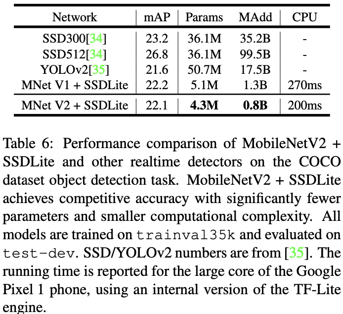

# MobileNetV1

## 基本信息

论文[MobileNets: Efficient Convolutional Neural Networks for Mobile
Vision Applications](https://arxiv.org/abs/1704.04861)

发表时间：2017CVPR

发表团队：Google

## 核心思想

专注于移动端或嵌入式设备的轻量级CNN网络，相比VGG16准确率减少0.9%，但模型参数只有VGG16的1/32。

核心思想在于卷积核的分解，可在准确率小幅降低的条件下大幅减少网络参数。

## 创新点

### 深度可分离卷积（Depthwise Separable Convolution, DSC）

#### 原理

将标准卷积分解为Depthwise（DW）和Pointwise（PW）两层：

{width="2.8020953630796153in"
height="1.1764555993000876in"}
{width="2.9374639107611547in"
height="1.238938101487314in"}

#### 计算量对比

{width="2.6041666666666665in"
height="3.39865813648294in"}

*M*为输入通道数，*N*为输出通道数，*D~K~*为卷积核size，*D~F~*为feature
map size，则

标准卷积计算量为：

{width="3.3020833333333335in"
height="0.15625in"}

DSC计算量为DW和PW计算量之和：

{width="4.760416666666667in"
height="0.6770833333333334in"}

DSC总面积与标准卷积计算量对比：

{width="1.6145833333333333in"
height="0.4583333333333333in"}

由于MobileNet采用3x3卷积核，理论上标准卷积计算量约为DSC的8～9倍。

#### 结构范式

{width="3.1145833333333335in"
height="1.9773786089238845in"}

#### 缺点

DW部分的卷积核容易废掉，参数大部分为零

### 宽度乘子和分辨率乘子

目的：为了构建计算量更小的网络

宽度乘子：改变输入和输出的通道数，减少特征图的数量来减少计算，减少后的计算量为

{width="4.947916666666667in"
height="0.4583333333333333in"}

分辨率乘子：减少输入图像的size来减少计算，减少后的计算量为：

{width="4.96875in"
height="0.4583333333333333in"}

## 网络结构

{width="3.3507841207349083in"
height="5.206886482939632in"}

## 实验结果

与其他模型对比，主要体现DSC的性能：

{width="3.0416666666666665in"
height="2.0794225721784776in"}

宽度乘子和分辨率乘子消融实验：

{width="3.0619127296587925in"
height="2.3759109798775153in"}

# MobileNetV2

## 基本信息

论文：[MobileNetV2: Inverted Residuals and Linear
Bottlenecks](https://arxiv.org/abs/1801.04381)

## 创新点

### Inverted residual（倒残差）

#### 目的

为了增加特征表征能力。

#### 原因

1.  DW卷积没有改变通道数的能力，若输入通道很少，DW卷积只能在低维空间工作，效果较差，因此需要扩张通道

2.  DW卷积不会关联各个通道，提取不到部分特征

#### 改进

在DW深度卷积之前增加PW进行升维（升维倍数t，t=6）。

{width="4.615550087489064in"
height="1.463099300087489in"}

#### 特点

Residual block与Inverted residual block对比：

1.  都采用1×1 -\> 3×3 -\> 1×1的模式，都使用Shortcut连接

2.  Residual block先降维（0.25倍）、卷积、再升维，Inverted residual
    block先升维 （6倍）、卷积、再降维

3.  Residual block中间用的是标准卷积，Inverted residual
    block中间用的是DW卷积

{width="5.242306430446194in"
height="1.7742957130358705in"}

由于维度变化正好与Residual block相反，故名Inverted residual
block。其中，第一个PW层称为Expansion layer，第二个PW层称为Projection
Layer。

### Linear bottleneck

#### 结构

Bottleneck首次提出是在ResNet中，采用1×1 -\> 3×3 -\> 1×1的模式。Linear
bottleneck最后一层PW卷积使用的激活函数是Linear，所以称为Linear
Bottleneck。

{width="2.375117016622922in"
height="3.3289041994750654in"}

#### 原理

作者认为MobileNetV1中DW卷积废掉的原因是ReLU丢失信息，为此作者分析了将低维流形的ReLU结果嵌入到高维空间中的例子，即，将原始特征变换到维度更高的N维空间再做ReLU，然后逆变换回到原始空间，对比该结果与原始特征的差异。

{width="6.299305555555556in"
height="0.8690704286964129in"}

ReLU运算对低维特征容易造成大量信息丢失，对高维特征则丢失信息很少。

## 网络结构

{width="3.5833333333333335in"
height="2.0832392825896764in"}

当Stride=1且输入特征与输出特征shape相同时才有shortcut连接。

{width="3.3541666666666665in"
height="2.4984109798775154in"}

其中，t：输入通道的扩张倍数；c：输出通道数；n：模块重复次数；s：stride（仅针对第一层，后续为1），所有卷积核size都为3x3。

## 实验结果

分类

{width="3.75in"
height="3.320200131233596in"}

目标检测

{width="3.75in"
height="3.4257917760279963in"}

语义分割

{width="3.7506824146981628in"
height="4.706946631671041in"}
