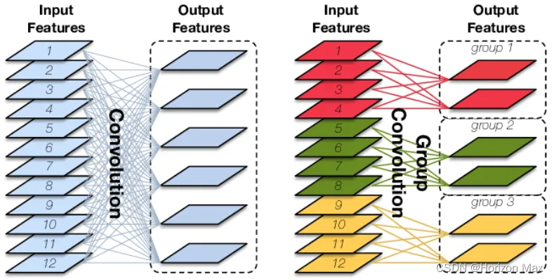
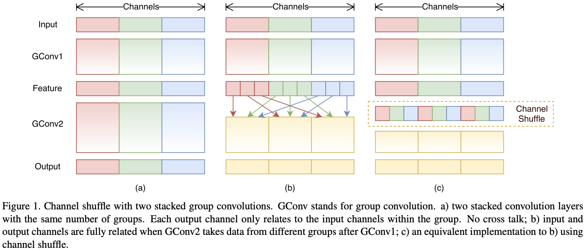
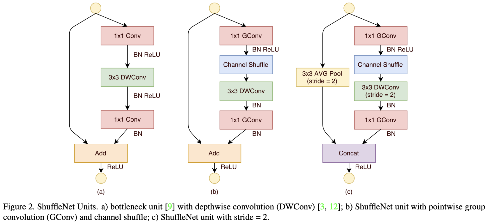
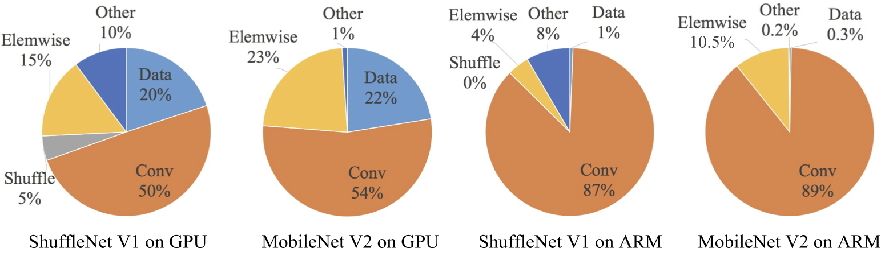
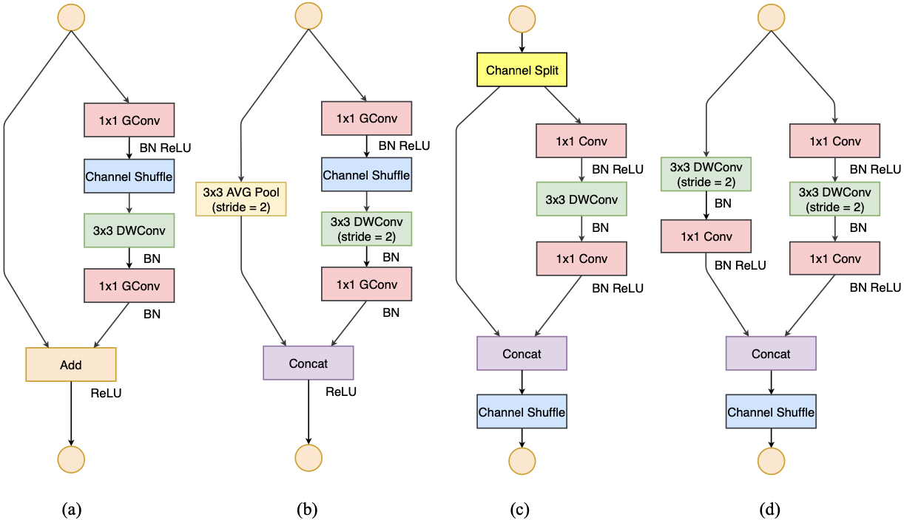
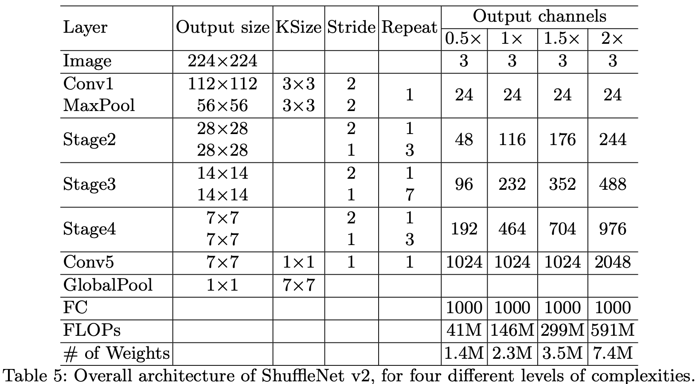

2017-ShuffleNet

ShuffleNetV1

可以看作ResNet的轻量化版本，针对移动设备设计。

基本信息

论文：[ShuffleNet: An Extremely Efficient Convolutional Neural Network
for Mobile Devices](https://arxiv.org/abs/1707.01083)

发表时间：2017

发表团队：Megvii（Face++）

网络性能

ImageNet分类和MS COCO目标检测上，优于其他网络

在计算预算为40M
FLOPs情况下，ImageNet分类任务的的top-1误差比MobileNet更低

在ARM移动设备上，相比AlexNet实现了13倍加速比，同时保证了精度

创新技术

主要思路是使用了Pointwise Group convolution和Channel shuffle。

Pointwise Group Convolution

动机

Xception和ResNeXt在小网络模型中效率很低，大量的1x1Conv浪费了计算资源

目的是采用通道稀疏连接(Channel Sparse Connection)，大幅降低计算量

原理

Pointwise Group Convolution即为卷积核为1x1的分组卷积

{width="3.718487532808399in"
height="1.8710258092738408in"}

Channel Shuffle

动机

为了克服GConv带来的通道间信息流动能力降低的副作用。GConv的本质是将卷积运算限制在各个组内从而显著减少计算量，但会导致组间没有信息流交换，影响模型表示能力。

原理

{width="4.854166666666667in"
height="2.0839555993000873in"}

优点

引入组间信息交换的机制，改善模型表示能力

Channel shuffle操作可导，可实现end to end训练网络

缺点

操作时需要大量指针跳转和memset，本身非常耗时，且非常依赖实现，实际速度不理想

shuffle规则由人工设计，无法通过网络自动学习，陷入人工设计特征的老路

网络单元

左边a为MobileNetV2网络单元，创新点为3x3 DWConv和最后一层线性激活层

右边b和c为ShuffleNet Unit，创新点为1x1 GConv和Channel Shuffle

{width="6.3in"
height="2.8844356955380577in"}

网络结构

ShuffleNetV2

基本信息

论文：[ShuffleNet V2: Practical Guidelines for Efficient CNN
Architecture Design](https://arxiv.org/abs/1807.11164)

发表时间：2018

发表团队：Megvii（Face++）、清华

创新技术

整体思路

网络运行速度不仅取决于FLOPs，也取决于其他因素，如MAC（Memory Access
Cost，内存访问成本）。

动机

分析了MobileNetV2和ShuffleNetV1在GPU/ARM平台下的耗时分布：

{width="5.375in"
height="1.5604833770778652in"}

提出了4种高效CNN网络设计的准则：

1.  G1：输入输出通道数相等时MAC最小

2.  G2：GConv会增加MAC，且MAC随分组数增加

3.  G3：碎片化的网络结构会降低并行度，如多路结构

4.  G4：Element-wise操作FLOPs小但MAC大，不能忽视，如ReLU/TensorAdd/BiasAdd

ShuffleNetV1违反了以上准则：

1.  使用bottleneck layer，输入输出通道数不同，违反G1

2.  大量使用GConv，违反G2

3.  过多碎片操作，违反G3

4.  Shortcut存在大量元素级Add操作，违反G4

原理

a和b为ShuffleNetV1的ShuffleNet Unit

c和d为新的Unit，重点为：

1.  提出了Channel Split

2.  弃用GConv，采用普通Conv，且输入输出通道数相同

3.  分支合并采用concat（由于d中取消Channel
    Split，可实现最终输出通道数翻倍）

{width="5.416666666666667in"
height="3.120566491688539in"}

网络结构

{width="6.3in"
height="3.4830577427821523in"}
