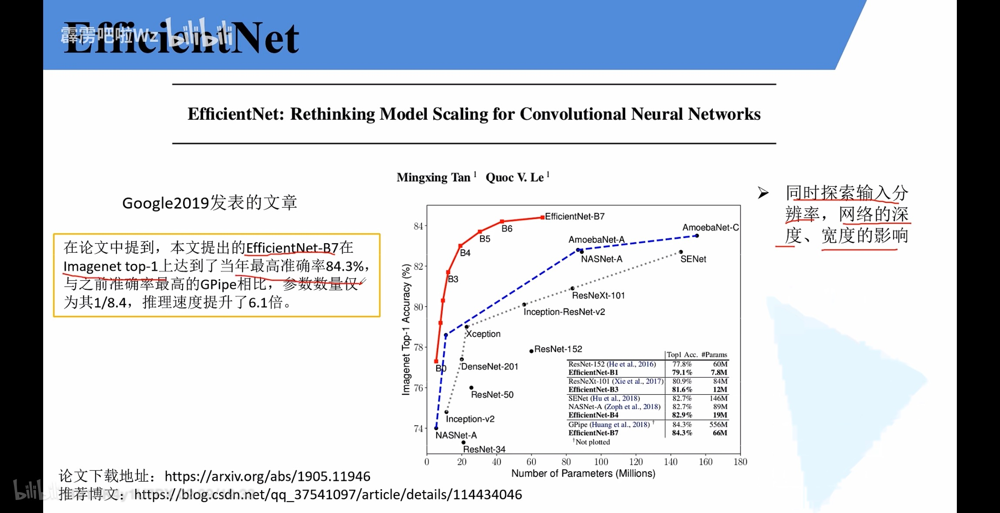
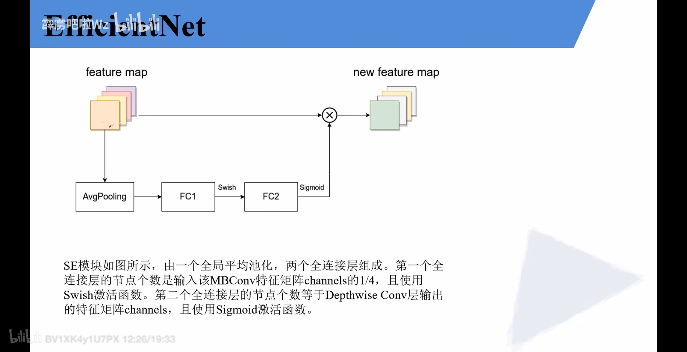

论文标题：EfficientNet: Rethinking Model Scaling for Convolutional
Neural Networks

论文地址：<https://arxiv.org/abs/1905.11946>

论文解读：<https://zhuanlan.zhihu.com/p/70369784>

{width="6.299305555555556in"
height="3.2375240594925634in"}{width="6.299305555555556in"
height="3.2375240594925634in"}
