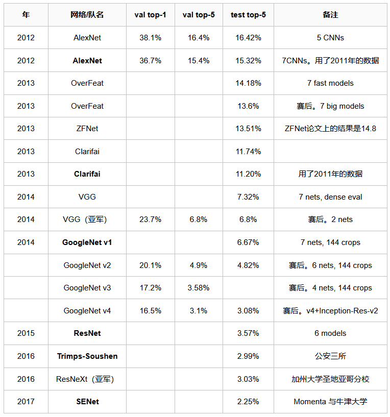

ILSVRC，全称ImageNet Large Scale Visual Recognition Challenge

# ImageNet

ImageNet是一个超过15 million的图像数据集，大约有22,000类。

由李飞飞团队通过各种方式（网络抓取、人工标注、亚马逊众包）收集制作而成，作为CVPR2009论文发布。

# 举办时间

从2010年开始举办到2017年最后一届。

使用ImageNet数据集的一个子集，总共有1000类，每类约1000张图像，训练集、验证集和测试集的数据量分别约为120w、5w和15w。

# 评价标准

top1是指概率向量中最大的作为预测结果，若分类正确，则为正确；top5则只要概率向量中最大的前五名里有分类正确的，则为正确。

# 历届冠军

{width="6.299305555555556in"
height="6.736299212598425in"}

# 历界冠军特点

[ILSVRC历届冠军网络](https://www.cnblogs.com/vincent1997/p/10901875.html)
