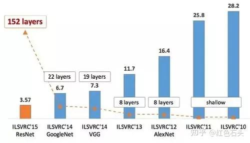

目标分类

目标

数据集

ImageNet

ImageNet是一个超过15 million的图像数据集，大约有22,000类。

由李飞飞团队通过各种方式（网络抓取、人工标注、亚马逊众包）收集制作而成，作为CVPR2009论文发布。

评价指标

重要竞赛

[ILSVRC](https://docs.qq.com/doc/DT2F3c1pPYVprRVRT?u=15ed59833fd54d19bc78ed3ee13df741)

经典论文

{width="5.208333333333333in"
height="2.9895833333333335in"}

1989-LeNet

[2012-AlexNet](https://docs.qq.com/doc/DT2JNekxaRVdycFFJ)

2014-Inception(GoogLeNet)

2014-VGG

[2015-ResNet](https://docs.qq.com/doc/DT2VjektmWkJUU2FY)

2015-SqueezeNet

2017-DenseNet

[2017-MobileNet](https://docs.qq.com/doc/DT0xLeGphemNFVHBj)

[2017-ShuffleNet](https://docs.qq.com/doc/DT0dYbXplc2FycFpE)

2017-SENet

2017-NasNet

[2019-EfficientNet](https://docs.qq.com/doc/DT0VtZ0pDbGFxSWZS)

UNet

GAN

FPN

性能对比

{width="6.299305555555556in"
height="3.612483595800525in"}

来源：[Benchmark Analysis of Representative Deep Neural Network
Architectures](https://arxiv.org/pdf/1810.00736.pdf)
