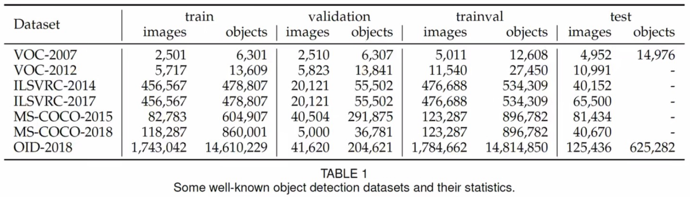
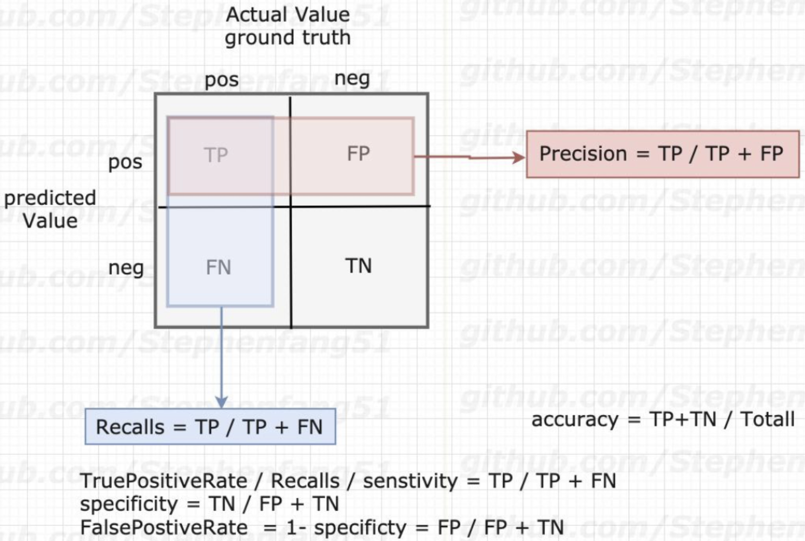
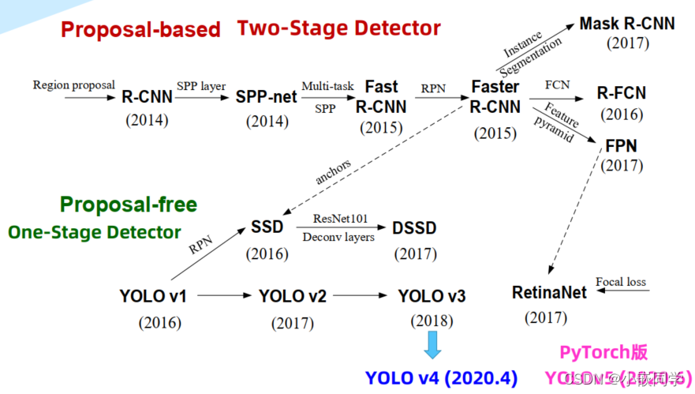
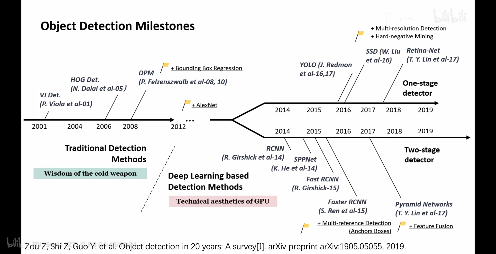
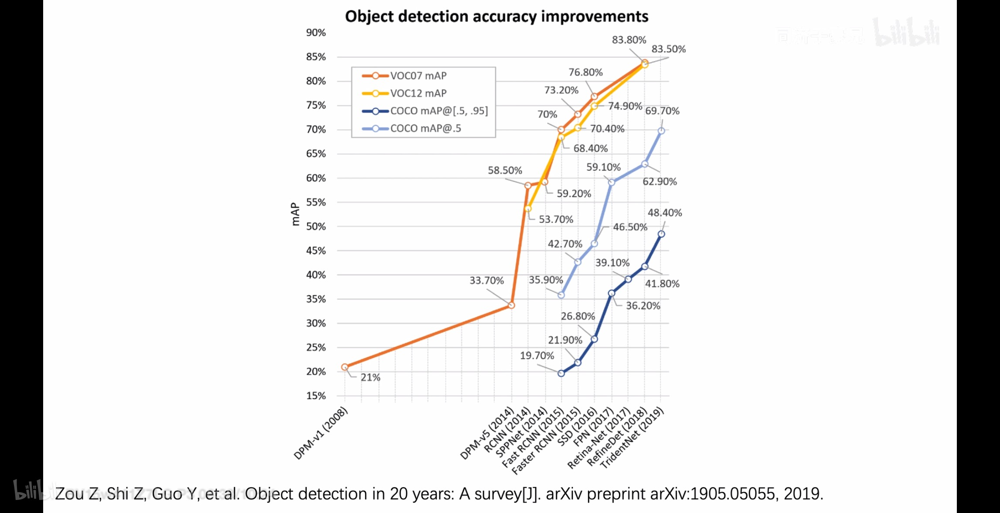

目标检测（Object Detection）

目标

数据集

PASCAL VOC

PASCAL VOC 2007：9963张图像，24640个标注

PASCAL VOC 2012：11530张图像，27450个标注，20个分类

链接: <http://host.robots.ox.ac.uk/pascal/voc/voc2012/>

MS COCO(Microsoft Common Objects in Context）

20w图像，其中11.5w+训练集图像，5k验证集图像，2w+测试集图像，80个类别，50w+目标标注，平均每个图像的目标数为7.2

链接：<http://cocodataset.org/>

{width="6.3in"
height="1.8052996500437446in"}

评价指标

Confusion Matrix（混淆矩阵）

{width="4.65625in"
height="3.129200568678915in"}

True/False表示预测是否正确，Positive/Negative表示预测结果为正例或反例

- TP (True Positive): 真正例，预测为正且预测正确

- TN (True Negative): 真反例，预测为负且预测正确

- FP (False Positive): 假正例，预测为正且预测错误

- FN (False Negative): 假反例，预测为负且预测错误

Precision（查准率，准确率）

所有预测结果为正例的结果中预测正确的比率，即

{width="1.2604166666666667in"
height="0.3958333333333333in"}

Recall（查全率，召回率）

所有正例中被正确预测的比率，即

{width="1.28125in"
height="0.3958333333333333in"}

F1 score

loU (Intersection over Union，交并比)

衡量两个区域的重叠程度，是两个区域的重叠面积占二者总面积（重叠部分只计一次）的比例。

目标检测中IoU就是预测框与实际框的交集除以并集。通常设置一个阈值（通常0.5）将预测结果分为：

- 如果IoU \>= 0.5且预测正确，分类为TP

- 如果IoU \>= 0.5且预测错误，分类为FP，即误检

- 如果IoU \< 0.5, 分类为FP（应为FN？漏检？）

- 如果目标出现在图像中，但是算法未检出，分类为FN，即漏检

- 图像上所有不包含实际框和检测框的部分，分类为TN，通常计算中用不到

P-R curve (Precison-Recall curve，P-R曲线)

对于单个类别，调节**置信度阈值**可得到不同的P-R性能数据对，以P为纵轴、R为横轴作图可得到一条"P-R曲线"。

P和R通常是一对矛盾的度量，如果A算法的P-R曲线被B算法的曲线完全包住，则可断言B算法优于A算法。实际中不同算法的P-R曲线经常交叉，此时需要考察平衡点(BEP)、F1度量、AP等指标。

AP (Average Precision，平均精度)

单个类别的模型在不同召回率条件下的平均精度，数学上等价于P-R曲线下的面积。

AP50、AP60、AP70等分别指的是取detector的IoU阈值大于0.5、0.6、0.7等。数值越高，即阈值越大，AP越低（剔除了IoU小的预测结果，查全率大为降低？）。

mAP (mean Average Precision)

所有类别的AP的平均值。

mAP@IoU=0.5、mAP@0.5、mAP_50

适用于VOC数据集，使用一个固定的IoU阈值0.5来计算AP值，即将IoU阈值设为0.5时，计算每一类的所有图片的AP，然后计算所有类别的AP平均值

mAP@IoU=0.5:0.05:0.95、mAP@IoU=0.5:0.95、mAP@\[0.5:0.95\]

适用于COCO数据集，更关注预测框位置的准确性，关注多个IoU阈值的AP平均值，即在\[0.5,
0.95\]区间均匀取10个IoU阈值

经典论文

SSD

yolo

fast-RCNN

faster-RCNN

{width="6.3in"
height="3.5683311461067366in"}

2019年综述论文：《Object Detection in 20 Years: A Survey》

{width="6.3in"
height="3.23788167104112in"}{width="6.3in"
height="3.23788167104112in"}
