知识蒸馏

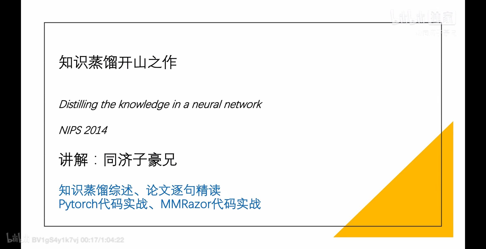{width="6.3in"
height="3.23788167104112in"}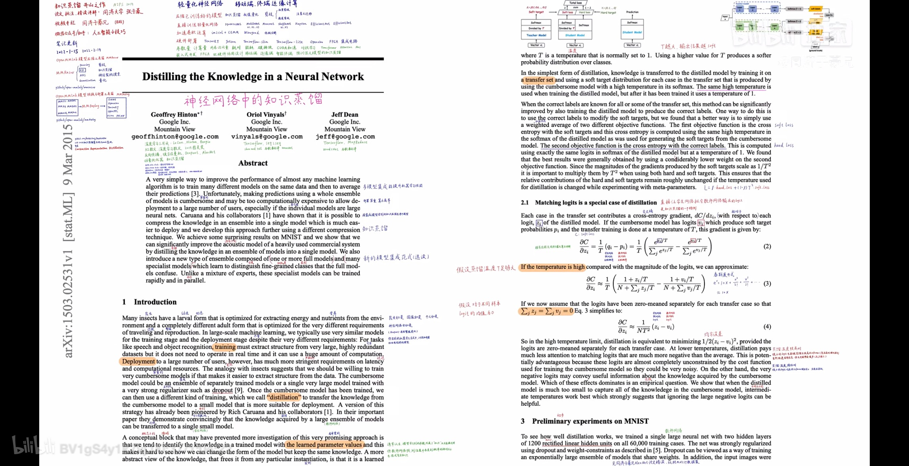{width="6.3in"
height="3.23788167104112in"}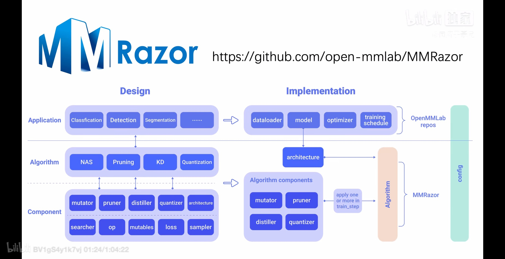{width="6.3in"
height="3.23788167104112in"}{width="6.3in"
height="3.23788167104112in"}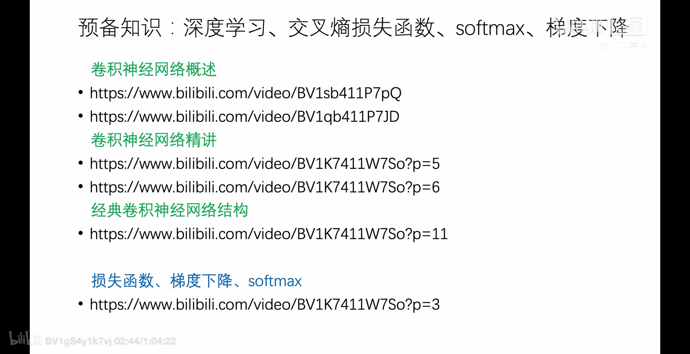{width="6.3in"
height="3.23788167104112in"}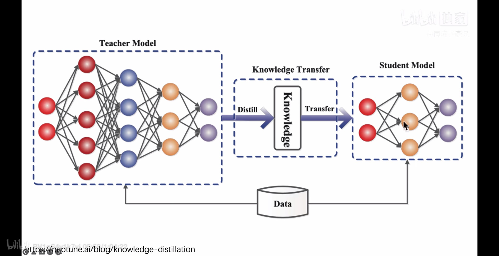{width="6.3in"
height="3.23788167104112in"}{width="6.3in"
height="3.23788167104112in"}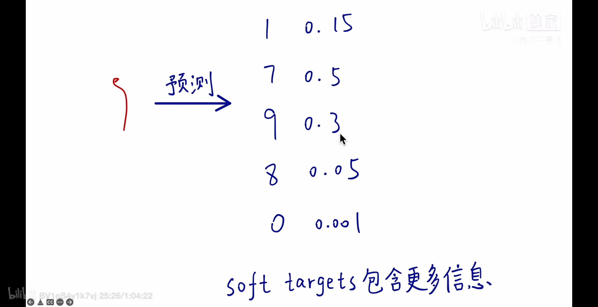{width="6.3in"
height="3.23788167104112in"}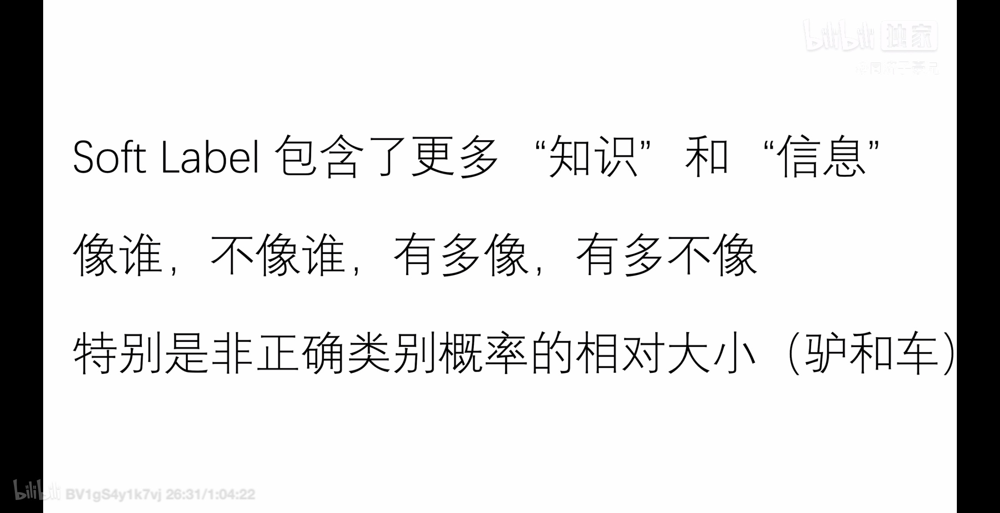{width="6.3in"
height="3.23788167104112in"}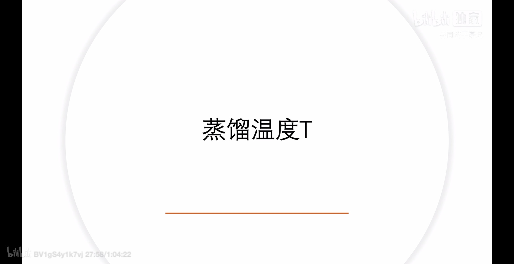{width="6.3in"
height="3.23788167104112in"}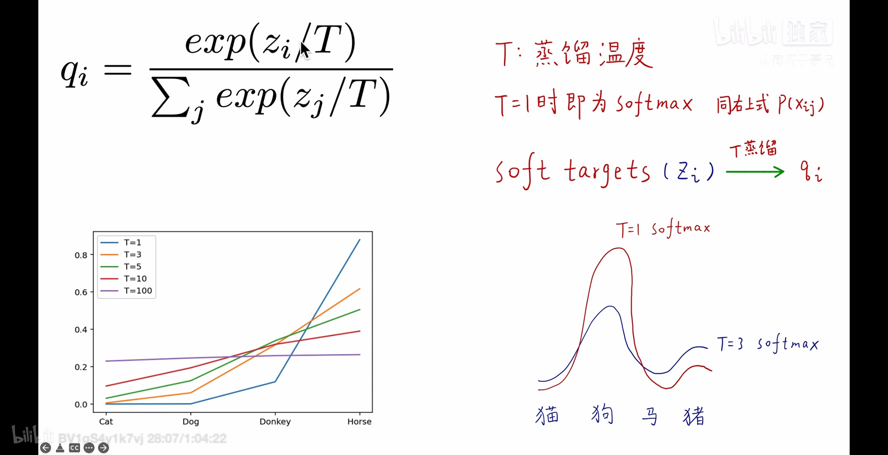{width="6.3in"
height="3.23788167104112in"}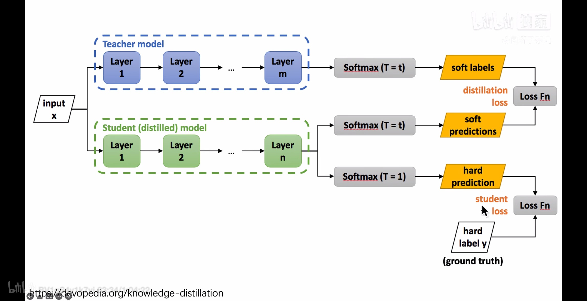{width="6.3in"
height="3.23788167104112in"}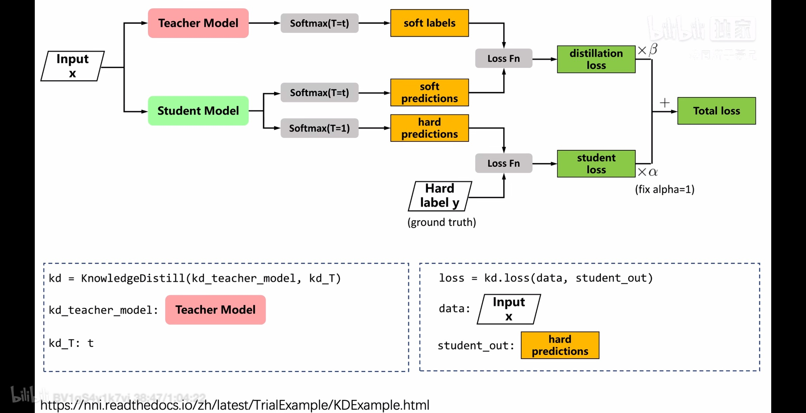{width="6.3in"
height="3.23788167104112in"}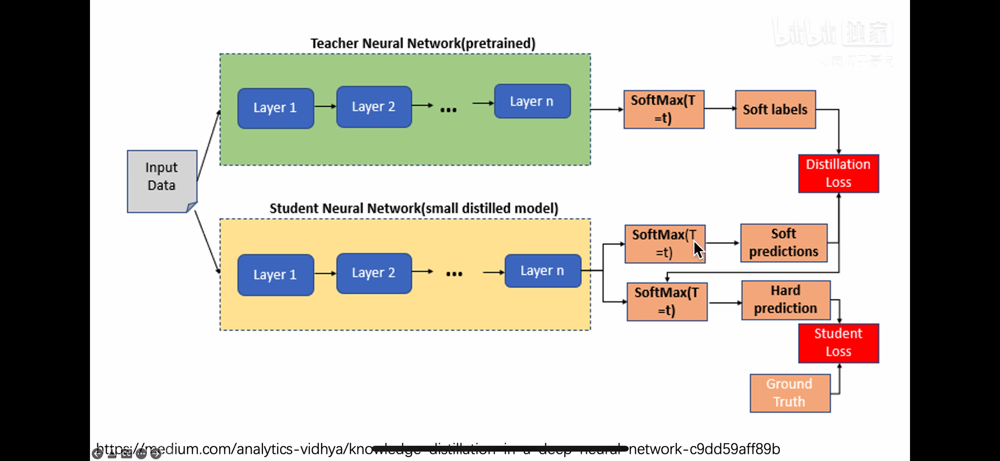{width="6.3in"
height="2.9059864391951007in"}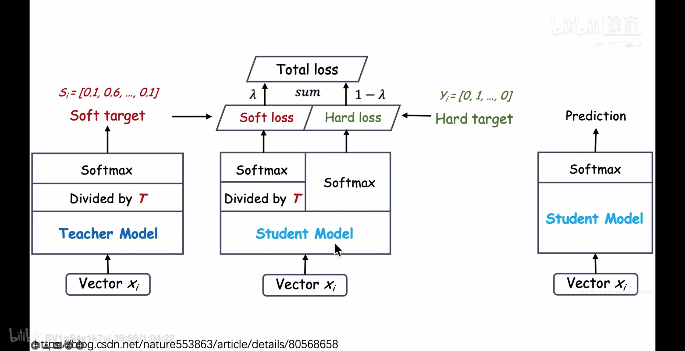{width="6.3in"
height="3.23788167104112in"}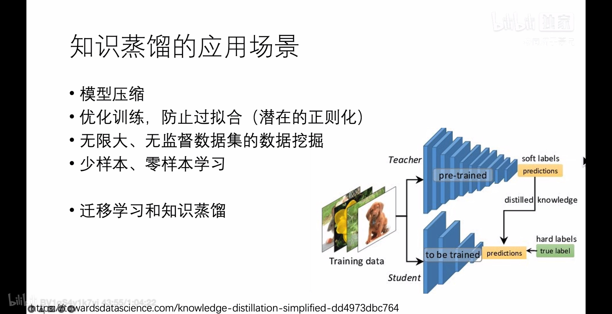{width="6.3in"
height="3.23788167104112in"}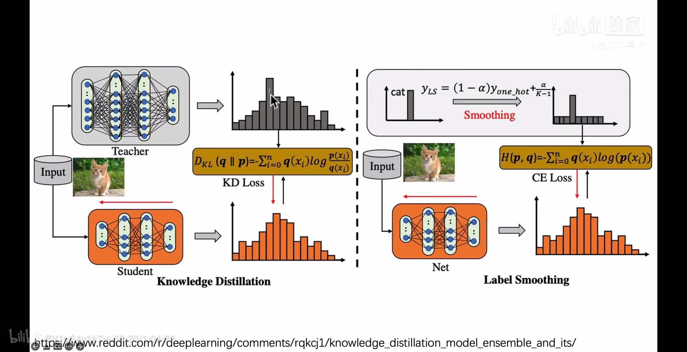{width="6.3in"
height="3.23788167104112in"}{width="6.3in"
height="3.23788167104112in"}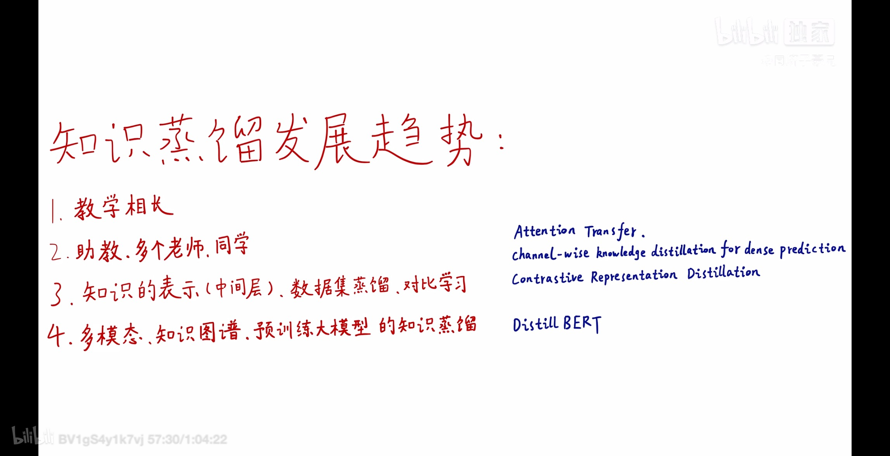{width="6.3in"
height="3.23788167104112in"}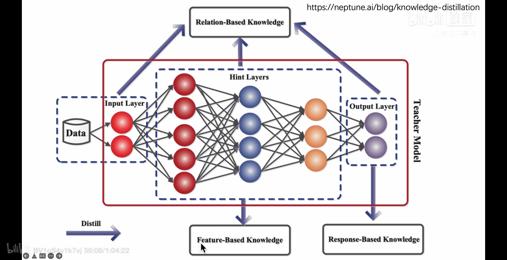{width="6.3in"
height="3.23788167104112in"}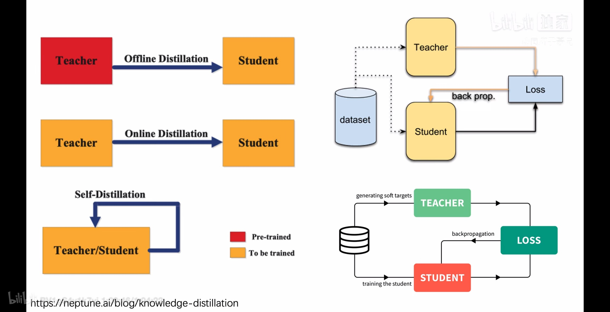{width="6.3in"
height="3.23788167104112in"}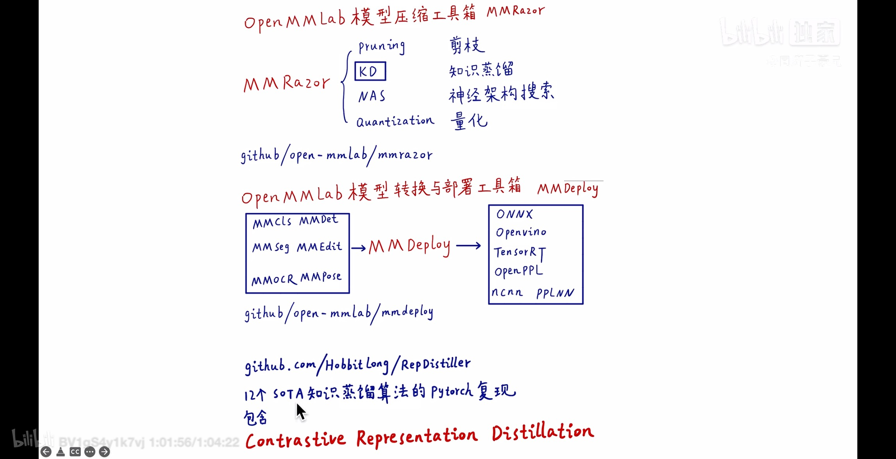{width="6.3in"
height="3.23788167104112in"}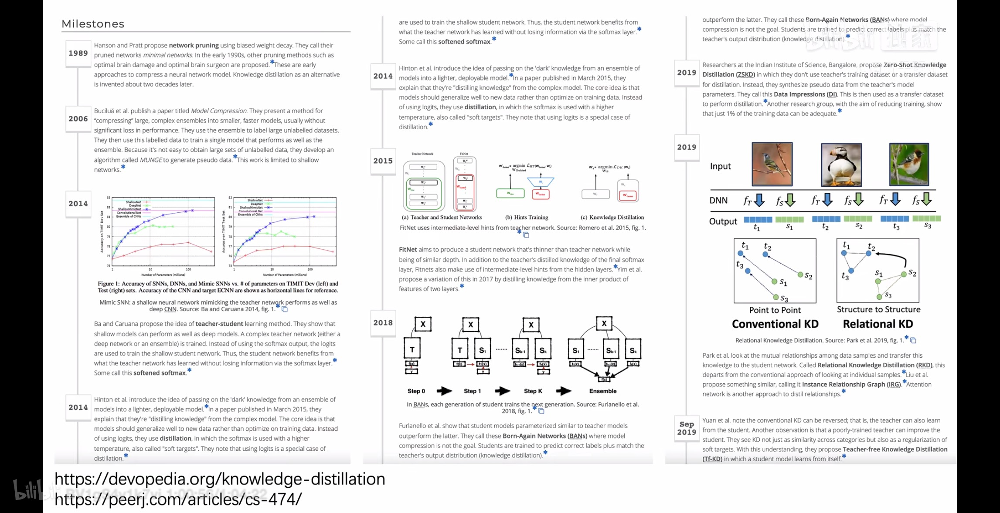{width="6.3in"
height="3.23788167104112in"}
