<https://learnopencv.com/denoising-diffusion-probabilistic-models/>

[An In-Depth Guide to Denoising Diffusion Probabilistic Models DDPM --
Theory to
Implementation](https://learnopencv.com/denoising-diffusion-probabilistic-models/)

GLIDE

DALLE2

Imagen

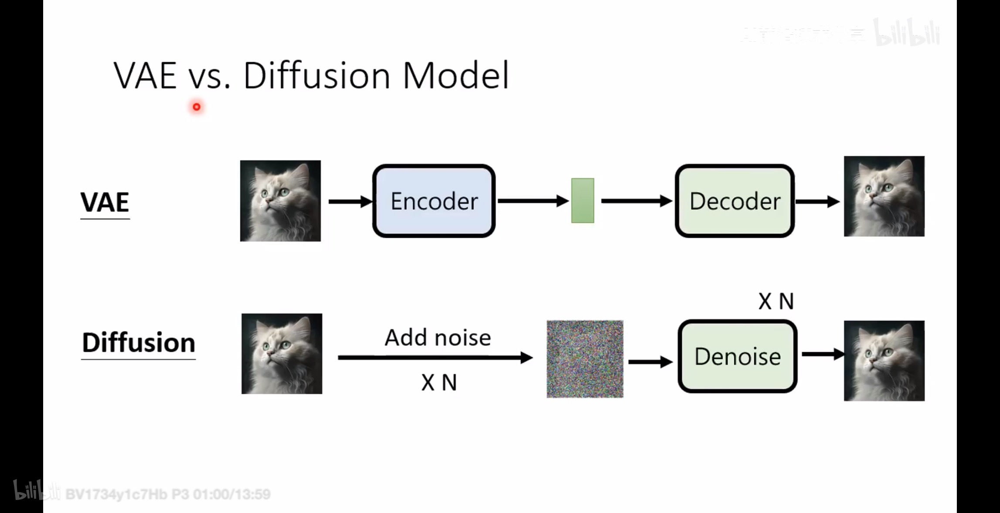{width="6.299305555555556in"
height="3.2375240594925634in"}

# DDPM

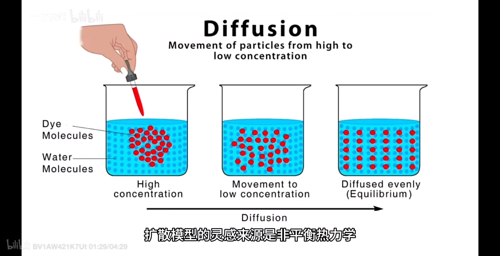{width="6.299305555555556in"
height="3.2375240594925634in"}

普通Diffusion Model将噪声直接叠加在图像上，DDPM使用Text
Encoder将图像编码为Latent Representation，噪声叠加在Latent
Representation之上。

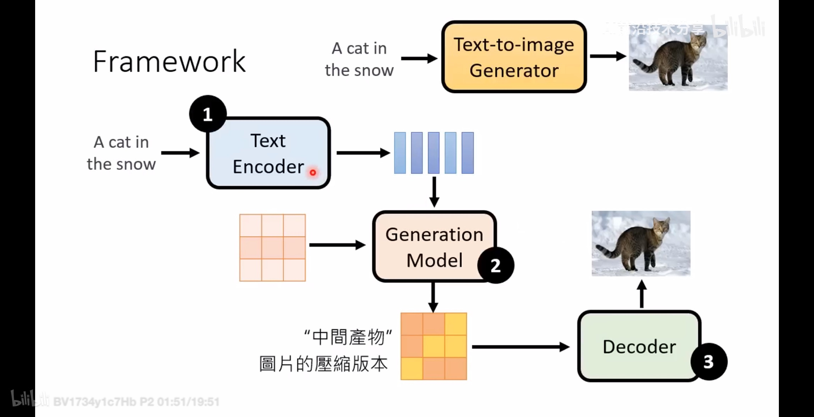{width="6.299305555555556in"
height="3.2375240594925634in"}

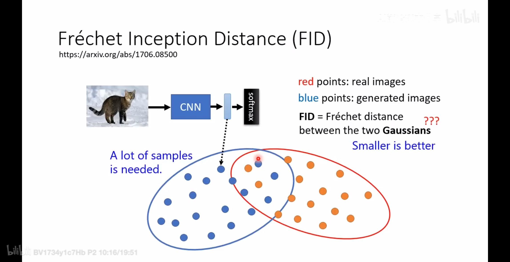{width="6.299305555555556in"
height="3.2375240594925634in"}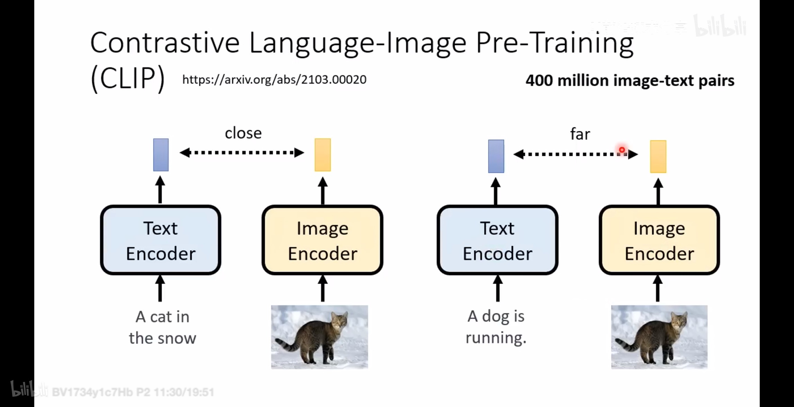{width="6.299305555555556in"
height="3.2375240594925634in"}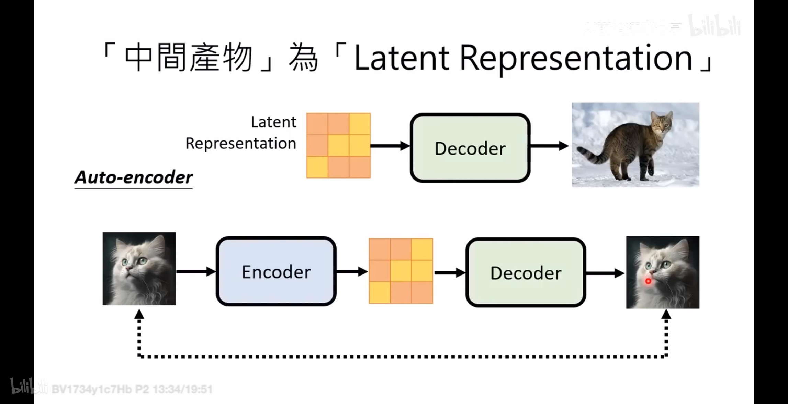{width="6.299305555555556in"
height="3.2375240594925634in"}

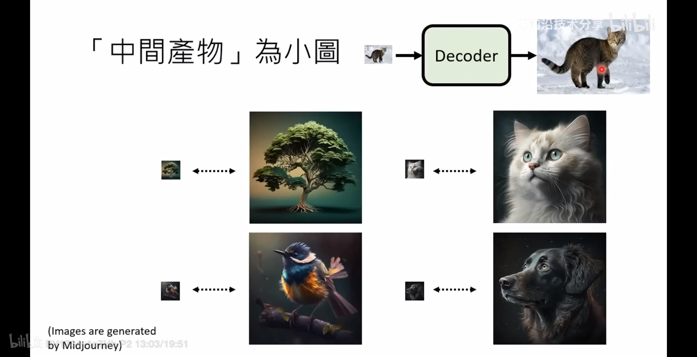{width="6.299305555555556in"
height="3.2375240594925634in"}

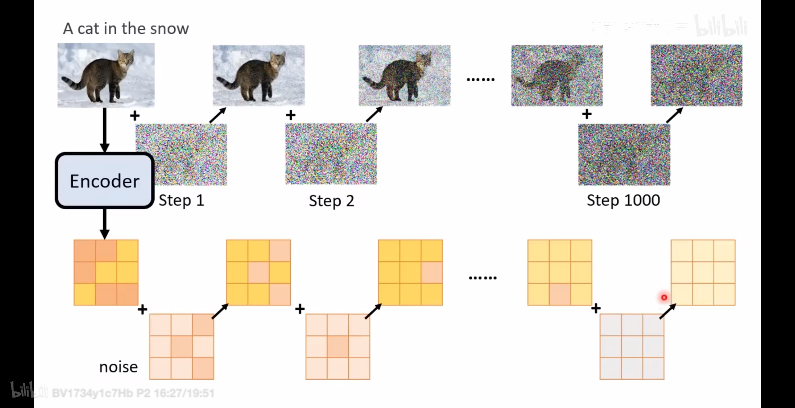{width="6.299305555555556in"
height="3.2375240594925634in"}

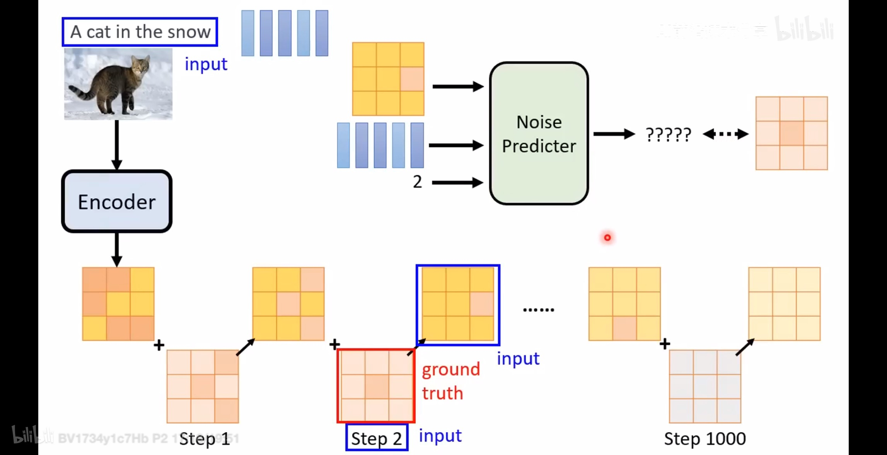{width="6.299305555555556in"
height="3.2375240594925634in"}

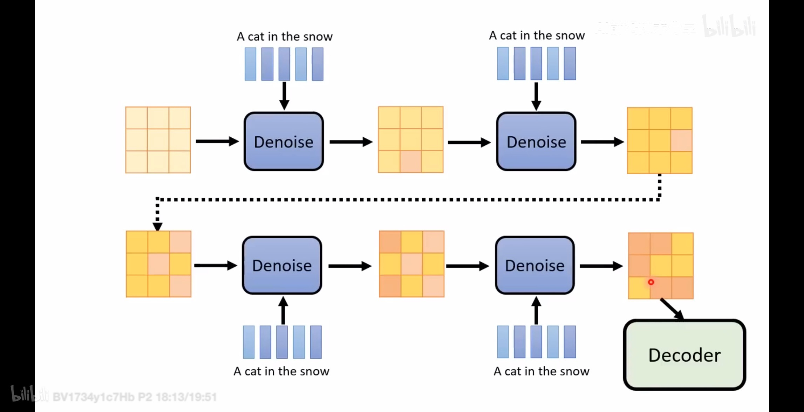{width="6.299305555555556in"
height="3.2375240594925634in"}

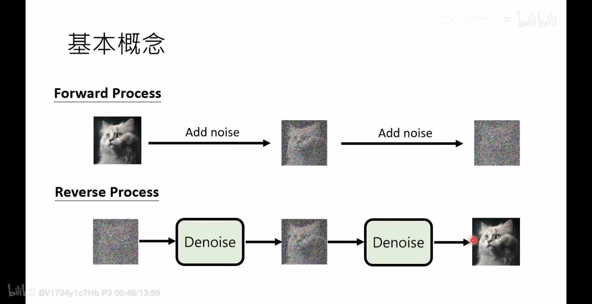{width="6.299305555555556in"
height="3.2375240594925634in"}{width="6.299305555555556in"
height="3.2375240594925634in"}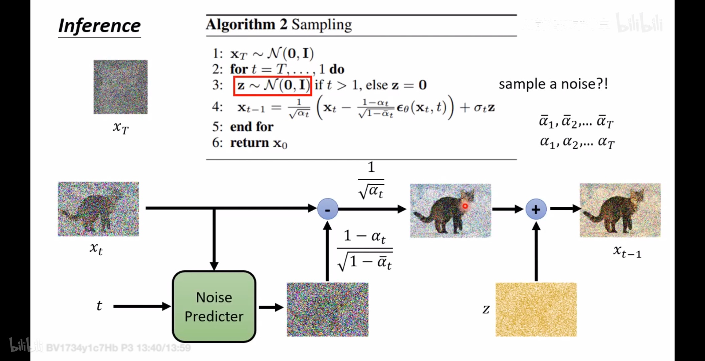{width="6.299305555555556in"
height="3.2375240594925634in"}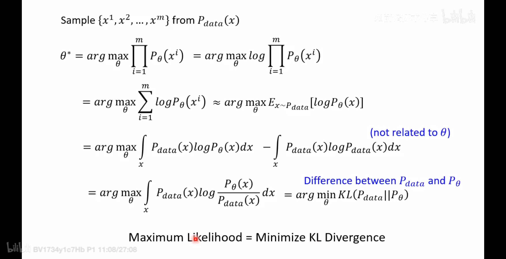{width="6.299305555555556in"
height="3.2375240594925634in"}

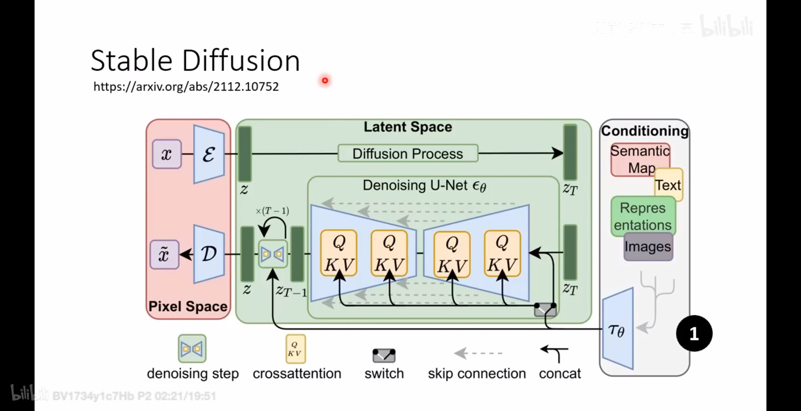{width="6.299305555555556in"
height="3.2375240594925634in"}

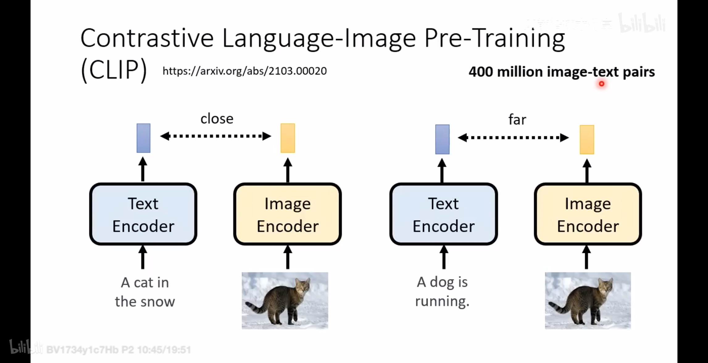{width="6.299305555555556in"
height="3.2375240594925634in"}

# DDIM
