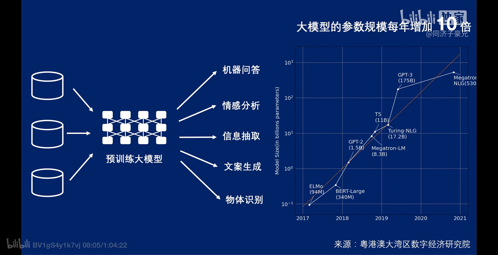

# 基础

## 分类

1.  判别模型：重点关注事物之间的差异

    a.  LR/SVM/NN/RF/CRF

2.  生成模型：需要学习和理解事物的特点

    a.  HMM/VAE/GAN

    b.  语言模型

        i.  大模型（基于Transformer）

### 语言大模型（Large Language Model, LLM）

模型的 temperature 参数是用于调整模型预测的概率分布的标量值。就 LLM
而言，它在坚持模型从训练数据中学到的内容和生成更多多样化或创意性的回复之间取得平衡。一般来说，这些具有创意性的回复更容易出现幻觉。

### 视觉大模型

### 多模态大模型（Large Multimodal Model, LMM）

## Scaling Law尺度定律

算法、算力、数据三角模型

# 数据集

# 评估方式

# 训练方式

# 重要榜单

Chatbot Arena LLM Leaderboard

# 重要模型

## DeepSeek-R1

1.  训练架构瘦身：如GRPO算法省去传统强化学习中必须的Critic模型（即\"双引擎\"设计）

2.  采用简评估标准：在代码生成场景直接用编译结果和单元测试通过率代替人工评分

3.  在数据策略上找到精妙平衡点，通过纯算法自主进化的Zero模式与仅需数千条人工标注数据的R1模式组合，既保留模型自主进化能力又保障人类可解释性

# 技术路线

## VAE

使用了逆向思维：用向量生成图像很困难，那就同时学习怎么用图像生成向量。这样，把某图像变成向量，再用该向量生成图像，就应该得到一幅和原图像一模一样的图像。每一个向量的绘画结果有了一个标准答案，可以用一般的优化方法来指导网络的训练了。VAE中，把图像变成向量的网络叫做编码器，把向量转换回图像的网络叫做解码器。其中，解码器就是负责生成图像的模型。

## Diffusion Model（扩散模型）

# 重点技术

## RL强化学习

## GRPO算法框架

## MOE专家混合模型

## COT/TOT/GOT

## SFT监督微调
