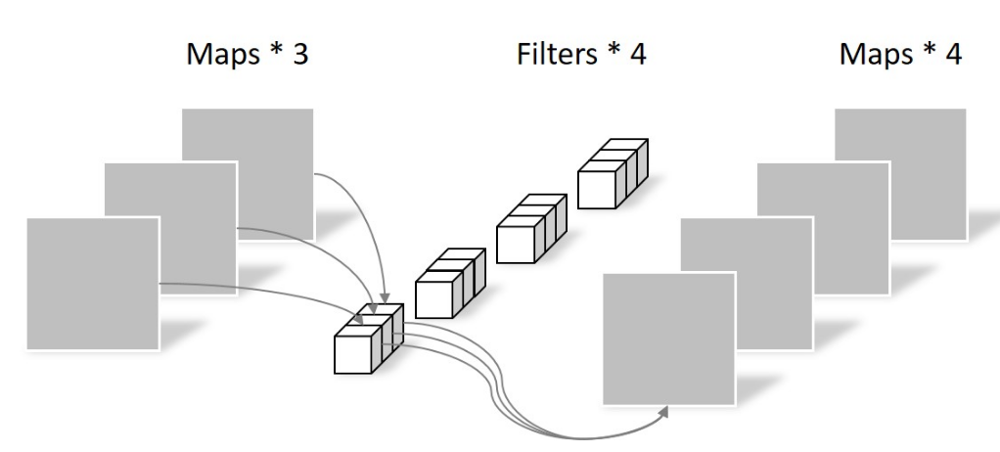
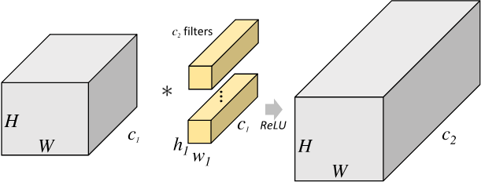
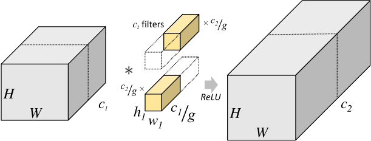

# AI基础概念

## 分类

按任务目标，可划分为分类、回归、聚类、降维四个类型；  
按训练方法，可划分为有监督学习、半监督学习、无监督学习（自监督学习）、强化学习等类别；  
按应用领域，可划分为计算机视觉（CV）、自然语言处理（NLP）两个方向。  

## 应用

按目前的行业现状，CV的应用场景可划分为High-Level和Low-Level两大场景，其中High-Level场景有
- 物体分类
- 目标检测
- 物体识别
- 物体跟踪
- 语义分割

Low-Level场景主要有：
- 降噪
- 超分
- 超帧
- HDR合成
- 画质恢复
- 色调增强
- 色彩增强
- 风格转换

## 性能参数

查准率：准确率（Precision）:  
查全率，召回率（Recall）:   
交并比 - Intersection Over Union (IOU)  
P-R曲线：  
mAP：  

## 机器学习主要技术

PCA主成分分析  
SVM  

## 深度学习基础概念

### 网络结构组成

损失函数  
激活函数  

假设CNN网络中某一层的输入数据维度为$ic \times ih \times iw$，输出数据维度为$oc \times oh \times ow$，则CNN的卷积核维度为$oc \times ic \times kh \times kw$，其中，

- $ic$是输入的通道数，如，RGB图像的通道为3
- $iw$和$ih$是输入的宽高
- $oc$是输出的通道数
- $ow$和$oh$是输出数据中每个通道的尺寸，可代表输出空间内容，或其他无具体物理意义的特征
- $kw$和$kh$是卷积核的尺寸
- $oc$决定有多少个不同的卷积核，每个卷积核的维度为$ic \times kw \times kh$，即卷积核需要跨越输入数据的所有通道
- 卷积核即为神经元
- $iw$和$kw$以及pading的大小决定$ow$，若$kw$为奇数，计算公式为$ow = iw + 2 * pad - (kw - 1)$，$oh$同理

权值共享：在同一个卷积层中，对于所有的像素，卷积核的参数相同  

### 训练迭代过程

深度学习中最基本的思想为梯度下降，反向传播减小误差优化参数。

前向传播  
反向传播  
权值更新  

训练的数量概念：
1. batchsize：一个迭代批次样本数量的大小，即每次迭代使用的样本数量
2. iteration：1个iteration是指一次迭代过程，即完成一次前向和反向的整个过程
3. epoch：1个epoch是指训练集中的全部样本都训练了一次，训练集中所有的样本都被迭代了一次就是完成了一个epoch，通常将的几个epoch就是指训练集中的所有样本被迭代了几次

参数优化涉及到Optimizer和Scheduler，两者同时作用，共同决定训练过程中的每次iteration的参数调整幅度。  
Optimizer/Scheduler与iteration/epoch的关系：
1. Optimizer：一般以iteration为单位更新模型参数，训练过程中每增加一次iteration，根据反向传播和梯度下降法更新模型的参数
2. Scheduler：一般以epoch为单位调整学习率，训练过程中每增加一个或多个epoch，学习率逐渐变小

#### 优化器(Optimizer)

作用是根据梯度计算更新模型参数的幅度，有三大类算法：  
- 梯度下降法：GD, BGD, SGD, MBGD
- 动量优化法：Momentum, NAG
- 自适应学习率优化法：AdaGrad, RMSProp, AdaDelta, Adam

这篇文章[《各种优化器Optimizer的总结与比较》](https://blog.csdn.net/weixin_40170902/article/details/80092628)详细对比了各种优化器的原理和特点。

##### 梯度下降法

###### GD（Gradient Descent）

###### BGD（Batch Gradient Descent）

每次迭代（完成一次前向和反向运算）会计算训练数据集中所有的样本，在深度学习中训练样本数量通常达十万、百万甚至更多，这样一次迭代遍历所有的样本显然很慢

###### SGD（Stochastic Gradient Descent）

每次迭代只使用训练集中的一个样本，即一次前向仅使用1个样本计算损失函数，然后计算梯度更新参数，这种方式虽然一次迭代速度很快，但是每次仅使用1个样本计算损失函数，容易受单个样本的质量好坏干扰，较难找到优化的最优点

###### MBGD（Mini-Batch Gradient Decent，小批量梯度下降）

这种方式介于上面两种方法之间，一次迭代使用小批量的数据，既能够防止一次迭代仅有1个样本带来的收敛性较差的问题，同时，每次迭代只是用了小批量样本，不会像Batch gradient descent那样单次迭代耗时过长。

#### 调度器(Scheduler)

调整学习率

## 重要技术模块

### 卷积

#### 空洞卷积

可扩大模型的感受野

#### 深度可分离卷积(DSC, Depthwise Separable Convolution)

相比常规卷积，其参数数量和运算成本比较低。

DSC一般由Depthwise Convolution(DW)和Pointwise Convolution(PW)两个部分结合组成。

PW实际为1x1卷积，在DSC中它起两方面的作用。第一个作用是让DSC能够自由改变输出通道的数量；第二个作用是对DW输出的feature map进行通道融合。

关于DSC的一个小细节是在DW之后是否有必要加入激活函数和BatchNorm。一些研究从增加网络整体非线性表达能力的角度出发，认为在DW之后加入激活函数和BatchNorm有助于提高网络的非线性表达能力，进而使网络有更强大的能力去拟合更加复杂的函数。但从近期的一些研究结果来看，在DW之后不加入激活函数和BatchNorm是更优的选择，因此这也逐步成为了使用DSC的一种最佳实践。

#### 可形变卷积(Deformable Convolution)

[Github代码和论文](https://github.com/msracver/Deformable-ConvNets)

可形变卷积可以提升CNN的形变建模能力，可以很容易取代现有CNN的普通模块并且利用反向传播进行端到端的训练，产生可变形的卷积神经网络。

需要注意的是，这里有一个非常容易混淆的点，所谓的deformable学习的并不是可变形的kernel，并不是对kernel学习offset，而是对feature的每个位置学习一个offset。

##### v1

基本原理是在普通卷积的基础上，对卷积核中每个采样点的位置都增加了一个偏移量，可以实现在当前位置附近随意采样而不局限于常规卷积的规则采样点。

偏移量本身是可学习的，可以是小数，因此feature map需要通过双线性插值的方法来计算。
偏移量定义为$\Delta p_n$，增加偏移量后的卷积公式为：
$$
y(p) = \sum_{p_n \in R} w(p_n) \cdot x(p + p_n + \Delta p_n)
$$

具体实现如上图所示，在输入的feature map中，常规卷积通过sliding window得到的是绿框。
引入可变形卷积后，把原来的卷积网路分为两路，共享input feature map，
其中上面的一路用一个conv来学习offset，得到$H \times W \times 2N$的输出offset，
其中，$2N$对应的是有$x$和$y$两个方向的偏移，
得到这个之后，对原始卷积的每一个窗口，都不再是原来规整的sliding window（input feature map中的绿框）而是经过平移后的window (input feature map中的篮框)，
取得数据后计算过程和常规卷积一样，即input feature map和offset共同作为deformable conv层的输入。

##### v2

DCN v2 在DCN v1基础上添加了每个采样点的权重，用于区分我们引入的区域是否为我们感兴趣的区域
$$
y(p) = \sum_{p_n \in R} w(p_n) \cdot \Delta M_k \cdot x(p + p_n + \Delta p_n)
$$

#### 分组卷积(Group Convolution)

分组卷积最早出现在AlexNet中。受限于当时的硬件资源，在AlexNet网络训练时，难以把整个网络全部放在一个GPU中进行训练，因此，作者将卷积运算分给多个GPU分别进行计算，最终把多个GPU的结果进行融合，分组卷积的概念应运而生。

对于尺寸为 $H1 \times W1 \times C1$ 的输入矩阵，当标准卷积核的尺寸为 $h1 \times w1 \times C1$ ，共有 $C2$ 个标准卷积核时，标准卷积会对完整的输入数据进行运算，最终得到的输出矩阵尺寸为 $H2 \times W2 \times C2$ 。这里假设卷积运算前后的特征图尺寸保持不变，则上述过程可以展示为下图：

分组卷积中，将输入数据在深度上分成 $g$ 组，输入的宽和高保持不变，即将每 $C1/g$ 个通道的数据分为一组。因为输入数据发生了改变，相应的卷积核的输入通道数也就变为了 $C1/g$ ，而卷积核的大小不变。同时，每组的卷积核个数也由原来的 $C2$ 变为 $C2/g$。每个组内的卷积运算同样采用标准卷积的方式，这样就可以得到 $g$ 组尺寸为 $H2 \times W2 \times C2/g$ 的输出矩阵，最终将这 $g$ 组输出矩阵进行拼接就可以得到最终结果，输出尺寸保持不变，仍然是 $H2 \times W2 \times C2$。分组卷积的运算过程如下图所示：

标准卷积中，参数量为：

$h1 \times w1 \times C1 \times C2$

使用分组卷积后，参数量则变为：

$h1 \times w1 \times \frac{C1}{g} \times \frac{C2}{g} \times g = h1 \times w1 \times C1 \times C2 \times \frac{1}{g}$

#### 反卷积/转置卷积(Transposed Convolution)

一种特殊的正向卷积，可起到上采样(Upsample)的作用，先按照一定的比例通过补 [公式] 来扩大输入图像的尺寸，接着旋转卷积核，再进行正向卷积。只能恢复尺寸，不能恢复数值。

#### 1x1卷积

降维，综合所有channel的信息，提取重要信息

### 多尺度结构

高斯金字塔：可缩小图像，保留重要的低频信息。  

拉普拉斯金字塔：可逐层恢复图像的原始细节信息。

### 图像对齐

#### PCD(Pyramid, Cascading and Deformable Convolution)

最先在EDVR论文中提出。PCD对每个相邻帧都进行了与参考帧的对齐操作，考虑到对齐中出现的复杂动作和大视差问题，PCD参考了光流估计中的金字塔流程、级联精化的思想。

黑色虚线：下采样  
黄色实线：  
蓝色实线：可变形卷积  
紫色虚线：双线性插值上采样  

### 注意力机制(Attention)

最先在NLP领域中提出，可用于自然语言翻译等场景。注意力机制可捕获特征的长距离的依赖关系，估计特征之间的相关性，有对齐数据、提高特征捕获效率的作用，通常与Encoder-Decoder框架结合使用，有相似度估计、数值转换、加权求和3个阶段，数值转换的作用通常为归一化。  
具体可分为以下类型：
- 常规Attention：估计的对象是输入元素和输出元素的相似度；
- SelfAttention：估计的对象是输入元素之间的相似度。

SEBlock:

PSA:

CBAM:

### 轻量化

知识蒸馏：可降低模型的复杂度

量化：

## 相关数学

范数

正定矩阵

二次型

最小二乘法

协方差矩阵

特征值：对一个矩阵A，存在一个向量v，使得Av = lambda \* v，即在向量v上，A的作用与lambda等同。lambda称为特征值，v称为特征向量

奇异值分解：缩写SVD

KL散度:

JS散度：

交叉熵：

