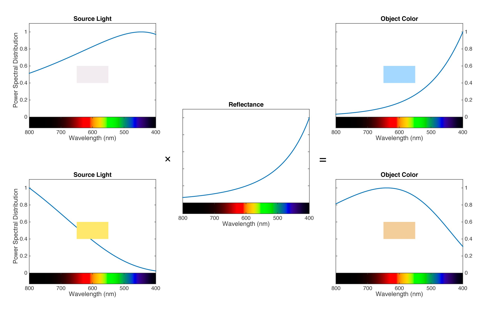

# 色彩表示

## 色彩形成

[色温、白平衡与色彩恒常性](https://zhuanlan.zhihu.com/p/27165715)

## 色彩表示

人眼中有三种分别对L、M、S三种波长敏感的锥状细胞，由三种锥状细胞得到的三刺激值可构成LMS色彩空间，但直接使用LMS三刺激值得到的色度图很大一部分落在第二象限，原因是红色的刺激值存在负值。

CIE XYZ表示的是由XYZ三刺激值绘制的色彩空间，XYZ三刺激值由LMS三刺激值转换而来，重新选择了三种基色，将红色刺激值全部转换为非负值，因此XYZ得到的色度图全部落在第一象限。

CIE XYZ的XZ代表色度，Y代表亮度。但需要注意的是，Y代表的是相对亮度而不是绝对亮度，即在色彩的辐射总能量相同的情况下，该色彩相对其他色彩的亮度。人眼感觉色度图的绿色区域较亮，蓝色部分较暗，原因就是色度图是从X + Y + Z = 1的单位光面上截出来的，在总的光辐射能量相同的情况下，人眼对绿色敏感因此觉得更亮，但这并不意味着绿色比所有红色都亮。

色彩的实际亮度取决于Y，XYZ、xyY和YUV中的Y完全等同，是由RGB加权计算得出的，加权权重由RGB的基色坐标和白点确定，具体可参考RGB2XYZ的计算过程。

CIE xyY由CIE XYZ派生而来，xyY的Y与XYZ的Y完全等同，xy由XY归一化得来，平常常见的CIE色度图其实是xyY对应的色度图，坐标已经进行了归一化处理。

[色彩空间表示与转换 - 知乎](https://zhuanlan.zhihu.com/p/24281841)  
[总结各种RGB转YUV的转换公式 - 郑建宏 - 博客园](https://www.cnblogs.com/zhengjianhong/p/7872459.html)  
[A Beginner’s Guide to (CIE) Colorimetry – Color and Imaging – Medium](https://medium.com/hipster-color-science/a-beginners-guide-to-colorimetry-401f1830b65a)  
[Useful Color Equations](http://www.brucelindbloom.com/index.html?Math.html)  
[RGB/XYZ Matrices](http://www.brucelindbloom.com/index.html?Eqn_RGB_XYZ_Matrix.html)  
[RGB and YUV Color Space Conversion](https://www.vocal.com/video/rgb-and-yuv-color-space-conversion/)  
[CVRL main](http://www.cvrl.org/)  
[CVRL main](http://cvrl.ioo.ucl.ac.uk/)  

## 重要概念

黑体：

色温：

普朗克轨迹：

固有色：

色彩恒常性：

### Scene Referred and Display Referred

[The BBC Explains Scene and Display Referred Systems and Impact on HLG](https://displaydaily.com/the-bbc-explains-scene-and-display-referred-systems-and-impact-on-hlg)
根据以上文章：
理论上，scene referred和display referred结果一致，都能产生相同的非线性系统gamma或创作意图，区别在于创作意图在哪里实现。
scene referred的创作意图在显示端的EOTF中实现，位于inverse OETF之后，渲染时需要考虑昏暗环境下观看显示器的心理视觉效果，如BT.709、HLG系统，通常适用于real time television。
display referred的创作意图在拍摄端的OETF端实现，位于inverse EOTF之前，显示端则逆转inverse EOTF引入的非线性，重新生成视觉准确的图像，如PQ系统，适用于non-real time or file-based workflows。
display referred需要在拍摄端实现inverse EOTF，因此需要确定最终显示的reference display，因此适用于电影制作，但对其他内容不适用，因为消费级显示器的亮度和观看环境特性变化较大，对于这些显示设备需要知道显示器特性和本地re-rendering，这正是Dolby Vision做的事情。

后期制作角度：
[Display Referred, Scene Referred, Timeline Colorspace](https://www.liftgammagain.com/forum/index.php?threads/display-referred-scene-referred-timeline-colorspace.18550)
A scene-referred workflow is one in which we manipulate our images prior to their transformation from camera color space to display color space. A display-referred workflow is one in which we manipulate our images after they’ve been transformed from camera color space to display color space.

Scene Referred描述了现实物理世界，表示图像中的数值可以（近似）的认为就是真实场景中光照的强度，拥有如下特性：
1. Scene Referred图像基本都是Linear的，光的强度就是线性的
2. Scene Referred图像基本都是HDR的，光照强度没有上限，动态范围非常大

Display Referred指图像数值已经经过某种变化，变化后的数值可以直接呈现在相应色域的显示设备上，并且符合人眼的感受，特点如下：
1. Display Referred图像基本都带Gamma
2. Display Referred图像的动态范围会受制于显示设备

[Models for image editing: Display-referred and scene-referred](https://ninedegreesbelow.com/photography/display-referred-scene-referred.html)
Display-referred RGB data is bounded by Color, which is to say by both Luminance and Chromaticity. Scene-referred RGB data is bounded only by Chromaticity.

[Models for image editing: Display-referred and scene-referred](https://ninedegreesbelow.com/photography/display-referred-scene-referred.html#conclusion)
根据上文的最后一节“总结”部分，对于display-referred和scene-referred两种制作流程的总结如下：
1. display-referred和scene-referred的最小亮度值都是0，即R=G=B=0.0
2. display-referred面向具有特定最大亮度的设备，最大RGB亮度值由白色表示，即R=G=B=1.0，动态范围一般约为9 stops；scene-referred没有“白色”的概念，最大RGB亮度值没有上限，可以容纳HDR
3. display-referred和scene-referred的有意义的RGB范围都会被用户选择的工作空间限制

## 光电转换 / 传递函数 / 传输曲线

### BT.1886 EOTF表达式优化

根据`BT.1886`标准文档，其EOTF为

$$
\begin{align}
L = a \left (\text{max} [(V + b),0] \right )^\gamma
\end{align}
$$

其中，

$$
\begin{align}
a &= \left ({L_W}^{1/\gamma} - {L_B}^{1/\gamma} \right )^\gamma \\
b &= \frac {{L_B}^{1/\gamma}} {{L_W}^{1/\gamma} - {L_B}^{1/\gamma}}
\end{align}
$$

一般情况下，$V+b$大于$0$成立，则有

$$
\begin{align}
L = a (V + b)^\gamma
\end{align}
$$

将$a$和$b$代入，则可得

$$
\begin{align}
L &= \left ({L_W}^{1/\gamma} - {L_B}^{1/\gamma} \right )^\gamma \left (V + \frac {{L_B}^{1/\gamma}} {{L_W}^{1/\gamma} - {L_B}^{1/\gamma}} \right )^\gamma \\
  &= \left [\left ({L_W}^{1/\gamma} - {L_B}^{1/\gamma} \right ) \left (V + \frac {{L_B}^{1/\gamma}} {{L_W}^{1/\gamma} - {L_B}^{1/\gamma}} \right ) \right ] ^ \gamma \\
  &= \left [\left ({L_W}^{1/\gamma} - {L_B}^{1/\gamma} \right ) V + {L_B}^{1/\gamma} \right ] ^ \gamma
\end{align}
$$

对应的inverse EOTF为

$$
\begin{align}
V = \frac {{L}^{1/\gamma} - {L_B}^{1/\gamma}} {{L_W}^{1/\gamma} - {L_B}^{1/\gamma}}
\end{align}
$$
