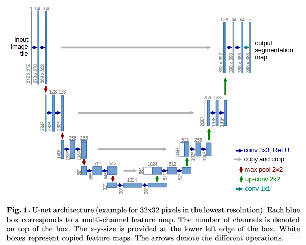

# AI学习笔记

## AI算法分类
按任务目标：分类、回归、聚类、降维

按训练方法：有监督学习、半监督学习、无监督学习（自监督学习）、强化学习

## 数学基础
范数

正定矩阵

二次型

最小二乘法

协方差矩阵

特征值：对一个矩阵A，存在一个向量v，使得Av = lambda \* v，即在向量v上，A的作用与lambda等同。lambda称为特征值，v称为特征向量

奇异值分解：缩写SVD

KL散度:

JS散度：

交叉熵：

## 基础概念

前向传播

反向传播

权值更新

权值共享：在同一个卷积层中，对于所有的像素，卷积核的参数相同

损失函数

激活函数

### 网络结构

假设CNN网络中某一层的输入数据维度为$ic \times ih \times iw$，输出数据维度为$oc \times oh \times ow$，则CNN的卷积核维度为$oc \times ic \times kh \times kw$，其中，

- $ic$是输入的通道数，如，RGB图像的通道为3
- $iw$和$ih$是输入的宽高
- $oc$是输出的通道数
- $ow$和$oh$是输出数据中每个通道的尺寸，可代表输出空间内容，或其他无具体物理意义的特征
- $kw$和$kh$是卷积核的尺寸
- $oc$决定有多少个不同的卷积核，每个卷积核的维度为$ic \times kw \times kh$，即卷积核需要跨越输入数据的所有通道
- 卷积核即为神经元
- $iw$和$kw$以及pading的大小决定$ow$，若$kw$为奇数，计算公式为$ow = iw + 2 * pad - (kw - 1)$，$oh$同理

### 训练迭代过程
深度学习中最基本的思想为梯度下降，反向传播减小误差优化参数。

参数优化的方式：
1. Batch Gradient Descent：每次迭代（完成一次前向和反向运算）会计算训练数据集中所有的样本，在深度学习中训练样本数量通常达十万、百万甚至更多，这样一次迭代遍历所有的样本显然很慢
2. Stochastic Gradient Descent：每次迭代只使用训练集中的一个样本，即一次前向仅使用1个样本计算损失函数，然后计算梯度更新参数，这种方式虽然一次迭代速度很快，但是每次仅使用1个样本计算损失函数，容易受单个样本的质量好坏干扰，较难找到优化的最优点
3. Mini-Batch Gradient Decent（小批量梯度下降）：这种方式介于上面两种方法之间，一次迭代使用小批量的数据，既能够防止一次迭代仅有1个样本带来的收敛性较差的问题，同时，每次迭代只是用了小批量样本，不会像Batch gradient descent那样单次迭代耗时过长。

训练的数量概念：
1. batchsize：一个迭代批次样本数量的大小，即每次迭代使用的样本数量
2. iteration：1个iteration是指一次迭代过程，即完成一次前向和反向的整个过程
3. epoch：1个epoch是指训练集中的全部样本都训练了一次，训练集中所有的样本都被迭代了一次就是完成了一个epoch，通常将的几个epoch就是指训练集中的所有样本被迭代了几次

参数优化的幅度调整：
1. Optimizer：根据梯度更新模型参数，有梯度下降法（GD, BGD, SGD）、动量优化法（Momentum, NAG）、自应用学习率优化法（AdaGrad, RMSProp, AdaDelta, Adam）三大类算法。这篇文章[《各种优化器Optimizer的总结与比较》](https://blog.csdn.net/weixin_40170902/article/details/80092628)详细对比了各种优化器的原理和特点。
2. Scheduler：调整学习率

Optimizer/Scheduler与iteration/epoch的关系：
1. Optimizer一般以iteration为单位更新模型参数，训练过程中每增加一次iteration，根据反向传播和梯度下降法更新模型的参数
2. Scheduler一般以epoch为单位调整学习率，训练过程中每增加一个或多个epoch，学习率逐渐变小

PCA主成分分析

注意力机制：一种加权方法，有对齐数据、提高特征捕获效率的作用，通常与Encoder-Decoder框架结合使用，有相似度估计、数值转换、加权求和3个阶段。若相似度估计的对象是输入元素和输出元素，则为常规Attention；若估计的是输入元素之间的相似度，则为Self-Attention。数值转换的作用通常为归一化。

轻量化

知识蒸馏：可降低模型的复杂度

空洞卷积：可扩大模型的感受野

反卷积（Transposed Convolution）：又称转置卷积，可起到上采样(Upsample)的作用，一种特殊的正向卷积，先按照一定的比例通过补 [公式] 来扩大输入图像的尺寸，接着旋转卷积核，再进行正向卷积。只能恢复尺寸，不能恢复数值。

1x1卷积：降维，综合所有channel的信息，提取重要信息

可变形卷积：

多尺度结构：高斯金字塔和拉普拉斯金字塔。高高斯金字塔可缩小图像，保留重要的低频信息，拉普拉斯金字塔可逐层恢复图像的原始细节信息

针对目标检测：

查准率，准确率（Precision）:

查全率，召回率（Recall）: 

交并比 - Intersection Over Union (IOU)

P-R曲线：

mAP：

## 重要网络

### UNet

上图为U-Net网络结构图（以最低分别率为32\*32为例）。每个蓝色框对应一个多通道特征图（map），其中通道数在框顶标，x-y的大小位于框的左下角；白色框表示复制的特征图；箭头表示不同的操作。

该网络由收缩路径（左边，contracting path）和扩张路径（右边，expanding path）组成。其中，收缩路径用于获取上下文信息（context），扩张路径用于精确的定位（localization），且两条路径相互对称。

收缩路径遵循典型的卷积网络结构，其由两个重复的33卷积核（无填充卷积，unpadded convolution）组成，且均使用ReLU激活函数和一个用于下采样（downsample）的步长为2的22最大池化操作，以及在每一个下采样的步骤中，特征通道数量都加倍。在扩张路径中，每一步都包含对特征图进行上采样（upsample）；然后用22的卷积核进行卷积运算（上卷积，up-convolution），用于减少一半的特征通道数量；接着级联收缩路径中相应的裁剪后的特征图；再用两个33的卷积核进行卷积运算，且均使用ReLU激活函数。由于在每次卷积操作中，边界像素存在缺失问题，因此有必要对特征图进行裁剪。在最后一层，利用1\*1的卷积核进行卷积运算，将每个64维的特征向量映射网络的输出层。总而言之，该网络有23个卷积层。

U-Net网络能从极少的训练图像中，依靠数据增强将有效的标注数据更为有效地使用。

通过FCN的学习会更好的了解U-Net。FCN在上采样时，根据前一池化层上采样的结合实现像素的密集预测，U-Net也是在上采样（扩展路径）结合下采样（收缩路径）生成特征向量。

在 Fully Convolutional Networks for Semantic Segmentation 一文中，其主要思想为通过连续层补充通常的收缩网络，其中上采样（upsample）操作取代了池化操作。因此，这些层提高了输出结果的分别率。为了进行定位操作，将来自收缩路径的高分辨率特征与上采样相结合。随后连续的卷积层可以基于该信息学习，得出更为精确的输出。

## 应用

分类

检测

识别

跟踪

分割

回归

超分

超帧

色彩增强

系统调度

