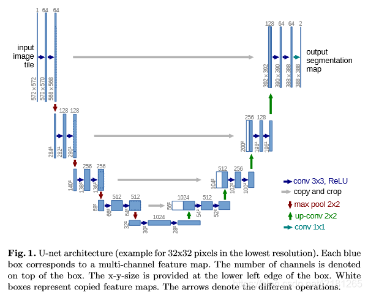

# AI重要网络

## UNet

上图为U-Net网络结构图（以最低分别率为32\*32为例）。每个蓝色框对应一个多通道特征图（map），其中通道数在框顶标，x-y的大小位于框的左下角；白色框表示复制的特征图；箭头表示不同的操作。

该网络由收缩路径（左边，contracting path）和扩张路径（右边，expanding path）组成。其中，收缩路径用于获取上下文信息（context），扩张路径用于精确的定位（localization），且两条路径相互对称。

收缩路径遵循典型的卷积网络结构，其由两个重复的33卷积核（无填充卷积，unpadded convolution）组成，且均使用ReLU激活函数和一个用于下采样（downsample）的步长为2的22最大池化操作，以及在每一个下采样的步骤中，特征通道数量都加倍。在扩张路径中，每一步都包含对特征图进行上采样（upsample）；然后用22的卷积核进行卷积运算（上卷积，up-convolution），用于减少一半的特征通道数量；接着级联收缩路径中相应的裁剪后的特征图；再用两个33的卷积核进行卷积运算，且均使用ReLU激活函数。由于在每次卷积操作中，边界像素存在缺失问题，因此有必要对特征图进行裁剪。在最后一层，利用1\*1的卷积核进行卷积运算，将每个64维的特征向量映射网络的输出层。总而言之，该网络有23个卷积层。

U-Net网络能从极少的训练图像中，依靠数据增强将有效的标注数据更为有效地使用。

通过FCN的学习会更好的了解U-Net。FCN在上采样时，根据前一池化层上采样的结合实现像素的密集预测，U-Net也是在上采样（扩展路径）结合下采样（收缩路径）生成特征向量。

在 Fully Convolutional Networks for Semantic Segmentation 一文中，其主要思想为通过连续层补充通常的收缩网络，其中上采样（upsample）操作取代了池化操作。因此，这些层提高了输出结果的分别率。为了进行定位操作，将来自收缩路径的高分辨率特征与上采样相结合。随后连续的卷积层可以基于该信息学习，得出更为精确的输出。

