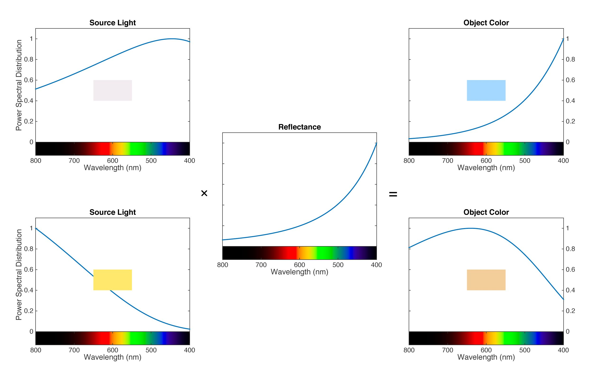

# 色彩编码

## 色彩形成

[色温、白平衡与色彩恒常性](https://zhuanlan.zhihu.com/p/27165715)

## 色彩表示

人眼中有三种分别对L、M、S三种波长敏感的锥状细胞，由三种锥状细胞得到的三刺激值可构成LMS色彩空间，但直接使用LMS三刺激值得到的色度图很大一部分落在第二象限，原因是红色的刺激值存在负值。

CIE XYZ表示的是由XYZ三刺激值绘制的色彩空间，XYZ三刺激值由LMS三刺激值转换而来，重新选择了三种基色，将红色刺激值全部转换为非负值，因此XYZ得到的色度图全部落在第一象限。

CIE XYZ的XZ代表色度，Y代表亮度。但需要注意的是，Y代表的是相对亮度而不是绝对亮度，即在色彩的辐射总能量相同的情况下，该色彩相对其他色彩的亮度。人眼感觉色度图的绿色区域较亮，蓝色部分较暗，原因就是色度图是从X + Y + Z = 1的单位光面上截出来的，在总的光辐射能量相同的情况下，人眼对绿色敏感因此觉得更亮，但这并不意味着绿色比所有红色都亮。

色彩的实际亮度取决于Y，XYZ、xyY和YUV中的Y完全等同，是由RGB加权计算得出的，加权权重由RGB的基色坐标和白点确定，具体可参考RGB2XYZ的计算过程。

CIE xyY由CIE XYZ派生而来，xyY的Y与XYZ的Y完全等同，xy由XY归一化得来，平常常见的CIE色度图其实是xyY对应的色度图，坐标已经进行了归一化处理。

[色彩空间表示与转换 - 知乎](https://zhuanlan.zhihu.com/p/24281841)  
[总结各种RGB转YUV的转换公式 - 郑建宏 - 博客园](https://www.cnblogs.com/zhengjianhong/p/7872459.html)  
[A Beginner’s Guide to (CIE) Colorimetry – Color and Imaging – Medium](https://medium.com/hipster-color-science/a-beginners-guide-to-colorimetry-401f1830b65a)  
[Useful Color Equations](http://www.brucelindbloom.com/index.html?Math.html)  
[RGB/XYZ Matrices](http://www.brucelindbloom.com/index.html?Eqn_RGB_XYZ_Matrix.html)  
[RGB and YUV Color Space Conversion](https://www.vocal.com/video/rgb-and-yuv-color-space-conversion/)  
[CVRL main](http://www.cvrl.org/)  
[CVRL main](http://cvrl.ioo.ucl.ac.uk/)  

## 重要概念

黑体：

色温：

普朗克轨迹：

固有色：

色彩恒常性：
