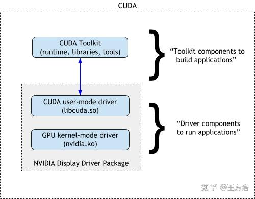
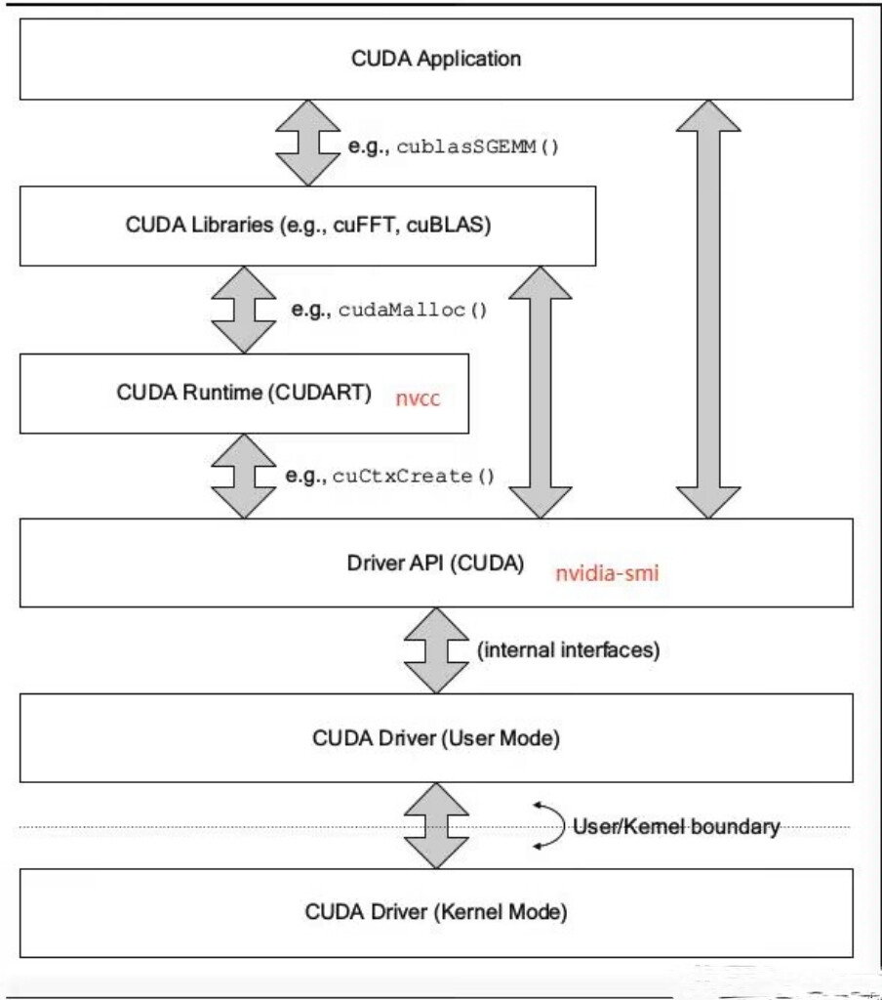

# 环境配置和工具编译

[toc]

## Linux远程开发机配置

- 安装或升级gcc/yasm/nasm
- 安装或升级make/cmake
- 安装或升级git，配置~/.gitconfig，配置密钥
- 安装universal-ctags
- 安装或升级vim (+python3支持)，配置~/.vimrc，安装插件

## 程序包和环境管理系统

### PIP

pip设置镜像源和代理
```
pip3 install torch -i https://mirrors.tencent.com/pypi/simple  --trusted-host mirrors.tencent.com --proxy proxy.xxx.com
pip3 install torch -i https://pypi.tuna.tsinghua.edu.cn/simple --trusted-host pypi.tuna.tsinghua.edu.cn
pip3 install torch -i https://mirrors.aliyun.com/pypi/simple   --trusted-host mirrors.aliyun.com
pip3 install torch -i https://pypi.mirrors.ustc.edu.cn/simple  --trusted-host pypi.mirrors.ustc.edu.cn
```

pip设置信任镜像源
```
# 命令行方式
pip config set global.index-url https://mirrors.tencent.com/pypi/simple/
pip config set global.extra-index-url https://mirrors.tencent.com/repository/pypi/tencent_pypi/simple
pip config set global.trusted-host mirrors.tencent.com

# 修改配置文件方式
$ cat ~/.config/pip/pip.conf
index-url = https://mirrors.tencent.com/pypi/simple/
extra-index-url = https://mirrors.tencent.com/repository/pypi/tencent_pypi/simple
trusted-host = mirrors.tencent.com
root-user-action = ignore
```

### Pypi国内镜像源
[腾讯](https://mirrors.tencent.com/pypi/simple)
[阿里云](https://mirrors.aliyun.com/pypi/simple)
[清华](https://pypi.tuna.tsinghua.edu.cn/simple)
[中科大](https://pypi.mirrors.ustc.edu.cn/simple)
[豆瓣](https://pypi.douban.com/simple)

### Conda

| command                                     | usage                                         |
| -----                                       | -----                                         |
| conda create --name py35 python=3.5         | create env                                    |
| conda remove --name py35 --all              | delete env                                    |
| conda create -n bak --clone src             | clone  env                                    |
| conda activate 3dlut                        | enter env                                     |
| conda deactivate                            | exit env                                      |
| conda info                                  | show conda info                               |
| conda info -e                               | show env                                      |
| conda install -n py35 numpy                 | install package                               |
| conda install --yes --file requirements.txt | install package via requirement file          |
| conda search numpy                          | search package                                |
| conda list -n py35                          | list package installed                        |
| conda update -n py35 numpy                  | update package                                |
| conda remove -n py35 numpy                  | delete package                                |
| conda update conda                          | update conda                                  |
| conda update anaconda                       | update anaconda                               |
| conda config --set auto_activate_base false | disable auto-activate base env while logining |
| conda clean -p                              | clean unused packages                         |
| conda clean -t                              | archive packages via tar                      |
| conda clean -y -all                         | remove all packages installed and cache       |
| conda env export > environment_droplet.yml  | export env to yml file                        |

```
conda config --show channels    # 显示当前镜像源配置
conda config --show-sources     # 显示镜像源配置文件路径
```

添加Conda镜像源：
```
conda config --add channels https://mirrors.tencent.com/anaconda/pkgs/r/
conda config --add channels https://mirrors.tencent.com/anaconda/pkgs/main/
conda config --add channels https://mirrors.tencent.com/anaconda/pkgs/free/
conda config --remove channels defaults
conda config --set show_channel_urls yes

conda config --add channels https://mirrors.tuna.tsinghua.edu.cn/anaconda/pkgs/free/
conda config --add channels https://mirrors.tuna.tsinghua.edu.cn/anaconda/pkgs/main/
conda config --add channels https://mirrors.tuna.tsinghua.edu.cn/anaconda/cloud/conda-forge/
conda config --add channels https://mirrors.tuna.tsinghua.edu.cn/anaconda/cloud/bioconda/
conda config --remove channels defaults
conda config --set show_channel_urls yes
```

修改conda的envs_dirs和pkgs_dirs：
可以通过编辑 \$HOME/.condarc 来实现。添加或修改 env_dirs 和 pkgs_dirs 配置项分别设置环境和缓存路径，按顺序第一个路径作为默认存储路径，搜索环境和缓存时按先后顺序在各目录中查找
```
envs_dirs:
  - /home/redleay/.conda/envs
  - /data/miniconda3/envs
pkgs_dirs:
  - /home/redleay/.conda/pkgs
  - /data/miniconda3/pkgs
```

conda安装应用报错
```
Solving environment: failed with initial frozen solve. Retrying with flexible solve
```
解决办法：
```
$ conda -V # 查询conda版本
$ conda update -n base conda # 升级conda
conda update --all # 更新全部应用
```

## 工具安装或升级

若需要源码编译，建议在特定目录下进行

```
test -d ~/tools/selfinstall || mkdir -p ~/tools/selfinstall
cd ~/tools/selfinstall
```

### GCC

#### 使用devtoolset

```
# 升级到7.x.x
sudo yum install centos-release-scl
sudo yum install devtoolset-7-gcc devtoolset-7-gcc-c++  # devtoolset-7-gcc*

# 使用设置
scl enable devtoolset-7 bash        # shall execute for every terminai
source /opt/rh/devtoolset-7/enable
```

#### 源码编译安装(v7.3.0)

下载gcc-7.3.0的源码并解压，并下载依赖的gmp、mpc、mpfr，解压到gcc-7.3.0的根目录下

```
cd gcc-7.3.0
tar -xjf gmp-6.1.0.tar.bz2 && ln -s gmp-6.1.0 gmp
tar -xzf mpc-1.0.3.tar.gz && ln -s mpc-1.0.3 mpc
tar -xjf mpfr-3.1.4.tar.bz2 && ln -s mpfr-3.1.4 mpfr
mkdir build
cd build
../configure --disable-multilib --enable-languages=c,c++ --enable-checking=release --prefix=/usr/local/gcc-7.3.0
make -j 8
make install
export PATH=/usr/local/bin:$PATH
```

若gmp/mpc/mpfr不存在，编译时会报错
```
configure: error: Building GCC requires GMP 4.2+, MPFR 2.4.0+ and MPC 0.8.0+.
Try the --with-gmp, --with-mpfr and/or --with-mpc options to specify
their locations.  Source code for these libraries can be found at
their respective hosting sites as well as at
ftp://gcc.gnu.org/pub/gcc/infrastructure/.  See also
http://gcc.gnu.org/install/prerequisites.html for additional info.  If
you obtained GMP, MPFR and/or MPC from a vendor distribution package,
make sure that you have installed both the libraries and the header
files.  They may be located in separate packages.
```

### GLIBC(v2.18)

编译和安装

```
wget http://mirrors.ustc.edu.cn/gnu/libc/glibc-2.18.tar.gz
tar -zxvf glibc-2.18.tar.gz
cd glibc-2.18
mkdir build
cd build
../configure --prefix=/usr
make -j4
sudo make install
```

### Git

```
# 安装依赖
sudo yum install curl-devel expat-devel gettext-devel openssl-devel zlib-devel gcc perl-ExtUtils-MakeMaker
sudo yum install asciidoc xmlto docbook2X
sudo ln -s /usr/bin/db2x_docbook2texi /usr/bin/docbook2x-texi
wget https://github.com/git/git/archive/refs/tags/v2.39.2.tar.gz -O git-v2.39.2.tar.gz
tar -xzf git-v2.39.2.tar.gz
cd git-2.39.2
source /opt/rh/devtoolset-7/enable  # 否则会报错"Required C99 support is in a test phase"

# 方法1
make prefix=/usr/local all doc info
sudo make prefix=/usr/local install install-doc install-html install-info

# 方法2
make configure
./configure --prefix=/usr/local
make all
sudo make install install-doc install-html
```

#### 错误解决

报错`/usr/local/lib64/libcrypto.so: undefined reference to 'dlopen'`

打开Makefile目录，搜索LIB_4_CRYPTO，前面添加-ldl
```
ifdef NEEDS_SSL_WITH_CRYPTO
  LIB_4_CRYPTO = $(OPENSSL_LINK) -ldl -lcrypto -lssl
else
  LIB_4_CRYPTO = $(OPENSSL_LINK) -ldl -lcrypto
endif
```

可使用`sed`命令修改：
```
sed -i 's#LIB_4_CRYPTO = $(OPENSSL_LINK)#LIB_4_CRYPTO = $(OPENSSL_LINK) -ldl#' Makefile
```

### universal-ctags

```
# 方法1：预编译二进制安装
wget https://github.com/universal-ctags/ctags-nightly-build/releases/download/2024.10.05%2Becf0c4adcce9853d666590bf2be101f983bad1cf/uctags-2024.10.05-linux-x86_64.tar.gz
tar -xzf uctags-2024.10.05-linux-x86_64.tar.gz
cd uctags-2024.10.05-linux-x86_64
sudo cp bin/* /usr/local/bin

# 方法2：源码编译安装
git clone https://github.com/universal-ctags/ctags.git
git checkout v6.1.0
./autogen.sh
./configure --prefix=/usr/local
make
sudo make install
```

### Vim

```
# Centos升级安装VIM8
sudo yum remove vim-common vim-enhanced vim-filesystem
sudo wget -P /etc/yum.repos.d/ https://copr.fedorainfracloud.org/coprs/lbiaggi/vim80-ligatures/repo/epel-7/lbiaggi-vim80-ligatures-epel-7.repo
sudo yum update vim-minimal
sudo yum install vim-enhanced
sudo ln -s /usr/bin/diff /usr/share/vim/vim80diff

# 安装插件
git clone https://github.com/VundleVim/Vundle.vim.git ~/.vim/bundle/Vundle.vim
vim +PluginInstall +qall
```

### mediainfo

安装

```
sudo yum install epel-release
sudo yum install mediainfo
```

### MP4Box

编译

```
./configure --static-mp4box --enable-debug
```

### X265

编译

```
cmake -DCMAKE_INSTALL_PREFIX=../bin/debug/ -DCMAKE_BUILD_TYPE=Debug \
    -DENABLE_SHARED=OFF \
    -DCMAKE_C_FLAGS=-pg -DCMAKE_CXX_FLAGS=-pg \
    -DCMAKE_EXE_LINKER_FLAGS=-pg -DCMAKE_SHARED_LINKER_FLAGS=-pg \
    -G "Unix Makefiles" ../source/
```

若要做gprof profiling，需要增加-pg编译和链接选项，并使用静态编译，动态编译无法分析动态库的函数耗时

### zimg

安装

```
sudo yum install zimg   # 依赖/etc/yum.repos.d/epel.repo
```

## AI环境配置

### GPU查询

GPU硬件状态查询

```
nvidia-smi
nvidia-smi dmon
nvidia-topo -m
```

GPU硬件性能分析工具
```
DLProf
PyProf
```

### GPU和CUDA



上面这张图简要说明了CUDA的架构，CUDA其实是分为2个部分，一部分是用户态的CUDA Driver，一部分是CUDA Toolkit。安装驱动（GPU kelnel-mode driver）的时候，往往是通过下载官网驱动的方式，英伟达官方已经把驱动和CUDA Driver匹配的版本打包到一起了，因此安装完驱动之后，调用nvidia-smi，就会显示用户态的CUDA Driver版本。



这是另一个版本的CUDA架构图，其中的CUDA Runtime和CUDA Libraries即为CUDA Toolkit。


#### 重点概念

- GPU和显卡：都属于硬件范畴
- Driver：同一个机器只能安装一个版本
- CUDA：可细分为多层，对于AI环境而言，主要分为CUDA Runtime API和CUDA Driver API
    - 几乎所有的框架程序（包括Torch）和CUDA Application所调用的CUDA都是CUDA Runtime API
    - CUDA Runtime API是NVIDIA封装的上层接口，内部调用CUDA Driver API，通常所说的CUDA都是指CUDA Runtime API（除非是驱动开发人员）
    - CUDA Driver API向下兼容（旧版本）CUDA Runtime API，CUDA Runtime API版本号必须小于等于 CUDA Driver API版本号
    - CUDA Driver API：
        - GPU设备的抽象层，通过提供一系列接口来操作GPU设备，性能好，但编程难度高
        - 由GPU Driver Installer安装
        - 典型文件有libcuda.so，nvidia-smi查询的就是此类API
    - CUDA Runtime API：
        - 是对CUDA Driver API进行了一定的封装，从而降低编程难度
        - 同一个机器可安装多个版本
        - 有多种安装方法，包括CUDA Toolkit installer安装、pytorch安装包安装
        - 典型文件有libcudart.so/nvcc，nvcc --version查询的就是此类API

#### 安装包区别

##### CUDA Toolkit Installer

通常集成了GPU Driver Installer，此时Runtime API与Driver API的版本应该一致。但如果单独进行GPU Driver Installer安装，版本有可能不一致

##### GPU Driver Installer

包含GPU/显卡驱动，可单独安装和升级

##### Pytorch

PyTorch安装包本身自带CUDA Runtime API，只包含库文件，不包含nvcc

#### 相关命令区别

##### `nvidia-smi`

- 管理和监控NVIDIA GPU设备，显示的是Driver版本，以及该Driver支持的最高CUDA Runtime API版本
- 只知道它自身构建时的CUDA Driver版本??，并不知道安装了什么版本的CUDA Runtime API，甚至不知道是否安装了CUDA Runtime API

##### `nvcc`

- nvcc是一个编译器，显示的是它自身构建时的CUDA Runtime API版本
- 一般是在安装CUDA Runtime API时附带的，系统中不一定存在nvcc，与CUDA Runtime API的安装方法有关
- 只知道它自身构建时的CUDA Runtime API版本，并不知道安装了什么版本的GPU Driver，甚至不知道是否安装了Driver，且在一个系统有多套CUDA Runtime API时，需要明确实际执行的是哪个CUDA Runtime API版本对应的nvcc

##### `torch.version.cuda`

- pytorch实际使用的CUDA Runtime API版本

#### 参考文献

[CUDA是什么](https://chenglu.me/blogs/what-is-cuda)

[CUDA驱动版本与运行版本不匹配问题详解](https://blog.csdn.net/weixin_45766759/article/details/114677710)

[不同命令查看cuda版本的区别](https://www.cnblogs.com/ining/p/17069111.html)

### Torch

安装pytorch
```
pip3 install torch==1.9.0+cu102 torchvision==0.10.0+cu102 -f https://download.pytorch.org/whl/cu102/torch_stable.html
pip3 install torch==1.7.1+cu110 torchvision==0.8.2+cu110 -f https://download.pytorch.org/whl/cu113/torch_stable.html
```

pytorch相关安装包下载地址
```
https://download.pytorch.org/whl/
https://download.pytorch.org/whl/torch_stable.html
https://download.pytorch.org/whl/cu110/torch_stable.html

https://download.pytorch.org/whl/cu110/torch-1.7.0%2Bcu110-cp38-cp38-linux_x86_64.whl
pip install torch-1.7.0+cu110-cp38-cp38-linux_x86_64.whl
https://download.pytorch.org/whl/cu110/torchvision-0.8.2+cu110-cp38-cp38-linux_x86_64.whl
pip install torchvision-0.8.2+cu110-cp38-cp38-linux_x86_64.whl
```

查看Pytorch能否利用GPU计算能力
```
>>> import torch
>>> print(torch.cuda.is_available())
```

查看编译Pytorch release版本时使用的CUDA版本
```
>>> import torch
>>> torch.version.cuda
```

查看Pytorch实际运行时使用的CUDA版本
```
>>> import torch
>>> import torch.utils
>>> import torch.utils.cpp_extension
>>> torch.utils.cpp_extension.CUDA_HOME
```

torchvision版本适配关系
```
https://pypi.org/project/torchvision/
```

### TensorBoard

执行`tensorboard --logdir=LOG_PATH`，然后在浏览器中访问`http://localhost:6006/`便可以查看到图形

### 其他


